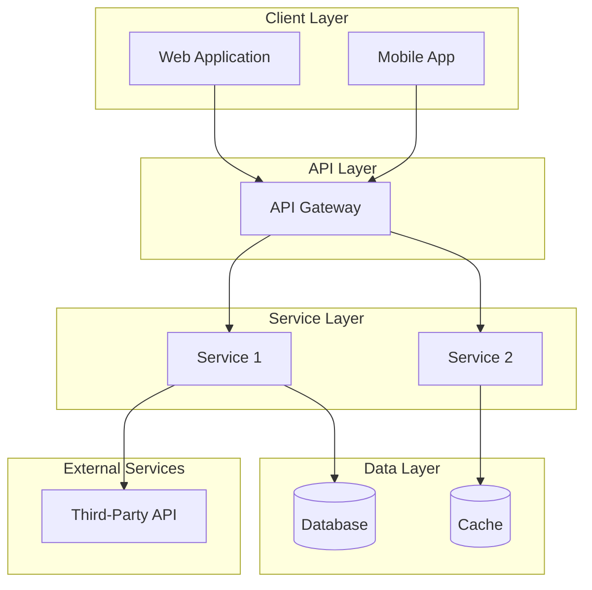
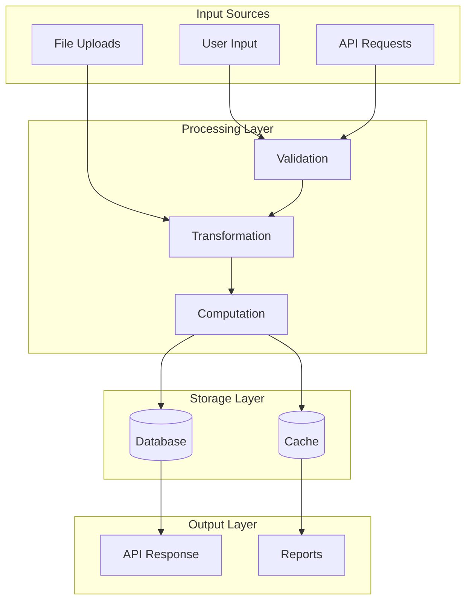
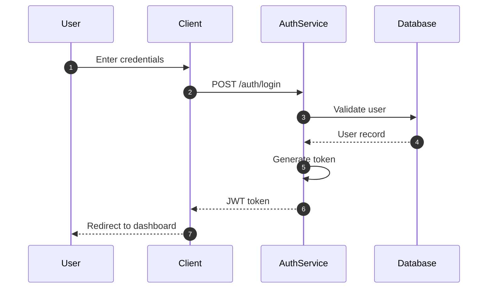
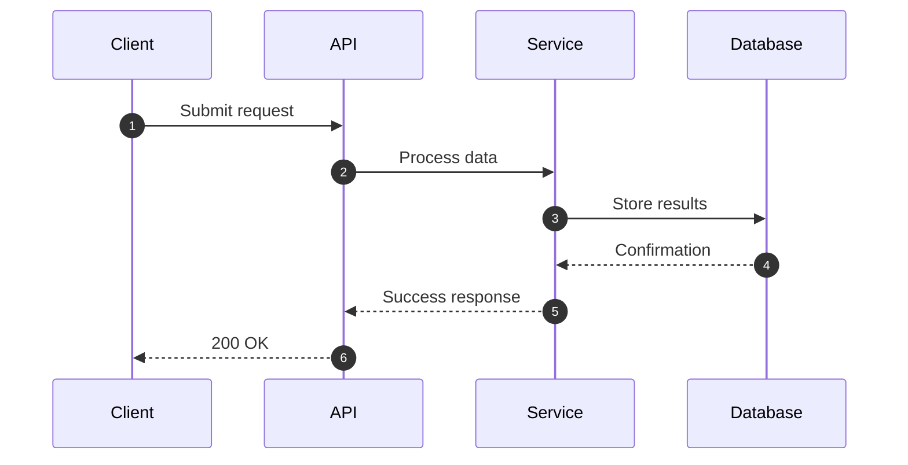
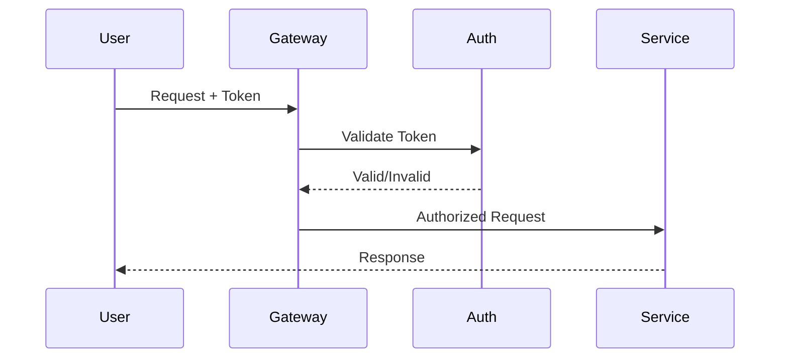
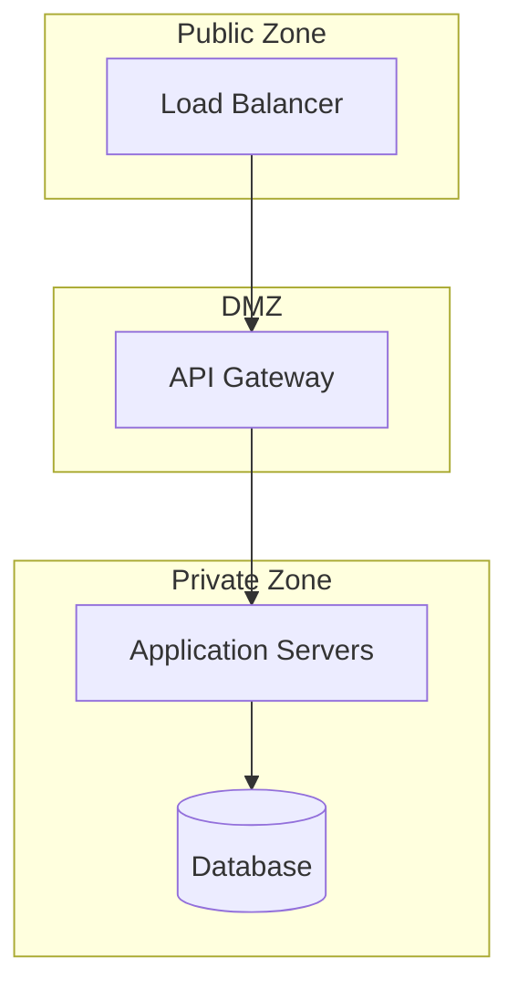
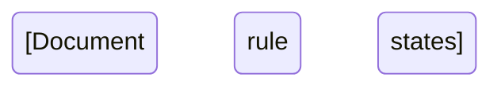

## User Input

```text
$ARGUMENTS
```

You **MUST** consider the user input before proceeding (if not empty). The user may specify which documentation types to generate or provide context about the system.

## Goal

Generate comprehensive, production-quality system documentation for any software repository. The documentation should be thorough, well-structured, and include visual diagrams using Mermaid syntax. All documentation must be language and framework agnostic in its approach while accurately documenting the specific technologies used in the repository.

## Output Location

All documentation will be created in the `docs/` directory at the repository root. Create this directory if it does not exist.

## Documentation Types to Generate

Generate **ALL** of the following documentation files:

1. **ARCHITECTURE.md** - System architecture and technology stack
2. **DATA_FLOW.md** - Data flow diagrams and transformation pipelines
3. **SEQUENCE_DIAGRAMS.md** - Detailed sequence diagrams for key workflows
4. **PII_DATA.md** - PII data classification and handling requirements
5. **DATA_SECURITY.md** - Security architecture and controls
6. **FEATURES_LIST.md** - Complete feature inventory with implementation status
7. **MODULES_LIST.md** - Module breakdown with responsibilities
8. **CONFIGURABLE_DESIGN.md** - Configurable system parameters
9. **README.md** - Documentation index

Additionally, generate domain-specific documentation based on repository analysis:
- For systems with business logic engines: **RULE_ENGINE.md** or **BUSINESS_LOGIC.md**
- For systems with calculations: **COMPUTATIONS.md** or **ALGORITHMS.md**
- For API-focused systems: **API_REFERENCE.md**
- For data-intensive systems: **DATA_MODEL.md**

## Execution Steps

### Phase 1: Repository Analysis

#### Step 1.1: Identify Repository Structure

Explore the repository thoroughly using appropriate tools to:

1. **Examine directory structure** - Identify the organization of source code, configuration files, and documentation
2. **Find configuration files** - Look for package.json, pom.xml, requirements.txt, Cargo.toml, go.mod, or similar files that indicate the technology stack
3. **Review existing documentation** - Check for README files, existing docs, and comments

Example analysis approach (adapt commands to your environment):
- List source directories and identify language-specific patterns
- Identify build/dependency files to determine frameworks
- Look for Docker/deployment configuration

#### Step 1.2: Identify Technology Stack

Detect and document:
- **Frontend**: React, Vue, Angular, Svelte, Next.js, etc.
- **Backend**: Spring Boot, Express, Django, FastAPI, Go, Rust, etc.
- **Database**: PostgreSQL, MySQL, MongoDB, Redis, etc.
- **Infrastructure**: Docker, Kubernetes, AWS, GCP, Azure, etc.
- **Build Tools**: Maven, Gradle, npm, yarn, cargo, etc.

#### Step 1.3: Identify System Type

Classify the system:
- Web Application (frontend + backend)
- API Service (backend only)
- Microservices Architecture
- Monolithic Application
- Library/Package
- CLI Tool
- Mobile Application
- Desktop Application

#### Step 1.4: Identify Core Domains

Analyze source code to identify:
- Business logic components
- Data processing pipelines
- Integration points
- User-facing features
- Background jobs/workers
- Configuration systems

### Phase 2: Generate Core Documentation

#### Step 2.1: ARCHITECTURE.md

Create comprehensive architecture documentation:

```markdown
# [Project Name] System Architecture

## Overview
[Brief description of the system and its purpose]

---

## High-Level Architecture Diagram



**Note**: Replace the example components above with actual components identified in the repository.

---

## Technology Stack

### [Layer Name]
| Component | Technology | Version |
|-----------|------------|---------|
| Web Framework | React/Vue/Angular | X.x |
| Backend | Spring Boot/Express/Django | X.x |
| Database | PostgreSQL/MySQL/MongoDB | X.x |

---

## Service Catalog (if microservices)

| Service | Port | Primary Responsibilities |
|---------|------|-------------------------|
| [Service Name] | [Port] | [Description] |

---

## Deployment Architecture

[Include container/deployment diagram if applicable]

---

## Communication Patterns

[Document synchronous/asynchronous communication]

---

## Version History

| Version | Date | Changes |
|---------|------|---------|
| 1.0 | [Date] | Initial documentation |
```

**Requirements for ARCHITECTURE.md:**
- Include at least one Mermaid diagram showing system components
- Document all major technologies with versions
- Identify all services/modules
- Document port numbers and endpoints
- Include deployment topology
- Document security boundaries

#### Step 2.2: DATA_FLOW.md

Create data flow documentation:

```markdown
# [Project Name] Data Flow Documentation

## Overview
[Brief description of how data flows through the system]

---

## High-Level Data Flow



**Note**: Replace the example components above with actual data flow identified in the repository.
```

---

## Core Data Flow Scenarios

### [Scenario 1 Name]

```mermaid
[Detailed flow diagram for this scenario]
```

[Repeat for each major data flow scenario - minimum 3]

---

## Data Transformation Pipeline

[Document how data is transformed at each stage]

---

## Integration Data Flows

[Document external system data flows]
```

**Requirements for DATA_FLOW.md:**
- Minimum 3 detailed data flow scenarios
- Include both happy path and error flows
- Document data transformations
- Include batch processing flows if applicable
- Document integration points

#### Step 2.3: SEQUENCE_DIAGRAMS.md

Create sequence diagrams for key workflows:

```markdown
# [Project Name] Sequence Diagrams

## Overview
[Brief description of the sequence diagrams included]

---

## 1. Authentication Flow



## 2. Data Processing Flow



**Note**: Create minimum 5 sequence diagrams covering authentication, primary workflow, data operations, background processing, and error handling.
```

**Requirements for SEQUENCE_DIAGRAMS.md:**
- Minimum 5 sequence diagrams covering:
  - Authentication/Authorization flow
  - Primary user workflow
  - Data creation/modification flow
  - Background processing flow
  - Error handling flow
- Use autonumber for step tracking
- Include alt/opt blocks for conditional logic
- Document all participants clearly

#### Step 2.4: PII_DATA.md

Create PII data documentation:

```markdown
# [Project Name] PII Data Documentation

## Overview
[Brief description of PII handling in the system]

---

## PII Classification Levels

| Level | Description | Examples | Protection Requirements |
|-------|-------------|----------|------------------------|
| HIGH | [Description] | [Examples] | [Requirements] |
| MEDIUM | [Description] | [Examples] | [Requirements] |
| LOW | [Description] | [Examples] | [Requirements] |

---

## PII Data Inventory

### [Data Category]

```mermaid
classDiagram
    class [EntityName] {
        <<PII Container>>
        +[field]: [type] [classification]
    }
```

| Field | Classification | Storage | Encryption | Masking |
|-------|---------------|---------|------------|---------|
| [Field] | [Level] | [Location] | [Method] | [Rule] |

[Repeat for each data category]

---

## Data Flow Map with PII Indicators

```mermaid
flowchart TB
    [Show PII flow through system]
```

---

## Protection Measures

### Encryption
[Document encryption at rest and in transit]

### Access Controls
[Document access control mechanisms]

### Data Masking Rules
[Document masking rules for display/logging]

### Data Retention
[Document retention periods]

---

## Compliance Requirements
[Document applicable regulations: GDPR, CCPA, HIPAA, etc.]
```

**Requirements for PII_DATA.md:**
- Identify ALL fields that could contain PII
- Classify each by sensitivity level
- Document encryption requirements
- Document masking rules
- Document retention requirements
- Include compliance mapping

#### Step 2.5: DATA_SECURITY.md

Create security documentation:

```markdown
# [Project Name] Data Security Documentation

## Overview
[Brief description of security architecture]

---

## Security Architecture

```mermaid
flowchart TB
    [Document security zones and boundaries]
```

---

## Authentication & Authorization

### Authentication Flow


### Role-Based Access Control

| Role | Permissions |
|------|------------|
| Admin | Full system access, user management, configuration |
| User | Read/write own data, limited read access to shared data |
| Guest | Read-only access to public resources |

**Note**: Document actual roles defined in the system.

### Permission Matrix
[Detailed resource-level permissions - create table mapping roles to specific resources/actions]

---

## Data Encryption

### At Rest
[Document encryption at rest mechanisms - e.g., AES-256, database TDE]

### In Transit
[Document transport layer security - e.g., TLS 1.3, certificate management]

---

## Network Security

### Network Segmentation


### Firewall Rules
[Document key firewall rules]

---

## Application Security

### Input Validation
[Document validation approach]

### Security Headers
[Document HTTP security headers]

### API Security
[Document API security measures]

---

## Audit Logging

### Logged Events
[Document what events are logged]

### Log Retention
[Document retention policy]

---

## Incident Response
[Document incident response procedures]

---

## Security Checklist
[Pre-production security checklist]
```

**Requirements for DATA_SECURITY.md:**
- Document authentication mechanism
- Document authorization model
- Include RBAC/ABAC details
- Document encryption methods
- Document network security
- Include security headers
- Document audit logging
- Include incident response basics

#### Step 2.6: FEATURES_LIST.md

Create feature inventory:

```markdown
# [Project Name] Features List

## Overview
[Brief description of system features]

---

## Feature Status Legend

| Status | Description |
|--------|-------------|
| ✅ IMPLEMENTED | Feature is complete |
| 🚧 IN PROGRESS | Partially implemented |
| ⏳ PLANNED | Planned but not started |
| ❌ NOT PLANNED | Not in roadmap |

---

## [Feature Category 1]

### [Sub-Category]

| Feature | Status | Description |
|---------|--------|-------------|
| [Feature Name] | [Status] | [Description] |

[Repeat for all feature categories]

---

## Feature Roadmap Summary

### Implemented
[List implemented features]

### In Progress
[List features in progress]

### Planned
[List planned features]
```

**Requirements for FEATURES_LIST.md:**
- Categorize all features logically
- Document implementation status
- Provide clear descriptions
- Include planned features
- Minimum 20 features documented

#### Step 2.7: MODULES_LIST.md

Create module documentation:

```markdown
# [Project Name] Modules List

## Overview
[Brief description of module organization]

---

## Module Architecture Overview

```mermaid
graph TB
    [Document module dependencies]
```

---

## [Layer Name] Modules

### [Module Name]

**Package/Path:** `[path]`

| Component | File | Responsibility |
|-----------|------|----------------|
| [Component] | [File] | [Description] |

**Port:** [if applicable]

**Endpoints:**
- `[METHOD] [path]` - [Description]

[Repeat for all modules]

---

## Module Dependencies

```mermaid
graph LR
    [Document module dependencies]
```

---

## Database Dependencies

| Module | Database | Tables |
|--------|----------|--------|
| [Module] | [DB] | [Tables] |
```

**Requirements for MODULES_LIST.md:**
- Document ALL modules/services
- Include file/package structure
- Document responsibilities
- Include API endpoints
- Document dependencies
- Include database usage

#### Step 2.8: CONFIGURABLE_DESIGN.md

Create configuration documentation:

```markdown
# [Project Name] Configurable Design Documentation

## Overview
[Brief description of configuration approach]

---

## Configuration Architecture

```mermaid
graph TB
    [Document configuration sources and flow]
```

---

## Configurable Components

### [Component Category]

```mermaid
classDiagram
    class [ConfigClass] {
        <<configurable>>
        +[parameter]: [type]
    }
```

**Configurable Parameters:**

| Parameter | Default | Range | Description |
|-----------|---------|-------|-------------|
| [Param] | [Default] | [Range] | [Description] |

[Repeat for all configurable components]

---

## Configuration via [Method]

### [Configuration File Type]

```yaml
# Example configuration
[Show example configuration]
```

### Environment Variables

```bash
# Override via environment
[Show environment variable examples]
```

---

## Multi-Tenant Configuration (if applicable)

[Document tenant-specific configuration]

---

## Configuration Best Practices

[Document recommended practices for configuration management]
```

**Requirements for CONFIGURABLE_DESIGN.md:**
- Identify ALL configurable parameters
- Document default values
- Document valid ranges
- Show configuration examples
- Document environment variables
- Include best practices

#### Step 2.9: README.md (Documentation Index)

Create documentation index:

```markdown
# [Project Name] Documentation Index

## Overview
[Welcome message and documentation description]

---

## Documentation Structure

```
docs/
├── ARCHITECTURE.md
├── DATA_FLOW.md
├── SEQUENCE_DIAGRAMS.md
├── PII_DATA.md
├── DATA_SECURITY.md
├── FEATURES_LIST.md
├── MODULES_LIST.md
├── CONFIGURABLE_DESIGN.md
├── [Domain-specific docs]
└── README.md
```

---

## Quick Reference Guide

### For Developers
| Document | Purpose | When to Use |
|----------|---------|-------------|
| [Doc] | [Purpose] | [Use Case] |

### For Security/Compliance
| Document | Purpose | When to Use |
|----------|---------|-------------|
| [Doc] | [Purpose] | [Use Case] |

---

## Document Summaries

### [Document Name]
[2-3 sentence summary]

[Repeat for all documents]

---

## Diagram Types Used

| Type | Used For | Example |
|------|----------|---------|
| flowchart | Process flows | Data flow diagrams |
| sequenceDiagram | Interactions | API call sequences |
| graph | Architecture | Component diagrams |
| erDiagram | Data models | Entity relationships |
| classDiagram | Object models | Configuration classes |
| stateDiagram | State machines | Workflow states |
| gantt | Timelines | Feature roadmaps |

---

## Contributing to Documentation

[Guidelines for documentation updates]

---

## Version History

| Version | Date | Changes |
|---------|------|---------|
| 1.0 | [Date] | Initial documentation |
```

### Phase 3: Generate Domain-Specific Documentation

Based on repository analysis, generate additional documentation:

#### If Business Logic/Rules Engine Present

Create **RULE_ENGINE.md** or **BUSINESS_LOGIC.md**:

```markdown
# [Project Name] Business Logic Documentation

## Overview
[Description of business logic/rules system]

---

## Logic Architecture

```mermaid
[Document logic flow and components]
```

---

## Rule Categories

| Category | Description | Example Rules |
|----------|-------------|---------------|
| [Category] | [Description] | [Examples] |

---

## Rule Data Model

```mermaid
erDiagram
    [Document rule entities and relationships]
```

---

## Rule Lifecycle



---

## Built-in Rules

| Rule Code | Category | Default | Description |
|-----------|----------|---------|-------------|
| [Code] | [Category] | [Default] | [Description] |

---

## Adding Custom Rules

[Document how to add new rules]

---

## Rule API Reference

[Document rule management APIs]
```

#### If Calculations Present

Create **COMPUTATIONS.md** or **ALGORITHMS.md**:

```markdown
# [Project Name] Computation Documentation

## Overview
[Description of computation/algorithm system]

---

## Computation Architecture

```mermaid
[Document computation flow]
```

---

## [Computation Type] Calculation

### Calculation Flow

```mermaid
flowchart TB
    [Document calculation steps]
```

### Formula

```
[Mathematical formula or pseudocode]
```

### Example

```
[Worked example with actual numbers]
```

[Repeat for each computation type]

---

## Configurable Parameters

| Parameter | Default | Description |
|-----------|---------|-------------|
| [Param] | [Default] | [Description] |
```

### Phase 4: Quality Validation

#### Step 4.1: Validate Completeness

Check each document for:
- [ ] Minimum required sections present
- [ ] At least one Mermaid diagram per document
- [ ] All tables properly formatted
- [ ] No placeholder text remaining
- [ ] Version history present
- [ ] Document owner identified

#### Step 4.2: Validate Consistency

Check across documents for:
- [ ] Consistent technology naming
- [ ] Consistent service/module naming
- [ ] Cross-references are valid
- [ ] No contradictory information

#### Step 4.3: Validate Diagrams

For each Mermaid diagram:
- [ ] Valid Mermaid syntax
- [ ] All nodes connected
- [ ] Labels are meaningful
- [ ] Subgraphs used appropriately

### Phase 5: Final Output

Create all documentation files in the `docs/` directory:

```bash
mkdir -p docs
# Create each documentation file
```

Report completion with:
- List of created documents
- Summary of documented components
- Any areas needing manual review

## Operating Principles

### Documentation Quality Standards

1. **Comprehensive Coverage**: Document ALL components, not just major ones
2. **Visual First**: Include diagrams wherever possible
3. **Consistent Format**: Follow templates exactly
4. **Actionable Content**: Information should be immediately useful
5. **Maintainable**: Structure for easy updates
6. **Technology Agnostic Approach**: Method applies to any stack
7. **Accurate Technology Details**: Document actual technologies used

### Mermaid Diagram Guidelines

1. **Use appropriate diagram type** for the content
2. **Keep diagrams focused** - split large diagrams
3. **Use meaningful labels** - avoid abbreviations
4. **Include legends** when using colors/styles
5. **Test syntax** - ensure diagrams render

### Content Guidelines

1. **No implementation code** in documentation (pseudocode OK)
2. **No sensitive data** - use placeholder values
3. **Include timestamps** - version history required
4. **Cross-reference** related documents
5. **Progressive disclosure** - overview first, details follow

### Handling Unknown Information

1. **Mark clearly**: Use `[TBD]` or `[NEEDS VERIFICATION]`
2. **Make reasonable assumptions**: Document assumptions made
3. **Flag for review**: Create list of items needing human review
4. **Never fabricate**: If information cannot be determined, say so

## Error Handling

- If repository structure is unclear, document what CAN be determined
- If technology cannot be identified, note it in the documentation
- If diagrams cannot represent complexity, use multiple simpler diagrams
- If modules are unclear, document the file structure as-is

## Completion Criteria

Documentation is complete when:
- [ ] All 9 core documents created
- [ ] Domain-specific documents created (as applicable)
- [ ] All documents have at least one diagram
- [ ] All documents pass quality validation
- [ ] README index references all documents
- [ ] No placeholder text remains (except [TBD] with reasons)

## Context

$ARGUMENTS
