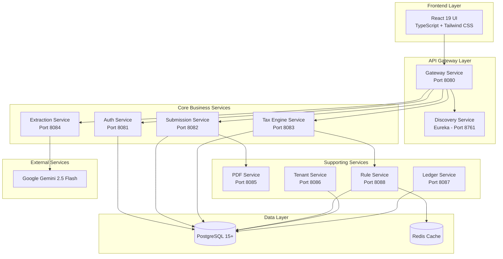
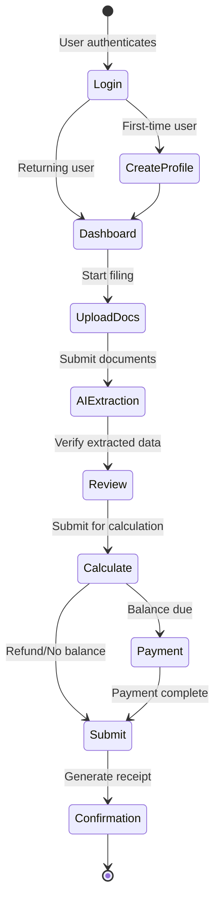
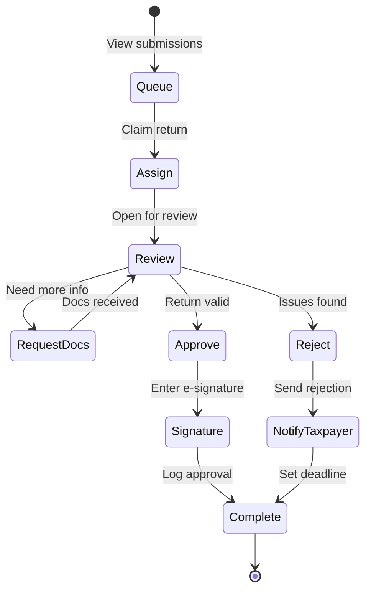
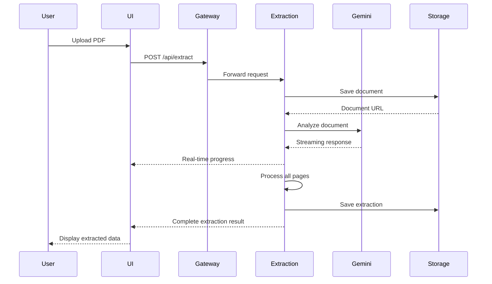

# MuniTax - Dublin Municipal Tax Filing System

## Complete Project Documentation

**Version:** 1.0.0  
**Date:** December 29, 2025  
**Project Type:** Municipal Tax Filing & Auditing Platform  
**Technology:** Microservices Architecture (Spring Boot + React)

---

## Executive Overview

MuniTax is a comprehensive municipal tax filing and auditing system designed for Dublin Municipality. The platform enables both individual and business taxpayers to file tax returns electronically while providing municipal auditors with a complete workflow for reviewing, approving, and tracking submissions.

### Key Capabilities

- **Dual Tax Engines**: Separate engines for individual and business tax calculations
- **AI-Powered Extraction**: Google Gemini 2.5 Flash for intelligent document analysis
- **Auditor Workflow**: Complete review queue, approval/rejection, and audit trail
- **Multi-Tenant Support**: Isolated tenant data with configurable tax rules
- **Microservices Architecture**: 10 independent services for scalability and maintainability
- **Role-Based Access Control**: Support for taxpayers, auditors, supervisors, and administrators

---

## System Overview

### Architecture Summary



---

## Technology Stack

### Frontend Technologies

| Component | Technology | Version | Purpose |
|-----------|------------|---------|---------|
| Framework | React | 19.2.0 | UI framework |
| Language | TypeScript | 5.8.2 | Type-safe JavaScript |
| Routing | React Router | 7.9.6 | SPA routing |
| Styling | Tailwind CSS | 4.1.17 | Utility-first CSS |
| Build Tool | Vite | 6.2.0 | Fast build and dev server |
| Icons | Lucide React | 0.554.0 | Icon library |
| PDF Viewer | react-pdf | 10.2.0 | PDF document viewing |
| AI Integration | @google/genai | 1.30.0 | Gemini API client |

### Backend Technologies

| Component | Technology | Version | Purpose |
|-----------|------------|---------|---------|
| Framework | Spring Boot | 3.2.3 | Microservices framework |
| Language | Java | 21 | Backend language |
| Cloud | Spring Cloud | 2023.0.0 | Microservices infrastructure |
| Database | PostgreSQL | 15+ | Primary data store |
| Cache | Redis | Latest | Rule caching |
| ORM | JPA/Hibernate | Included | Object-relational mapping |
| Security | JWT | Custom | Authentication tokens |
| Service Discovery | Eureka | Netflix OSS | Service registry |
| API Gateway | Spring Cloud Gateway | Latest | Routing and filtering |
| Build Tool | Maven | 3.8+ | Dependency management |

### Development & Deployment

| Component | Technology | Purpose |
|-----------|------------|---------|
| Version Control | Git | Source code management |
| Testing (Frontend) | Vitest | Unit testing |
| Testing (E2E) | Playwright | End-to-end testing |
| Testing (Backend) | JUnit 5 | Unit/integration testing |
| Coverage | Jacoco | Code coverage (90% minimum) |
| Containerization | Docker | Service containerization |
| Orchestration | Docker Compose | Local development |

---

## Service Catalog

### 1. Gateway Service (Port 8080)
**Purpose:** API Gateway and request routing  
**Responsibilities:**
- Route requests to appropriate microservices
- Load balancing and circuit breaking
- Cross-cutting concerns (logging, monitoring)
- CORS configuration

**Technology:** Spring Cloud Gateway

### 2. Discovery Service (Port 8761)
**Purpose:** Service registry and discovery  
**Responsibilities:**
- Service registration
- Health monitoring
- Dynamic service discovery
- Load balancer integration

**Technology:** Netflix Eureka Server

### 3. Auth Service (Port 8081)
**Purpose:** User authentication and authorization  
**Responsibilities:**
- User registration and login
- JWT token generation and validation
- Role-based access control (RBAC)
- Password management and email verification
- Session management

**Key Entities:** User, Role, Permission

### 4. Submission Service (Port 8082)
**Purpose:** Tax return submissions and auditor workflow  
**Responsibilities:**
- Tax return submission management
- Auditor queue and assignment
- Document request workflow
- Audit trail and action logging
- W-3 reconciliation processing
- Approval/rejection workflow with e-signatures

**Key Entities:** Submission, AuditQueue, AuditTrail, DocumentRequest, W3Reconciliation

### 5. Tax Engine Service (Port 8083)
**Purpose:** Tax calculations and discrepancy detection  
**Responsibilities:**
- Individual tax calculations (W-2, 1099, Schedules)
- Business tax calculations (Withholding, Net Profits)
- Schedule Y credit calculations
- Discrepancy detection and validation
- NOL (Net Operating Loss) processing
- Tax liability computation

**Key Entities:** TaxFormData, TaxPayerProfile, CalculationResult

### 6. Extraction Service (Port 8084)
**Purpose:** AI-powered document data extraction  
**Responsibilities:**
- PDF document analysis using Gemini AI
- Form field extraction (W-2, 1099, 1040, Schedules)
- Confidence scoring for extracted data
- Document provenance tracking
- Real-time extraction feedback
- Multi-form detection

**Key Entities:** ExtractionRequest, ExtractionResult, FieldConfidence

### 7. PDF Service (Port 8085)
**Purpose:** PDF generation and manipulation  
**Responsibilities:**
- Generate tax form PDFs
- Create filing receipts
- Merge multiple documents
- Add watermarks and stamps
- PDF form filling

**Technology:** Apache PDFBox or similar

### 8. Tenant Service (Port 8086)
**Purpose:** Multi-tenant management  
**Responsibilities:**
- Tenant provisioning and configuration
- Tenant-specific settings
- Data isolation enforcement
- Tenant billing and usage tracking

**Key Entities:** Tenant, TenantConfig

### 9. Ledger Service (Port 8087)
**Purpose:** Financial transaction and payment processing  
**Responsibilities:**
- Payment transaction recording
- Balance due calculations
- Refund processing
- Payment history tracking
- Mock payment gateway integration (TEST mode)

**Key Entities:** Transaction, Payment, Refund

### 10. Rule Service (Port 8088)
**Purpose:** Dynamic tax rule management  
**Responsibilities:**
- Tax rule CRUD operations
- Temporal effective dating
- Rule approval workflow
- Rule caching with Redis
- Multi-tenant rule isolation

**Key Entities:** TaxRule, RuleChangeLog

⚠️ **CRITICAL ISSUE:** Rule Service is not integrated with Tax Engine calculations. See Critical Findings document.

---

## User Roles & Permissions

### Taxpayer Roles

#### ROLE_INDIVIDUAL
- File personal tax returns (1040)
- Upload W-2, 1099, and other forms
- View submission history
- Amend previous returns
- Make payments

#### ROLE_BUSINESS
- File business tax returns (Withholding, Net Profits, W-3)
- Upload business documents
- Manage employee W-2 data
- View reconciliation reports
- Make business tax payments

### Auditor Roles

#### ROLE_AUDITOR
- View assigned submissions
- Review return details and documents
- Request additional documentation
- Recommend approval/rejection
- Generate audit reports
- Log review actions

#### ROLE_SENIOR_AUDITOR
- All auditor permissions
- Approve returns under $50,000
- Reject returns with detailed reasons
- Assign returns to junior auditors
- Prioritize submissions

#### ROLE_SUPERVISOR
- All senior auditor permissions
- Approve any return (no limit)
- Override priority assignments
- Reassign returns between auditors
- Generate compliance reports

#### ROLE_MANAGER
- All permissions
- Configure audit rules and thresholds
- Generate system-wide reports
- Manage auditor accounts
- Set department policies

#### ROLE_ADMIN
- System administration
- User management
- Service configuration
- Database maintenance
- Security settings

---

## Core Features

### Tax Filing Features

1. **Individual Tax Filing**
   - W-2 wage reporting
   - 1099 income (NEC, MISC, INT, DIV)
   - Gambling winnings (W-2G)
   - Schedule C (Business Income)
   - Schedule E (Rental/Royalty Income)
   - Schedule F (Farm Income)
   - Schedule Y credit calculations

2. **Business Tax Filing**
   - Withholding returns (W-1)
   - Net profit returns (Form 27)
   - W-3 reconciliation
   - Quarterly filings
   - Annual reconciliation

3. **AI Document Extraction**
   - Automatic form detection
   - Field-level extraction with confidence scores
   - Real-time extraction feedback
   - Document provenance tracking
   - User-provided or system API key
   - Support for multiple form types

4. **Amendment Support**
   - File amended returns
   - Track changes from original
   - Audit trail for amendments
   - Reason codes for changes

### Auditor Features

1. **Submission Queue**
   - Prioritized queue (HIGH/MEDIUM/LOW)
   - Filter by status, risk score, tax year
   - Sort by submission date, amount, days in queue
   - Claim and assign returns

2. **Return Review**
   - View complete return details
   - Access supporting documents
   - Review audit reports and risk scores
   - View taxpayer history
   - Document provenance (click to see PDF source)

3. **Approval Workflow**
   - E-signature approval
   - Detailed approval notes
   - Automated notifications
   - Immutable audit trail

4. **Rejection Workflow**
   - Categorized rejection reasons
   - Resubmission deadline setting
   - Taxpayer notifications
   - Tracking of resubmissions

5. **Document Requests**
   - Request specific documents
   - Set response deadlines
   - Track document submissions
   - Link documents to requests

6. **Risk Scoring**
   - Automated risk calculation (0-100)
   - Year-over-year variance analysis
   - Industry benchmark comparison
   - Pattern detection (round numbers, unusual timing)
   - Discrepancy flagging

### Payment Features

1. **Payment Processing** (TEST MODE)
   - Credit card payments (simulated)
   - ACH bank transfers (simulated)
   - Payment plans and installments
   - Real-time confirmation

2. **Refund Processing**
   - Direct deposit setup
   - Refund tracking
   - Check mailing option
   - Credit to next year option

---

## Key Workflows

### 1. Individual Tax Filing Workflow



### 2. Auditor Review Workflow



### 3. Data Extraction Workflow



---

## Development Setup

### Prerequisites

- **Node.js:** 18+ (for frontend)
- **Java:** 21 (JDK)
- **Maven:** 3.8+
- **PostgreSQL:** 15+
- **Redis:** Latest (for rule caching)
- **Docker:** Optional (for containerized development)
- **Git:** Version control

### Local Development Setup

#### 1. Clone Repository
```bash
git clone https://github.com/shashanksaxena-tz/munciplaityTax.git
cd munciplaityTax
```

#### 2. Database Setup
```bash
# Start PostgreSQL
psql -U postgres

# Create database
CREATE DATABASE munitax_db;

# Create user
CREATE USER munitax WITH PASSWORD 'secure_password';
GRANT ALL PRIVILEGES ON DATABASE munitax_db TO munitax;
```

#### 3. Backend Setup
```bash
cd backend

# Build all services
mvn clean install

# Start services in order:
# Terminal 1: Discovery Service
cd discovery-service && mvn spring-boot:run

# Terminal 2: Gateway Service (wait for discovery to start)
cd gateway-service && mvn spring-boot:run

# Terminal 3: Auth Service
cd auth-service && mvn spring-boot:run

# Terminal 4: Submission Service
cd submission-service && mvn spring-boot:run

# Terminal 5: Tax Engine Service
cd tax-engine-service && mvn spring-boot:run

# Terminal 6: Extraction Service
cd extraction-service && mvn spring-boot:run

# Continue for other services as needed
```

#### 4. Frontend Setup
```bash
# Install dependencies
npm install

# Set environment variables (create .env.local)
echo "VITE_API_BASE_URL=http://localhost:8080" > .env.local
echo "VITE_GEMINI_API_KEY=your_api_key_here" >> .env.local

# Run development server
npm run dev

# Access at http://localhost:5173
```

#### 5. Verify Setup
- Gateway: http://localhost:8080
- Discovery: http://localhost:8761
- Frontend: http://localhost:5173

---

## Testing

### Frontend Testing
```bash
# Run unit tests
npm run test

# Run with watch mode
npm run test:watch

# Run E2E tests
npm run test:e2e

# Run E2E tests with UI
npm run test:e2e:ui
```

### Backend Testing
```bash
cd backend

# Run all tests
mvn test

# Run specific service tests
cd submission-service
mvn test

# Run with coverage
mvn test jacoco:report

# Minimum coverage: 90%
```

---

## Deployment

### Docker Deployment
```bash
# Build all services
docker-compose build

# Start all services
docker-compose up -d

# View logs
docker-compose logs -f

# Stop services
docker-compose down
```

### Production Considerations

1. **Environment Variables**
   - Database credentials
   - JWT secret keys
   - Gemini API keys
   - Redis connection
   - Service URLs

2. **Database Migration**
   - Use Flyway for schema versioning
   - Backup before migration
   - Test migrations in staging

3. **Monitoring**
   - Service health endpoints
   - Log aggregation
   - Performance metrics
   - Error tracking

4. **Security**
   - Enable HTTPS/TLS
   - Secure database connections
   - Rotate JWT secrets
   - Rate limiting
   - Input validation

---

## Project Structure

```
munciplaityTax/
├── backend/                          # Spring Boot microservices
│   ├── discovery-service/            # Eureka service registry
│   ├── gateway-service/              # API gateway
│   ├── auth-service/                 # Authentication
│   ├── submission-service/           # Submissions & auditor workflow
│   ├── tax-engine-service/           # Tax calculations
│   ├── extraction-service/           # AI document extraction
│   ├── pdf-service/                  # PDF generation
│   ├── tenant-service/               # Multi-tenant management
│   ├── ledger-service/               # Payment processing
│   ├── rule-service/                 # Tax rule management
│   └── pom.xml                       # Parent POM
│
├── components/                       # React components
│   ├── AuditorDashboard.tsx         # Auditor submission queue
│   ├── ReturnReviewPanel.tsx        # Return review interface
│   ├── ExtractionProgress.tsx       # AI extraction feedback
│   └── ...
│
├── docs/                             # Technical documentation
│   ├── ARCHITECTURE.md
│   ├── DATA_FLOW.md
│   ├── RULE_ENGINE.md
│   └── ...
│
├── doc-29-dec-2025/                  # Comprehensive documentation
│   └── (this documentation set)
│
├── config/                           # Configuration files
├── public/                           # Static assets
├── utils/                            # Utility functions
├── types.ts                          # TypeScript type definitions
├── App.tsx                           # Main application component
├── docker-compose.yml                # Docker orchestration
├── package.json                      # Frontend dependencies
└── README.md                         # Project README
```

---

## API Endpoints Summary

### Authentication (`/api/auth`)
- `POST /register` - Register new user
- `POST /login` - Authenticate user
- `POST /logout` - Logout user
- `POST /verify-email` - Verify email address
- `POST /refresh-token` - Refresh JWT token

### Submissions (`/api/submissions`)
- `POST /` - Create submission
- `GET /{id}` - Get submission details
- `PUT /{id}` - Update submission
- `DELETE /{id}` - Delete draft submission
- `POST /{id}/submit` - Submit for review

### Tax Engine (`/api/tax`)
- `POST /calculate/individual` - Calculate individual tax
- `POST /calculate/business` - Calculate business tax
- `GET /calculate/{id}` - Get calculation result
- `POST /validate` - Validate tax data

### Extraction (`/api/extract`)
- `POST /` - Extract data from document
- `GET /{id}` - Get extraction result
- `POST /stream` - Stream extraction progress
- `GET /{id}/provenance` - Get field provenance

### Auditor (`/api/audit`)
- `GET /queue` - Get submission queue
- `POST /{id}/assign` - Assign to auditor
- `POST /{id}/approve` - Approve submission
- `POST /{id}/reject` - Reject submission
- `POST /{id}/request-docs` - Request documents
- `GET /{id}/audit-trail` - Get audit trail

### Rules (`/api/rules`)
- `POST /` - Create rule
- `PUT /{id}` - Update rule
- `POST /{id}/approve` - Approve rule
- `GET /active` - Get active rules
- `GET /{code}/history` - Get rule history

---

## Critical Issues & Known Limitations

### 🔴 Critical Issues

1. **Rule Service Integration Disconnect** (Priority: CRITICAL)
   - Rule Service exists but is not integrated with tax calculations
   - Tax rates are hardcoded in IndividualTaxCalculator and BusinessTaxCalculator
   - Rules can be managed but are never applied
   - **Impact:** System cannot use dynamic tax rules
   - **See:** `15-CRITICAL_FINDINGS.md` for details

2. **Missing Database Schema**
   - `tax_rules` table not created in Docker postgres
   - Rule Service connects to external cloud DB instead of local
   - **Impact:** Local development uses wrong database

### ⚠️ Production Blockers

1. **Payment Integration** - Only TEST mode implemented
2. **Refund Processing** - No disbursement workflow
3. **Receipt Generation** - No official receipt PDFs
4. **Mobile Optimization** - Desktop-only interface
5. **Email Notifications** - Not fully implemented

**See:** `15-CRITICAL_FINDINGS.md` for complete list

---

## Compliance & Standards

### Regulatory Compliance
- **IRS Regulations:** Form validation per IRS specifications
- **Audit Trail Retention:** 7+ years (IRS requirement)
- **E-Signature Standards:** Digital signature hashing for non-repudiation
- **Data Privacy:** GDPR-compliant data handling

### Security Standards
- **Authentication:** JWT-based with secure token management
- **Authorization:** Role-based access control (RBAC)
- **Encryption:** TLS/SSL for data in transit
- **Audit Logging:** Immutable append-only logs

### Code Quality Standards
- **Code Coverage:** Minimum 90% (enforced by Jacoco)
- **Code Style:** Google Java Style Guide
- **TypeScript:** Strict mode enabled
- **Testing:** Unit, integration, and E2E tests required

---

## Support & Contributing

### Getting Help
- **Documentation:** See `doc-29-dec-2025/` folder
- **Issue Tracker:** GitHub Issues
- **Team Contact:** Development team via GitHub

### Contributing Guidelines
1. Create feature branch from `main`
2. Follow code style guidelines
3. Write tests (maintain 90% coverage)
4. Update documentation
5. Submit pull request
6. Request code review

---

## Version History

| Version | Date | Description | Author |
|---------|------|-------------|--------|
| 1.0.0 | 2025-12-29 | Initial comprehensive documentation | Documentation Team |

---

## Document Index

This is part of the comprehensive documentation set located in `doc-29-dec-2025/`. See `README.md` in that folder for the complete index.

### Related Documents
- `01-ARCHITECTURE.md` - Detailed system architecture
- `09-TAX_ENGINE.md` - Tax engine detailed documentation
- `10-RULE_FLOW.md` - Rule engine workflow
- `15-CRITICAL_FINDINGS.md` - Critical issues and remediation

---

**Document Status:** ✅ Complete  
**Last Updated:** December 29, 2025  
**Maintained By:** MuniTax Development Team
