# MuniTax - Tax Engine Detailed Documentation

## Document Overview

**Purpose:** Comprehensive documentation of the Tax Engine Service architecture, calculations, and algorithms  
**Date:** December 29, 2025  
**Service:** Tax Engine Service (Port 8083)  
**Status:** ⚠️ Uses Hardcoded Rules (see Critical Findings)

---

## Executive Summary

The Tax Engine Service is the core calculation engine for MuniTax, responsible for computing tax liability for both individual and business taxpayers. It implements Dublin Municipality's tax rules, including W-2 processing, Schedule processing, credit calculations, and business tax calculations with book-tax reconciliations.

### Key Capabilities

- **Dual Calculation Engines**: Separate engines for individual and business taxes
- **Multi-Form Support**: W-2, 1099, W-2G, Schedules C/E/F, and business forms
- **Discrepancy Detection**: Automated validation and anomaly detection
- **Credit Calculations**: Schedule Y credit processing
- **NOL Processing**: Net Operating Loss carryforward and application
- **Penalty & Interest**: Automated calculation of penalties and interest

**⚠️ Critical Issue:** Tax rates and rules are currently hardcoded. Rule Service integration is missing (see CRITICAL-001 in Critical Findings).

---

## Tax Engine Architecture

### Service Architecture

```mermaid
graph TB
    subgraph "Tax Engine Service - Port 8083"
        CTRL[Tax Engine Controller]
        
        subgraph "Calculation Engines"
            IND[Individual Tax Calculator]
            BUS[Business Tax Calculator]
        end
        
        subgraph "Supporting Services"
            DISC[Discrepancy Detector]
            VAL[Validation Service]
            RATE[Tax Rate Resolver]
        end
        
        subgraph "Integration Layer"
            RULE_INT[Rule Service Integration<br/>❌ NOT USED]
            SUBMIT[Submission Service Client]
        end
    end
    
    subgraph "External Services"
        RULE[Rule Service<br/>❌ NOT CALLED]
        SUB[Submission Service]
    end
    
    CTRL --> IND
    CTRL --> BUS
    
    IND --> DISC
    BUS --> DISC
    
    IND --> VAL
    BUS --> VAL
    
    IND -.->|Should call| RATE
    BUS -.->|Should call| RATE
    RATE -.->|Should call| RULE_INT
    RULE_INT -.->|Should call| RULE
    
    IND --> SUBMIT
    BUS --> SUBMIT
    SUBMIT --> SUB
    
    style RULE fill:#ffcccc,stroke:#ff0000,stroke-width:2px
    style RULE_INT fill:#ffcccc,stroke:#ff0000,stroke-width:2px
    style RATE fill:#fff3cd,stroke:#ff9900,stroke-width:2px
```



---

## Individual Tax Calculation Engine

### Calculation Flow


### Tax Calculation Formula

```
┌─────────────────────────────────────────────────────────────────┐
│  INDIVIDUAL TAX CALCULATION FORMULA                             │
├─────────────────────────────────────────────────────────────────┤
│                                                                 │
│  Step 1: Calculate Taxable Income                              │
│  ────────────────────────────────────────────────────────────  │
│  W-2 Qualifying Wages                           $XXX,XXX        │
│  + Schedule C Net Profit                        $XXX,XXX        │
│  + Schedule E Net Income                        $XXX,XXX        │
│  + Schedule F Net Farm Profit                   $XXX,XXX        │
│  + W-2G Gambling Winnings                       $XXX,XXX        │
│  + 1099 Income                                  $XXX,XXX        │
│  ─────────────────────────────────────────────────────────────  │
│  = Total Taxable Income                         $XXX,XXX        │
│                                                                 │
│  Step 2: Calculate Gross Tax Liability                         │
│  ─────────────────────────────────────────────────────────────  │
│  Total Taxable Income                           $XXX,XXX        │
│  × Municipal Tax Rate (2.5%)                    × 0.025         │
│  ─────────────────────────────────────────────────────────────  │
│  = Gross Municipal Liability                    $XX,XXX         │
│                                                                 │
│  Step 3: Apply Credits                                         │
│  ─────────────────────────────────────────────────────────────  │
│  Gross Municipal Liability                      $XX,XXX         │
│  − Schedule Y Credits (Other City Tax)          $(X,XXX)        │
│  ─────────────────────────────────────────────────────────────  │
│  = Net Municipal Liability                      $XX,XXX         │
│                                                                 │
│  Step 4: Calculate Balance                                     │
│  ─────────────────────────────────────────────────────────────  │
│  Net Municipal Liability                        $XX,XXX         │
│  − Local Tax Withheld (from W-2)                $(X,XXX)        │
│  ─────────────────────────────────────────────────────────────  │
│  = Balance Due / (Refund)                       $X,XXX          │
│                                                                 │
└─────────────────────────────────────────────────────────────────┘
```

---

## W-2 Processing

### Qualifying Wages Rule

The Tax Engine supports multiple methods for determining qualifying wages from W-2 forms:


### W-2 Processing Algorithm

```java
/**
 * Process W-2 forms to calculate qualifying wages
 */
public W2ProcessingResult processW2Forms(List<W2Form> w2Forms, TaxRulesConfig rules) {
    BigDecimal totalQualifyingWages = BigDecimal.ZERO;
    BigDecimal totalLocalWithheld = BigDecimal.ZERO;
    BigDecimal totalGrossIncome = BigDecimal.ZERO;
    List<W2Detail> w2Details = new ArrayList<>();
    
    for (W2Form w2 : w2Forms) {
        // Extract W-2 box values
        BigDecimal box1 = w2.getFederalWages() != null ? w2.getFederalWages() : BigDecimal.ZERO;
        BigDecimal box5 = w2.getMedicareWages() != null ? w2.getMedicareWages() : BigDecimal.ZERO;
        BigDecimal box18 = w2.getLocalWages() != null ? w2.getLocalWages() : BigDecimal.ZERO;
        BigDecimal localWithheld = w2.getLocalWithheld() != null ? w2.getLocalWithheld() : BigDecimal.ZERO;
        
        // Determine qualifying wages based on rule
        BigDecimal qualifyingWages = calculateQualifyingWages(box1, box5, box18, rules);
        
        // Accumulate totals
        totalQualifyingWages = totalQualifyingWages.add(qualifyingWages);
        totalLocalWithheld = totalLocalWithheld.add(localWithheld);
        totalGrossIncome = totalGrossIncome.add(box1);
        
        // Create detail record
        w2Details.add(new W2Detail(w2.getEmployerName(), box1, box5, box18, 
                                    qualifyingWages, localWithheld));
    }
    
    return new W2ProcessingResult(totalQualifyingWages, totalLocalWithheld, 
                                   totalGrossIncome, w2Details);
}

private BigDecimal calculateQualifyingWages(BigDecimal box1, BigDecimal box5, 
                                             BigDecimal box18, TaxRulesConfig rules) {
    return switch (rules.getQualifyingWagesRule()) {
        case HIGHEST_OF_ALL -> box1.max(box5).max(box18);
        case BOX_1_FEDERAL -> box1;
        case BOX_5_MEDICARE -> box5;
        case BOX_18_LOCAL -> box18;
        default -> box1.max(box5).max(box18); // Default to HIGHEST_OF_ALL
    };
}
```

### W-2 Discrepancy Detection

```mermaid
flowchart TB
    W2[W-2 Form] --> CHECK1{Box 1 vs Box 5<br/>Difference > 10%?}
    CHECK1 -->|Yes| FLAG1[🚩 Flag: Box 1/5 Mismatch]
    CHECK1 -->|No| CHECK2{Box 5 vs Box 18<br/>Difference > 10%?}
    
    CHECK2 -->|Yes| FLAG2[🚩 Flag: Box 5/18 Mismatch]
    CHECK2 -->|No| CHECK3{Local Withheld<br/>> Calculated Tax?}
    
    CHECK3 -->|Yes| FLAG3[🚩 Flag: Excess Withholding]
    CHECK3 -->|No| CHECK4{Local Withheld = 0<br/>but Wages > 0?}
    
    CHECK4 -->|Yes| FLAG4[🚩 Flag: Missing Withholding]
    CHECK4 -->|No| VALID[✓ W-2 Valid]
```



**Discrepancy Checks:**
1. **Box Mismatch**: Box 1, 5, and 18 should be similar (within 10%)
2. **Excess Withholding**: Local tax withheld exceeds calculated liability
3. **Missing Withholding**: No withholding despite significant wages
4. **Invalid Employer**: Employer EIN not recognized or invalid format

---

## Schedule Processing

### Schedule C - Business Income

**Purpose:** Report profit or loss from sole proprietorship or single-member LLC

```mermaid
flowchart LR
    INCOME[Gross Receipts<br/>or Sales] --> COGS[− Cost of<br/>Goods Sold]
    COGS --> GROSS[= Gross Profit]
    GROSS --> EXP[− Business<br/>Expenses]
    EXP --> HOME[− Home Office]
    HOME --> AUTO[− Auto Expenses]
    AUTO --> OTHER[− Other<br/>Deductions]
    OTHER --> NET[= Net Profit<br/>or Loss]
```



**Algorithm:**
```java
public BigDecimal processScheduleC(ScheduleC scheduleC, TaxRulesConfig rules) {
    if (!rules.isIncludeScheduleC()) {
        return BigDecimal.ZERO;
    }
    
    BigDecimal grossReceipts = scheduleC.getGrossReceipts() != null ? 
                                scheduleC.getGrossReceipts() : BigDecimal.ZERO;
    BigDecimal returns = scheduleC.getReturnsAndAllowances() != null ? 
                         scheduleC.getReturnsAndAllowances() : BigDecimal.ZERO;
    BigDecimal cogs = scheduleC.getCostOfGoodsSold() != null ? 
                      scheduleC.getCostOfGoodsSold() : BigDecimal.ZERO;
    
    // Gross profit = Receipts - Returns - COGS
    BigDecimal grossProfit = grossReceipts.subtract(returns).subtract(cogs);
    
    // Total expenses
    BigDecimal totalExpenses = calculateScheduleCExpenses(scheduleC);
    
    // Net profit = Gross profit - Expenses
    BigDecimal netProfit = grossProfit.subtract(totalExpenses);
    
    // Only include profit, not losses (for individual tax)
    return netProfit.max(BigDecimal.ZERO);
}
```

**Discrepancy Checks:**
- Net loss exceeds $100,000 (possible reporting error)
- Gross receipts < $1,000 but significant expenses (hobby vs. business)
- Home office deduction > 20% of gross income (audit trigger)

### Schedule E - Rental and Royalty Income

**Purpose:** Report income from rental properties, partnerships, S-corps, trusts


**Algorithm:**
```java
public BigDecimal processScheduleE(ScheduleE scheduleE, TaxRulesConfig rules) {
    if (!rules.isIncludeScheduleE()) {
        return BigDecimal.ZERO;
    }
    
    BigDecimal totalNetIncome = BigDecimal.ZERO;
    
    // Process rental properties
    if (scheduleE.getRentalProperties() != null) {
        for (RentalProperty rental : scheduleE.getRentalProperties()) {
            BigDecimal rentalIncome = rental.getRentalIncome() != null ? 
                                      rental.getRentalIncome() : BigDecimal.ZERO;
            BigDecimal rentalExpenses = rental.getTotalExpenses() != null ? 
                                        rental.getTotalExpenses() : BigDecimal.ZERO;
            
            BigDecimal netRental = rentalIncome.subtract(rentalExpenses);
            
            // Include deductible losses (with limits)
            if (netRental.compareTo(BigDecimal.ZERO) < 0) {
                BigDecimal deductibleLoss = applyPassiveLossLimit(netRental, rules);
                totalNetIncome = totalNetIncome.add(deductibleLoss);
            } else {
                totalNetIncome = totalNetIncome.add(netRental);
            }
        }
    }
    
    // Process partnerships/S-corps
    if (scheduleE.getPartnerships() != null) {
        for (Partnership partnership : scheduleE.getPartnerships()) {
            BigDecimal partnershipIncome = partnership.getNetProfit() != null ? 
                                           partnership.getNetProfit() : BigDecimal.ZERO;
            totalNetIncome = totalNetIncome.add(partnershipIncome);
        }
    }
    
    return totalNetIncome;
}
```

### Schedule F - Farm Income

**Purpose:** Report profit or loss from farming

**Algorithm:**
```java
public BigDecimal processScheduleF(ScheduleF scheduleF, TaxRulesConfig rules) {
    if (!rules.isIncludeScheduleF()) {
        return BigDecimal.ZERO;
    }
    
    BigDecimal grossIncome = calculateFarmGrossIncome(scheduleF);
    BigDecimal expenses = calculateFarmExpenses(scheduleF);
    BigDecimal netFarmProfit = grossIncome.subtract(expenses);
    
    // Only include profit for individual tax
    return netFarmProfit.max(BigDecimal.ZERO);
}
```

---

## Schedule Y Credit Calculation

### Credit Overview

Schedule Y allows credit for taxes paid to other municipalities on the same income.

```mermaid
flowchart TB
    START[Income with Other<br/>City Tax Withheld] --> CHECK{Is Other<br/>Municipality?}
    CHECK -->|No - Dublin| NOCREDIT[No Credit<br/>Already paid to Dublin]
    CHECK -->|Yes| RESIDENT{Resident<br/>Status?}
    
    RESIDENT -->|Resident| PCT100[100% Credit<br/>up to Limit]
    RESIDENT -->|Non-Resident| PCT50[50% Credit<br/>up to Limit]
    RESIDENT -->|Part-Year| PRORATE[Prorated Credit]
    
    PCT100 --> LIMIT[Apply Credit Limit]
    PCT50 --> LIMIT
    PRORATE --> LIMIT
    
    LIMIT --> CALC[Credit = MIN of:<br/>• Tax Withheld<br/>• Calculated Limit]
```



### Credit Calculation Algorithm

```java
public BigDecimal calculateScheduleYCredits(List<TaxFormData> forms, TaxRulesConfig rules) {
    BigDecimal totalCredit = BigDecimal.ZERO;
    
    for (TaxFormData form : forms) {
        // Skip if no local tax withheld
        if (form.getLocalWithheld() == null || 
            form.getLocalWithheld().compareTo(BigDecimal.ZERO) <= 0) {
            continue;
        }
        
        // Skip if tax paid to Dublin (no credit for home city)
        if ("DUBLIN".equalsIgnoreCase(form.getLocality())) {
            continue;
        }
        
        // Determine income subject to credit
        BigDecimal incomeForCredit = determineIncomeForCredit(form);
        
        // Calculate credit limit (income * Dublin rate)
        BigDecimal creditLimit = incomeForCredit.multiply(rules.getMunicipalRate());
        
        // Credit is lesser of withheld amount or limit
        BigDecimal creditAllowed = form.getLocalWithheld().min(creditLimit);
        
        // Apply resident/non-resident adjustment
        creditAllowed = applyResidentAdjustment(creditAllowed, rules);
        
        totalCredit = totalCredit.add(creditAllowed);
    }
    
    return totalCredit;
}

private BigDecimal applyResidentAdjustment(BigDecimal credit, TaxRulesConfig rules) {
    return switch (rules.getResidentStatus()) {
        case RESIDENT -> credit; // 100%
        case NON_RESIDENT -> credit.multiply(new BigDecimal("0.5")); // 50%
        case PART_YEAR -> credit.multiply(rules.getPartYearFactor()); // Prorated
    };
}
```

**Credit Limits:**
- Resident: 100% of other city tax, up to Dublin liability on that income
- Non-Resident: 50% of other city tax, up to Dublin liability on that income
- Part-Year: Prorated based on residency period

---

## Business Tax Calculation Engine

### Business Tax Flow

```mermaid
flowchart TB
    START([Start Business Tax]) --> FORM[Load Business Forms]
    FORM --> FED[Federal Taxable Income<br/>from 1120/1065]
    
    FED --> SCHX[Process Schedule X<br/>Book-Tax Reconciliation]
    
    SCHX --> ADD[Add-Backs]
    ADD --> ADD1[+ Interest & State Taxes]
    ADD --> ADD2[+ Wages Credit]
    ADD --> ADD3[+ Capital Losses]
    ADD --> ADD4[+ Guaranteed Payments]
    ADD --> ADD5[+ Other Add-Backs]
    
    ADD5 --> DED[Deductions]
    DED --> DED1[− Interest Income]
    DED --> DED2[− Dividends]
    DED --> DED3[− Capital Gains]
    DED --> DED4[− Other Deductions]
    
    DED4 --> ADJ[= Adjusted Municipal Income]
    
    ADJ --> SCHY[Process Schedule Y<br/>Allocation Factors]
    SCHY --> ALLOC[Calculate Allocated<br/>Dublin Income]
    
    ALLOC --> NOL{NOL<br/>Available?}
    NOL -->|Yes| APPLY_NOL[Apply NOL<br/>Max 50% Offset]
    NOL -->|No| TAX
    
    APPLY_NOL --> TAX[Calculate Tax Due<br/>Income × 2.0%]
    
    TAX --> WITHHOLD[− Withholding Payments]
    WITHHOLD --> BALANCE[= Net Tax Due]
    
    BALANCE --> PENALTY{Underpayment?}
    PENALTY -->|Yes| ADD_PEN[Add Penalty<br/>5% per month]
    PENALTY -->|No| INT[Calculate Interest<br/>4% annual]
    
    ADD_PEN --> INT
    INT --> RESULT([Return Result])
```



### Schedule X - Book-Tax Reconciliation

**Purpose:** Reconcile federal taxable income to municipal taxable income


**27-Field Schedule X Calculation:**
```java
public BigDecimal processScheduleX(NetProfitReturnData returnData) {
    BigDecimal federalIncome = returnData.getFederalTaxableIncome();
    
    // Calculate total add-backs (11 fields)
    BigDecimal totalAddBacks = BigDecimal.ZERO;
    totalAddBacks = totalAddBacks.add(returnData.getInterestAndStateTaxDeducted());
    totalAddBacks = totalAddBacks.add(returnData.getWagesCredit());
    totalAddBacks = totalAddBacks.add(returnData.getCapitalLosses());
    totalAddBacks = totalAddBacks.add(returnData.getGuaranteedPayments());
    totalAddBacks = totalAddBacks.add(returnData.getIntangibleExpenses());
    totalAddBacks = totalAddBacks.add(returnData.getDepreciationAdjustment());
    totalAddBacks = totalAddBacks.add(returnData.getMealsEntertainment());
    totalAddBacks = totalAddBacks.add(returnData.getRelatedPartyExpenses());
    totalAddBacks = totalAddBacks.add(returnData.getPoliticalContributions());
    totalAddBacks = totalAddBacks.add(returnData.getOfficerLifeInsurance());
    totalAddBacks = totalAddBacks.add(returnData.getOtherAddBacks());
    
    // Calculate total deductions (16 fields)
    BigDecimal totalDeductions = BigDecimal.ZERO;
    totalDeductions = totalDeductions.add(returnData.getInterestIncome());
    totalDeductions = totalDeductions.add(returnData.getDividends());
    totalDeductions = totalDeductions.add(returnData.getCapitalGains());
    totalDeductions = totalDeductions.add(returnData.getSection179Excess());
    totalDeductions = totalDeductions.add(returnData.getBonusDepreciation());
    totalDeductions = totalDeductions.add(returnData.getBadDebtReserves());
    totalDeductions = totalDeductions.add(returnData.getCharitableExcess());
    totalDeductions = totalDeductions.add(returnData.getDomesticProductionDeduction());
    totalDeductions = totalDeductions.add(returnData.getStockBasedCompensation());
    totalDeductions = totalDeductions.add(returnData.getOtherDeductions());
    // ... additional 6 deduction fields
    
    // Adjusted municipal income
    BigDecimal adjustedIncome = federalIncome.add(totalAddBacks).subtract(totalDeductions);
    
    return adjustedIncome.max(BigDecimal.ZERO); // Cannot be negative
}
```

### Schedule Y - Allocation Factors

**Purpose:** Allocate multi-state business income to Dublin

```mermaid
graph TB
    INCOME[Adjusted Municipal Income] --> ALLOC[Schedule Y Allocation]
    
    subgraph "Three-Factor Formula"
        PROP[Property Factor<br/>Dublin Property / Total Property]
        PAY[Payroll Factor<br/>Dublin Payroll / Total Payroll]
        SALES[Sales Factor<br/>Dublin Sales / Total Sales]
    end
    
    ALLOC --> PROP
    ALLOC --> PAY
    ALLOC --> SALES
    
    PROP --> AVG[Average of Factors]
    PAY --> AVG
    SALES --> AVG
    
    AVG --> CALC[Allocated Income =<br/>Adjusted Income × Average Factor]
```



**Allocation Formula:**
```java
public BigDecimal processScheduleY(NetProfitReturnData returnData, BigDecimal adjustedIncome) {
    // Calculate property factor
    BigDecimal dublinProperty = returnData.getDublinPropertyValue();
    BigDecimal totalProperty = returnData.getTotalPropertyValue();
    BigDecimal propertyFactor = totalProperty.compareTo(BigDecimal.ZERO) > 0 ? 
                                dublinProperty.divide(totalProperty, 6, RoundingMode.HALF_UP) : 
                                BigDecimal.ZERO;
    
    // Calculate payroll factor
    BigDecimal dublinPayroll = returnData.getDublinPayroll();
    BigDecimal totalPayroll = returnData.getTotalPayroll();
    BigDecimal payrollFactor = totalPayroll.compareTo(BigDecimal.ZERO) > 0 ? 
                               dublinPayroll.divide(totalPayroll, 6, RoundingMode.HALF_UP) : 
                               BigDecimal.ZERO;
    
    // Calculate sales factor
    BigDecimal dublinSales = returnData.getDublinSales();
    BigDecimal totalSales = returnData.getTotalSales();
    BigDecimal salesFactor = totalSales.compareTo(BigDecimal.ZERO) > 0 ? 
                             dublinSales.divide(totalSales, 6, RoundingMode.HALF_UP) : 
                             BigDecimal.ZERO;
    
    // Average of three factors
    BigDecimal averageFactor = propertyFactor.add(payrollFactor).add(salesFactor)
                                .divide(new BigDecimal("3"), 6, RoundingMode.HALF_UP);
    
    // Allocated income
    return adjustedIncome.multiply(averageFactor).setScale(2, RoundingMode.HALF_UP);
}
```

---

## NOL (Net Operating Loss) Processing

### NOL Carryforward Rules

```mermaid
stateDiagram-v2
    [*] --> CurrentYear: Business operates
    CurrentYear --> HasProfit: Profitable?
    
    HasProfit -->|No - Loss| CarryForward: Create NOL
    HasProfit -->|Yes| CanUseNOL: NOL Available?
    
    CarryForward --> NOL_Pool: Add to NOL Pool
    NOL_Pool --> [*]
    
    CanUseNOL -->|Yes| ApplyNOL: Apply NOL (Max 50%)
    CanUseNOL -->|No| CalculateTax: Calculate Tax
    
    ApplyNOL --> ReducedIncome: Reduce Taxable Income
    ReducedIncome --> CalculateTax
    CalculateTax --> [*]
```

**NOL Rules:**
- **Carryforward Period:** 20 years
- **Maximum Offset:** 50% of current year taxable income
- **FIFO Application:** Oldest NOLs used first
- **No Carryback:** Only carryforward allowed

**Algorithm:**
```java
public BigDecimal applyNOL(BigDecimal allocatedIncome, List<NOLCarryforward> nolPool) {
    if (allocatedIncome.compareTo(BigDecimal.ZERO) <= 0) {
        return allocatedIncome; // Already a loss, no NOL needed
    }
    
    // Maximum NOL usage is 50% of allocated income
    BigDecimal maxNOLUsage = allocatedIncome.multiply(new BigDecimal("0.5"));
    BigDecimal totalNOLApplied = BigDecimal.ZERO;
    
    // Sort NOLs by year (FIFO - oldest first)
    nolPool.sort(Comparator.comparing(NOLCarryforward::getTaxYear));
    
    for (NOLCarryforward nol : nolPool) {
        if (totalNOLApplied.compareTo(maxNOLUsage) >= 0) {
            break; // Already used maximum allowed
        }
        
        BigDecimal remainingNOL = nol.getRemainingAmount();
        BigDecimal remainingAllowance = maxNOLUsage.subtract(totalNOLApplied);
        
        BigDecimal nolToApply = remainingNOL.min(remainingAllowance);
        totalNOLApplied = totalNOLApplied.add(nolToApply);
        
        // Update NOL carryforward
        nol.setUsedAmount(nol.getUsedAmount().add(nolToApply));
        nol.setRemainingAmount(nol.getRemainingAmount().subtract(nolToApply));
    }
    
    // Reduce taxable income by NOL applied
    return allocatedIncome.subtract(totalNOLApplied);
}
```

---

## Discrepancy Detection

### Discrepancy Types


### Risk Scoring

```java
public int calculateRiskScore(TaxCalculationResult result) {
    int riskScore = 0;
    
    // High-value returns
    if (result.getTotalTaxableIncome().compareTo(new BigDecimal("100000")) > 0) {
        riskScore += 20;
    }
    
    // Large refund
    if (result.getBalance().compareTo(BigDecimal.ZERO) < 0 && 
        result.getBalance().abs().compareTo(new BigDecimal("5000")) > 0) {
        riskScore += 15;
    }
    
    // Discrepancies found
    riskScore += result.getDiscrepancies().size() * 10;
    
    // Schedule C loss
    if (hasScheduleCLoss(result)) {
        riskScore += 10;
    }
    
    // Year-over-year variance > 50%
    if (hasLargeVariance(result)) {
        riskScore += 25;
    }
    
    // Cap at 100
    return Math.min(riskScore, 100);
}
```

**Risk Levels:**
- **LOW (0-20):** Routine return, standard processing
- **MEDIUM (21-60):** Some discrepancies, detailed review
- **HIGH (61-100):** Major issues, field audit recommended

---

## API Reference

### Calculate Individual Tax

**Endpoint:** `POST /api/tax/calculate/individual`

**Request:**
```json
{
  "taxpayerId": "12345",
  "taxYear": 2025,
  "taxpayerProfile": {
    "firstName": "John",
    "lastName": "Doe",
    "ssn": "***-**-1234",
    "address": { ... },
    "filingStatus": "SINGLE"
  },
  "w2Forms": [ ... ],
  "scheduleC": [ ... ],
  "scheduleE": [ ... ],
  "other1099": [ ... ]
}
```

**Response:**
```json
{
  "calculationId": "calc-789",
  "totalTaxableIncome": 75000.00,
  "grossMunicipalLiability": 1875.00,
  "scheduleYCredits": 250.00,
  "netMunicipalLiability": 1625.00,
  "totalWithheld": 1800.00,
  "balance": -175.00,
  "balanceType": "REFUND",
  "riskScore": 15,
  "discrepancies": [],
  "breakdown": { ... }
}
```

### Calculate Business Tax

**Endpoint:** `POST /api/tax/calculate/business`

**Request:**
```json
{
  "businessId": "67890",
  "taxYear": 2025,
  "entityType": "CORPORATION",
  "federalTaxableIncome": 500000.00,
  "scheduleX": { ... },
  "scheduleY": { ... },
  "nolCarryforwards": [ ... ],
  "withholdingPayments": 9000.00
}
```

**Response:**
```json
{
  "calculationId": "calc-790",
  "adjustedMunicipalIncome": 520000.00,
  "allocatedIncome": 350000.00,
  "nolApplied": 175000.00,
  "taxableIncome": 175000.00,
  "taxDue": 3500.00,
  "withholdingPayments": 9000.00,
  "netBalance": -5500.00,
  "balanceType": "OVERPAYMENT",
  "penalty": 0.00,
  "interest": 0.00,
  "totalDue": 0.00,
  "breakdown": { ... }
}
```

---

## Configuration

### Tax Rules Configuration

```java
@Configuration
public class TaxRulesConfig {
    // ⚠️ These should come from Rule Service, not hardcoded
    
    // Individual Tax Rates
    private static final BigDecimal INDIVIDUAL_TAX_RATE = new BigDecimal("0.025"); // 2.5%
    
    // Business Tax Rates
    private static final BigDecimal BUSINESS_TAX_RATE = new BigDecimal("0.020"); // 2.0%
    private static final BigDecimal WITHHOLDING_RATE = new BigDecimal("0.0275"); // 2.75%
    
    // Exemptions
    private static final BigDecimal PERSONAL_EXEMPTION = new BigDecimal("650.00");
    private static final BigDecimal SENIOR_EXEMPTION = new BigDecimal("1300.00");
    private static final BigDecimal DEPENDENT_EXEMPTION = new BigDecimal("650.00");
    
    // Thresholds
    private static final BigDecimal FILING_THRESHOLD = new BigDecimal("12000.00");
    
    // Credits
    private static final BigDecimal RESIDENT_CREDIT_PCT = BigDecimal.ONE; // 100%
    private static final BigDecimal NON_RESIDENT_CREDIT_PCT = new BigDecimal("0.5"); // 50%
    
    // Penalties & Interest
    private static final BigDecimal LATE_FILING_PENALTY_RATE = new BigDecimal("0.05"); // 5% per month
    private static final BigDecimal UNDERPAYMENT_PENALTY_RATE = new BigDecimal("0.005"); // 0.5% per month
    private static final BigDecimal INTEREST_RATE = new BigDecimal("0.04"); // 4% annual
}
```

---

## Performance Considerations

### Caching Strategy
- Cache tax rules (when integrated)
- Cache calculation results for 24 hours
- Cache taxpayer profiles

### Optimization
- Parallel processing of multiple forms
- Lazy loading of historical data
- Batch calculation support

---

## Testing

### Unit Tests
- Test each calculation component independently
- Test edge cases (zero income, large losses, etc.)
- Test rounding behavior

### Integration Tests
- Test end-to-end calculation flow
- Test with real tax form data
- Test discrepancy detection

### Performance Tests
- Test with 1000+ W-2 forms
- Test calculation latency (target: < 500ms)
- Test concurrent calculations

---

## Document History

| Version | Date | Changes | Author |
|---------|------|---------|--------|
| 1.0 | 2025-12-29 | Initial tax engine documentation | Documentation Team |

---

## Related Documents

- `00-PROJECT_README.md` - Overall project documentation
- `10-RULE_FLOW.md` - Rule engine and integration
- `11-TAX_COMPUTATIONS.md` - Detailed computation algorithms
- `15-CRITICAL_FINDINGS.md` - Critical issues (CRITICAL-001)

---

**Document Status:** ✅ Complete  
**Last Updated:** December 29, 2025  
**Maintained By:** Tax Engine Team
