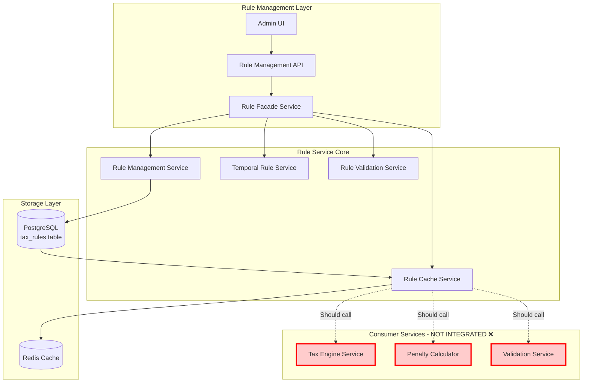
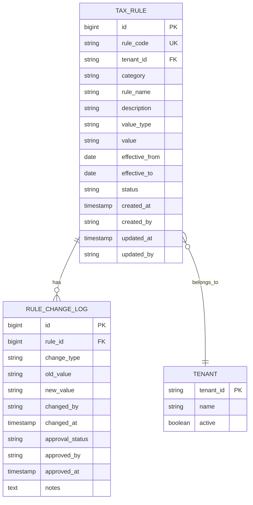
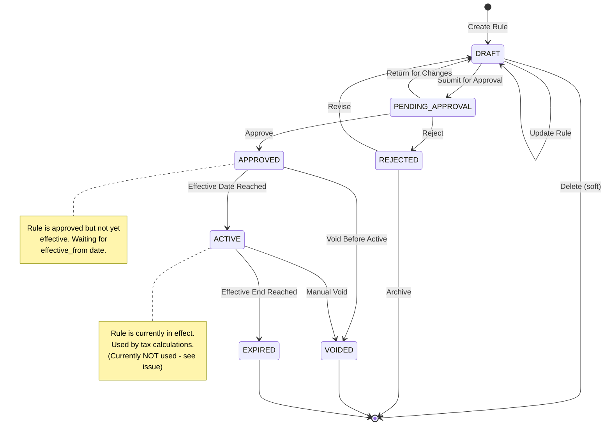
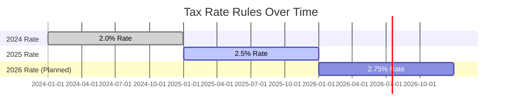
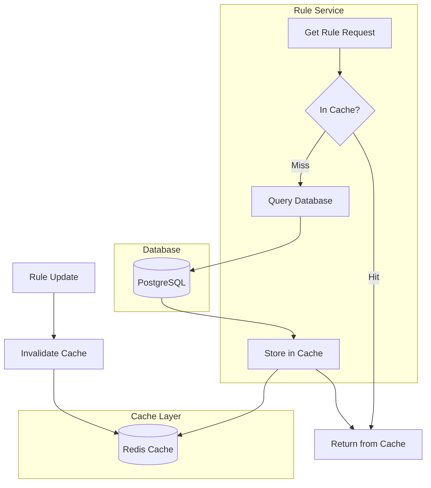
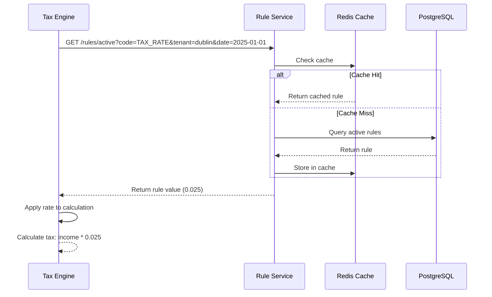
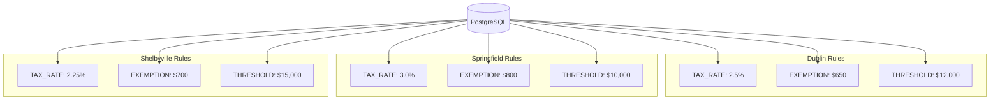
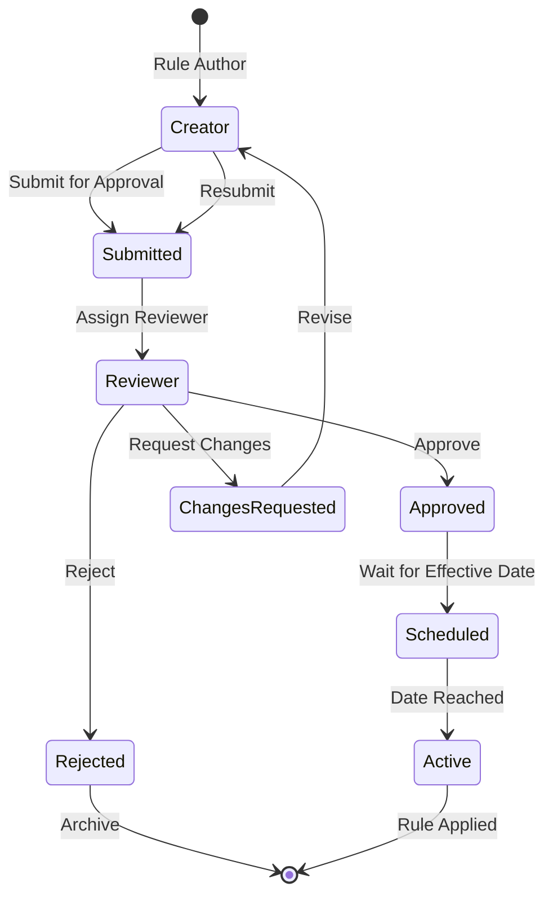
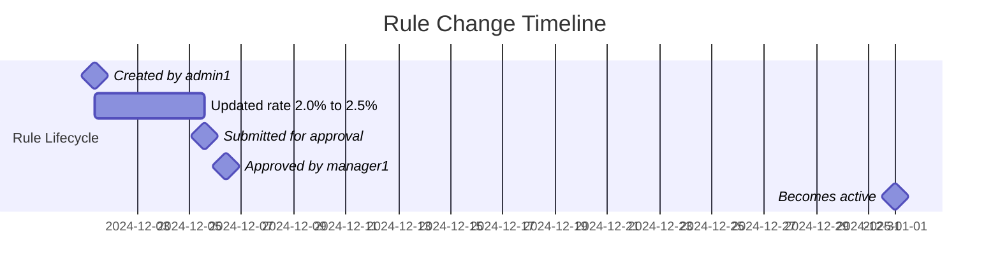

# MuniTax - Rule Flow and Engine Documentation

## Document Overview

**Purpose:** Comprehensive documentation of the Rule Engine architecture, workflow, and integration  
**Date:** December 29, 2025  
**Status:** ⚠️ IMPLEMENTATION INCOMPLETE (see Critical Issues)

---

## Executive Summary

The MuniTax Rule Engine is a dynamic, configurable system designed to manage all tax-related business rules. It supports temporal effective dating, multi-tenant isolation, and approval workflows for rule changes. However, **the Rule Service is currently NOT integrated with tax calculators** - this is a critical architectural issue documented in `15-CRITICAL_FINDINGS.md`.

---

## Rule Engine Architecture

### High-Level Overview



**⚠️ Critical Note:** Red boxes indicate services that should consume rules but currently don't. Tax calculations use hardcoded values instead.

---

## Rule Data Model

### Entity Relationship Diagram



### Tax Rule Entity

```java
@Entity
@Table(name = "tax_rules", uniqueConstraints = {
    @UniqueConstraint(columnNames = {"rule_code", "tenant_id", "effective_from"})
})
public class TaxRule {
    @Id
    @GeneratedValue(strategy = GenerationType.IDENTITY)
    private Long id;
    
    @Column(nullable = false, length = 100)
    private String ruleCode;          // e.g., "TAX_RATE", "EXEMPTION_AMOUNT"
    
    @Column(nullable = false, length = 50)
    private String tenantId;          // Multi-tenant isolation
    
    @Enumerated(EnumType.STRING)
    @Column(nullable = false)
    private RuleCategory category;    // TAX_RATE, EXEMPTION, THRESHOLD, etc.
    
    @Column(nullable = false, length = 200)
    private String ruleName;
    
    @Column(length = 1000)
    private String description;
    
    @Enumerated(EnumType.STRING)
    @Column(nullable = false)
    private RuleValueType valueType;  // DECIMAL, INTEGER, BOOLEAN, STRING
    
    @Column(nullable = false, length = 500)
    private String value;             // Stored as string, parsed by type
    
    @Column(nullable = false)
    private LocalDate effectiveFrom;  // Temporal validity start
    
    @Column
    private LocalDate effectiveTo;    // Temporal validity end (null = forever)
    
    @Enumerated(EnumType.STRING)
    @Column(nullable = false)
    private ApprovalStatus status;    // DRAFT, PENDING_APPROVAL, APPROVED, REJECTED, VOIDED
    
    // Audit fields
    @Column(nullable = false)
    private Instant createdAt;
    
    @Column(nullable = false, length = 100)
    private String createdBy;
    
    @Column
    private Instant updatedAt;
    
    @Column(length = 100)
    private String updatedBy;
    
    @Column(length = 100)
    private String approvedBy;
    
    @Column
    private Instant approvedAt;
}
```

---

## Rule Categories

### Supported Rule Types

```mermaid
graph TB
    RULE[Tax Rule] --> CAT{Category}
    
    CAT --> RATE[TAX_RATE]
    CAT --> EXEMPT[EXEMPTION]
    CAT --> THRESH[THRESHOLD]
    CAT --> CREDIT[CREDIT]
    CAT --> PENALTY[PENALTY]
    CAT --> INTEREST[INTEREST]
    CAT --> FILING[FILING_DEADLINE]
    CAT --> VALIDATE[VALIDATION]
    
    RATE --> RATE1[Individual Tax Rate: 2.5%]
    RATE --> RATE2[Business Tax Rate: 2.0%]
    RATE --> RATE3[Withholding Rate: 2.75%]
    
    EXEMPT --> EXEMPT1[Personal Exemption: $650]
    EXEMPT --> EXEMPT2[Senior Exemption: $1,300]
    EXEMPT --> EXEMPT3[Dependent Exemption: $650]
    
    THRESH --> THRESH1[Filing Threshold: $12,000]
    THRESH --> THRESH2[Senior Approval Limit: $50,000]
    
    CREDIT --> CREDIT1[Resident Credit: 100%]
    CREDIT --> CREDIT2[Non-Resident Credit: 50%]
    
    PENALTY --> PENALTY1[Late Filing: 5% per month]
    PENALTY --> PENALTY2[Underpayment: 0.5% per month]
    
    INTEREST --> INT1[Interest Rate: 4% annual]
    
    FILING --> FILING1[Annual Deadline: April 15]
    FILING --> FILING2[Extension Deadline: October 15]
    
    VALIDATE --> VAL1[Max W-2 Box Diff: 10%]
    VALIDATE --> VAL2[Max Schedule C Loss: $100,000]
```



### Rule Category Definitions

| Category | Purpose | Value Type | Examples |
|----------|---------|------------|----------|
| TAX_RATE | Tax percentage rates | DECIMAL | 0.025 (2.5%) |
| EXEMPTION | Exemption amounts | DECIMAL | 650.00 |
| THRESHOLD | Minimum/maximum limits | DECIMAL | 12000.00 |
| CREDIT | Credit percentages | DECIMAL | 1.0 (100%) |
| PENALTY | Penalty rates | DECIMAL | 0.05 (5%) |
| INTEREST | Interest rates | DECIMAL | 0.04 (4%) |
| FILING_DEADLINE | Important dates | DATE | 2025-04-15 |
| VALIDATION | Validation rules | EXPRESSION | "${w2Box1} < ${w2Box5} * 1.1" |

---

## Rule Lifecycle

### State Machine



### Lifecycle Operations

#### 1. Create Rule

```java
@PostMapping("/")
public ResponseEntity<RuleResponse> createRule(
    @Valid @RequestBody CreateRuleRequest request,
    @RequestHeader("X-User-Id") String userId
) {
    RuleResponse rule = ruleFacadeService.createRule(request, userId);
    return ResponseEntity.status(HttpStatus.CREATED).body(rule);
}
```

**Request:**
```json
{
  "ruleCode": "TAX_RATE_INDIVIDUAL_2025",
  "tenantId": "dublin",
  "category": "TAX_RATE",
  "ruleName": "Individual Tax Rate 2025",
  "description": "Standard individual income tax rate for 2025",
  "valueType": "DECIMAL",
  "value": "0.025",
  "effectiveFrom": "2025-01-01",
  "effectiveTo": "2025-12-31"
}
```

**Validations:**
- Rule code is unique for tenant and date range
- Effective dates are valid
- Value matches value type
- User has CREATE_RULE permission

#### 2. Update Rule

```java
@PutMapping("/{id}")
public ResponseEntity<RuleResponse> updateRule(
    @PathVariable Long id,
    @Valid @RequestBody UpdateRuleRequest request,
    @RequestHeader("X-User-Id") String userId
) {
    RuleResponse rule = ruleFacadeService.updateRule(id, request, userId);
    return ResponseEntity.ok(rule);
}
```

**Business Rules:**
- Can only update rules in DRAFT status
- Updates create change log entry
- Approved rules cannot be modified (must void and recreate)

#### 3. Approve Rule

```java
@PostMapping("/{id}/approve")
public ResponseEntity<RuleResponse> approveRule(
    @PathVariable Long id,
    @RequestHeader("X-User-Id") String approverId,
    @RequestBody(required = false) ApprovalRequest request
) {
    RuleResponse rule = ruleFacadeService.approveRule(id, approverId, 
        request != null ? request.getNotes() : null);
    return ResponseEntity.ok(rule);
}
```

**Requirements:**
- User has APPROVE_RULE permission
- Rule is in PENDING_APPROVAL status
- Approver cannot be creator (separation of duties)
- Approval notes are required

#### 4. Void Rule

```java
@PostMapping("/{id}/void")
public ResponseEntity<Void> voidRule(
    @PathVariable Long id,
    @RequestHeader("X-User-Id") String userId,
    @RequestBody VoidRuleRequest request
) {
    ruleFacadeService.voidRule(id, userId, request.getReason());
    return ResponseEntity.noContent().build();
}
```

**Effect:**
- Sets status to VOIDED
- Sets effectiveTo to current date
- Creates audit log entry
- Invalidates cache
- Rule becomes inactive immediately

---

## Temporal Rule Management

### Time-Based Rule Resolution

The Rule Engine supports temporal (time-based) rule validity, allowing different rules to be active at different times.



### Rule Resolution Algorithm

```java
public Optional<TaxRule> getActiveRuleByCode(
    String ruleCode, 
    String tenantId, 
    LocalDate asOfDate
) {
    return ruleRepository.findByRuleCodeAndTenantIdAndStatusAndEffectiveDates(
        ruleCode,
        tenantId,
        ApprovalStatus.APPROVED,
        asOfDate
    )
    .stream()
    .filter(rule -> isEffectiveOnDate(rule, asOfDate))
    .findFirst();
}

private boolean isEffectiveOnDate(TaxRule rule, LocalDate date) {
    boolean afterStart = !date.isBefore(rule.getEffectiveFrom());
    boolean beforeEnd = rule.getEffectiveTo() == null || 
                        !date.isAfter(rule.getEffectiveTo());
    return afterStart && beforeEnd;
}
```

### Query Examples

#### Get Current Tax Rate

```java
// Get tax rate as of today
Optional<TaxRule> currentRate = temporalRuleService.getActiveRuleByCode(
    "TAX_RATE_INDIVIDUAL",
    "dublin",
    LocalDate.now()
);

BigDecimal rate = currentRate
    .map(rule -> new BigDecimal(rule.getValue()))
    .orElse(DEFAULT_TAX_RATE);
```

#### Get Historical Rate

```java
// Get tax rate as of January 1, 2023
Optional<TaxRule> historicalRate = temporalRuleService.getActiveRuleByCode(
    "TAX_RATE_INDIVIDUAL",
    "dublin",
    LocalDate.of(2023, 1, 1)
);
```

#### Get Future Rate

```java
// Get planned rate for next year
Optional<TaxRule> futureRate = temporalRuleService.getActiveRuleByCode(
    "TAX_RATE_INDIVIDUAL",
    "dublin",
    LocalDate.of(2026, 1, 1)
);
```

#### Get Rule History

```java
// Get all versions of a rule
List<TaxRule> history = temporalRuleService.getHistoricalRules(
    "TAX_RATE_INDIVIDUAL",
    "dublin"
);
// Returns: [2024 version, 2025 version, 2026 version]
```

---

## Rule Caching Strategy

### Cache Architecture



### Cache Keys

```
Pattern: rule:{tenantId}:{ruleCode}:{date}
Example: rule:dublin:TAX_RATE_INDIVIDUAL:2025-01-01

Pattern: rule:active:{tenantId}:{category}:{date}
Example: rule:active:dublin:TAX_RATE:2025-01-01
```

### Cache TTL

| Cache Type | TTL | Reason |
|------------|-----|--------|
| Active Rules | 1 hour | Frequently accessed, rarely change |
| Future Rules | 24 hours | Planning data, change infrequently |
| Historical Rules | Indefinite | Never change once expired |
| Rule List | 5 minutes | Changes frequently during admin |

### Cache Invalidation

```java
@Service
public class RuleCacheService {
    
    @CacheEvict(value = "rules", allEntries = true)
    public void invalidateAllRules() {
        // Clear all cached rules
    }
    
    @CacheEvict(value = "rules", key = "#tenantId + ':' + #ruleCode")
    public void invalidateRule(String tenantId, String ruleCode) {
        // Clear specific rule from cache
    }
    
    @CacheEvict(value = "rules", key = "#tenantId + ':*'")
    public void invalidateTenantRules(String tenantId) {
        // Clear all rules for a tenant
    }
}
```

---

## Rule Integration Flow (Expected vs. Current)

### Expected Integration Flow ✅



### Current Flow (Broken) ❌

```mermaid
sequenceDiagram
    participant Tax as Tax Engine
    participant Rule as Rule Service (Unused)
    participant Cache as Redis Cache (Unused)
    participant DB as PostgreSQL (Unused)

    Tax->>Tax: Use hardcoded rate
    Tax->>Tax: BigDecimal rate = new BigDecimal("0.025")
    Tax->>Tax: Calculate tax: income * 0.025
    
    Note over Rule,DB: Rule Service exists but<br/>is never called!
    
    style Rule fill:#ffcccc
    style Cache fill:#ffcccc
    style DB fill:#ffcccc
```

**⚠️ This is the critical issue documented in CRITICAL-001 of the Critical Findings document.**

---

## Rule Service API Reference

### Create Rule

**Endpoint:** `POST /api/rules`

**Request Body:**
```json
{
  "ruleCode": "TAX_RATE_INDIVIDUAL_2025",
  "tenantId": "dublin",
  "category": "TAX_RATE",
  "ruleName": "Individual Tax Rate 2025",
  "description": "Standard individual income tax rate for 2025",
  "valueType": "DECIMAL",
  "value": "0.025",
  "effectiveFrom": "2025-01-01",
  "effectiveTo": "2025-12-31"
}
```

**Response:** `201 Created`
```json
{
  "id": 123,
  "ruleCode": "TAX_RATE_INDIVIDUAL_2025",
  "tenantId": "dublin",
  "category": "TAX_RATE",
  "ruleName": "Individual Tax Rate 2025",
  "description": "Standard individual income tax rate for 2025",
  "valueType": "DECIMAL",
  "value": "0.025",
  "effectiveFrom": "2025-01-01",
  "effectiveTo": "2025-12-31",
  "status": "DRAFT",
  "createdAt": "2024-12-29T10:00:00Z",
  "createdBy": "admin@dublin.gov"
}
```

---

### Get Active Rules

**Endpoint:** `GET /api/rules/active`

**Query Parameters:**
- `tenantId` (required): Tenant identifier
- `category` (optional): Rule category filter
- `asOfDate` (optional): Date for temporal query (default: today)
- `entityType` (optional): Entity type filter

**Example:**
```
GET /api/rules/active?tenantId=dublin&category=TAX_RATE&asOfDate=2025-01-01
```

**Response:** `200 OK`
```json
{
  "rules": [
    {
      "id": 123,
      "ruleCode": "TAX_RATE_INDIVIDUAL_2025",
      "category": "TAX_RATE",
      "value": "0.025",
      "effectiveFrom": "2025-01-01",
      "effectiveTo": "2025-12-31"
    },
    {
      "id": 124,
      "ruleCode": "TAX_RATE_BUSINESS_2025",
      "category": "TAX_RATE",
      "value": "0.020",
      "effectiveFrom": "2025-01-01",
      "effectiveTo": "2025-12-31"
    }
  ],
  "asOfDate": "2025-01-01",
  "totalCount": 2
}
```

---

### Get Rule History

**Endpoint:** `GET /api/rules/{ruleCode}/history`

**Query Parameters:**
- `tenantId` (required): Tenant identifier

**Example:**
```
GET /api/rules/TAX_RATE_INDIVIDUAL/history?tenantId=dublin
```

**Response:** `200 OK`
```json
{
  "ruleCode": "TAX_RATE_INDIVIDUAL",
  "tenantId": "dublin",
  "versions": [
    {
      "version": 1,
      "value": "0.020",
      "effectiveFrom": "2024-01-01",
      "effectiveTo": "2024-12-31",
      "status": "EXPIRED"
    },
    {
      "version": 2,
      "value": "0.025",
      "effectiveFrom": "2025-01-01",
      "effectiveTo": "2025-12-31",
      "status": "ACTIVE"
    },
    {
      "version": 3,
      "value": "0.0275",
      "effectiveFrom": "2026-01-01",
      "effectiveTo": null,
      "status": "APPROVED"
    }
  ]
}
```

---

### Approve Rule

**Endpoint:** `POST /api/rules/{id}/approve`

**Request Body:**
```json
{
  "notes": "Approved based on city council resolution 2024-123"
}
```

**Response:** `200 OK`
```json
{
  "id": 123,
  "status": "APPROVED",
  "approvedBy": "supervisor@dublin.gov",
  "approvedAt": "2024-12-29T14:30:00Z",
  "notes": "Approved based on city council resolution 2024-123"
}
```

---

## Multi-Tenant Isolation

### Tenant-Specific Rules

Each rule is isolated by `tenantId`, ensuring complete data separation between municipalities.



### Tenant Isolation Enforcement

```java
@Repository
public interface TaxRuleRepository extends JpaRepository<TaxRule, Long> {
    
    // Tenant filter is ALWAYS required
    List<TaxRule> findByTenantIdAndStatus(
        String tenantId, 
        ApprovalStatus status
    );
    
    // Cannot query across tenants
    @Query("SELECT r FROM TaxRule r WHERE r.tenantId = :tenantId " +
           "AND r.ruleCode = :ruleCode " +
           "AND r.effectiveFrom <= :date " +
           "AND (r.effectiveTo IS NULL OR r.effectiveTo >= :date)")
    Optional<TaxRule> findActiveRule(
        @Param("tenantId") String tenantId,
        @Param("ruleCode") String ruleCode,
        @Param("date") LocalDate date
    );
}
```

---

## Rule Approval Workflow

### Approval Process



### Separation of Duties

**Rule:** Creator cannot approve their own rules

```java
public RuleResponse approveRule(Long id, String approverId, String notes) {
    TaxRule rule = ruleRepository.findById(id)
        .orElseThrow(() -> new RuleNotFoundException(id));
    
    // Enforce separation of duties
    if (rule.getCreatedBy().equals(approverId)) {
        throw new ApprovalException(
            "Cannot approve own rule. Separation of duties required."
        );
    }
    
    // Continue with approval...
}
```

### Approval Permissions

| Role | Create | Submit | Approve | Void |
|------|--------|--------|---------|------|
| RULE_ADMIN | ✅ | ✅ | ❌ | ❌ |
| RULE_MANAGER | ✅ | ✅ | ✅ | ✅ |
| SUPERVISOR | ❌ | ❌ | ✅ | ✅ |
| MANAGER | ❌ | ❌ | ✅ | ✅ |

---

## Rule Change Audit Trail

### Change Log Schema

```java
@Entity
@Table(name = "rule_change_log")
public class RuleChangeLog {
    @Id
    @GeneratedValue(strategy = GenerationType.IDENTITY)
    private Long id;
    
    @Column(nullable = false)
    private Long ruleId;
    
    @Enumerated(EnumType.STRING)
    @Column(nullable = false)
    private ChangeType changeType;  // CREATE, UPDATE, APPROVE, REJECT, VOID
    
    @Column(columnDefinition = "TEXT")
    private String oldValue;
    
    @Column(columnDefinition = "TEXT")
    private String newValue;
    
    @Column(nullable = false)
    private String changedBy;
    
    @Column(nullable = false)
    private Instant changedAt;
    
    @Enumerated(EnumType.STRING)
    private ApprovalStatus approvalStatus;
    
    @Column
    private String approvedBy;
    
    @Column
    private Instant approvedAt;
    
    @Column(columnDefinition = "TEXT")
    private String notes;
}
```

### Change Tracking Example



---

## Built-in Rules Catalog

### Tax Rate Rules

| Rule Code | Category | Default Value | Tenant | Effective |
|-----------|----------|---------------|--------|-----------|
| TAX_RATE_INDIVIDUAL | TAX_RATE | 0.025 (2.5%) | dublin | 2025-01-01 |
| TAX_RATE_BUSINESS | TAX_RATE | 0.020 (2.0%) | dublin | 2025-01-01 |
| TAX_RATE_WITHHOLDING | TAX_RATE | 0.0275 (2.75%) | dublin | 2025-01-01 |

### Exemption Rules

| Rule Code | Category | Default Value | Tenant | Effective |
|-----------|----------|---------------|--------|-----------|
| EXEMPTION_PERSONAL | EXEMPTION | 650.00 | dublin | 2025-01-01 |
| EXEMPTION_SENIOR | EXEMPTION | 1300.00 | dublin | 2025-01-01 |
| EXEMPTION_DEPENDENT | EXEMPTION | 650.00 | dublin | 2025-01-01 |

### Threshold Rules

| Rule Code | Category | Default Value | Tenant | Effective |
|-----------|----------|---------------|--------|-----------|
| FILING_THRESHOLD | THRESHOLD | 12000.00 | dublin | 2025-01-01 |
| SENIOR_APPROVAL_LIMIT | THRESHOLD | 50000.00 | dublin | 2025-01-01 |
| SMALL_BUSINESS_LIMIT | THRESHOLD | 100000.00 | dublin | 2025-01-01 |

### Credit Rules

| Rule Code | Category | Default Value | Tenant | Effective |
|-----------|----------|---------------|--------|-----------|
| RESIDENT_CREDIT_PCT | CREDIT | 1.0 (100%) | dublin | 2025-01-01 |
| NONRESIDENT_CREDIT_PCT | CREDIT | 0.5 (50%) | dublin | 2025-01-01 |
| PART_YEAR_PRORATE | CREDIT | true | dublin | 2025-01-01 |

---

## Known Issues and Limitations

### 🔴 CRITICAL: Rule Service Not Integrated

**Issue:** Rule Service exists but is not called by tax calculators  
**Impact:** All rules are stored but never applied  
**Status:** Open  
**Priority:** P0 - Production blocker  
**Details:** See `15-CRITICAL_FINDINGS.md`, issue CRITICAL-001

### Database Schema Issue

**Issue:** `tax_rules` table not created in local Docker postgres  
**Impact:** Rule Service connects to external cloud DB instead  
**Status:** Open  
**Priority:** P1 - Development blocker

### Missing Features

1. **Rule Expressions** - Complex rules with formulas not supported
2. **Rule Dependencies** - No dependency management between rules
3. **Rule Testing** - No sandbox environment for testing rule changes
4. **Rule Rollback** - Cannot easily rollback to previous rule version
5. **Bulk Import** - No CSV import for rule setup

---

## Future Enhancements

### Phase 1: Integration (Priority: P0)
- [ ] Integrate Rule Service with Tax Engine
- [ ] Remove hardcoded values from calculators
- [ ] Add integration tests
- [ ] Performance testing

### Phase 2: Advanced Features (Priority: P1)
- [ ] Rule expression engine (SpEL or similar)
- [ ] Rule dependency management
- [ ] Rule testing sandbox
- [ ] Rule versioning and rollback
- [ ] Bulk import/export

### Phase 3: Intelligence (Priority: P2)
- [ ] Rule conflict detection
- [ ] Rule impact analysis
- [ ] AI-powered rule suggestions
- [ ] Predictive rule adjustment

---

## Best Practices

### Creating Rules

1. **Use Descriptive Codes**
   ```
   Good: TAX_RATE_INDIVIDUAL_2025
   Bad: TR1
   ```

2. **Include Effective Dates**
   - Always set `effectiveFrom`
   - Use `effectiveTo` for temporary rules
   - Plan future rules in advance

3. **Document Changes**
   - Add detailed descriptions
   - Include rationale in approval notes
   - Reference source (e.g., city council resolution)

### Rule Maintenance

1. **Review Periodically**
   - Quarterly review of active rules
   - Annual review of all rules
   - Remove obsolete rules

2. **Test Before Approval**
   - Verify value formats
   - Check date ranges
   - Test with sample calculations

3. **Version Control**
   - Never modify approved rules
   - Create new version instead
   - Maintain change history

### Security

1. **Principle of Least Privilege**
   - Restrict rule creation to admins
   - Require approval for activation
   - Audit all rule changes

2. **Data Integrity**
   - Validate all inputs
   - Enforce referential integrity
   - Prevent unauthorized modifications

---

## Troubleshooting

### Rule Not Applied

**Symptom:** Tax calculation not using expected rule  
**Cause:** Rule Service not integrated with Tax Engine  
**Resolution:** See CRITICAL-001 in Critical Findings

### Cache Issues

**Symptom:** Old rule values still being used  
**Resolution:**
```bash
# Clear Redis cache
redis-cli FLUSHDB

# Or restart Rule Service
```

### Date Range Conflicts

**Symptom:** Multiple active rules for same code and date  
**Resolution:**
- Check `effectiveTo` dates
- Ensure no overlaps
- Use temporal query to verify

---

## Document History

| Version | Date | Changes | Author |
|---------|------|---------|--------|
| 1.0 | 2025-12-29 | Initial rule flow documentation | Documentation Team |

---

## Related Documents

- `00-PROJECT_README.md` - Overall project documentation
- `01-ARCHITECTURE.md` - System architecture
- `09-TAX_ENGINE.md` - Tax engine documentation
- `15-CRITICAL_FINDINGS.md` - Critical issues (especially CRITICAL-001)

---

**Document Status:** ✅ Complete  
**Last Updated:** December 29, 2025  
**Maintained By:** Rule Engine Team
