# MuniTax - Critical Findings and Issues

## Document Overview

**Purpose:** Comprehensive catalog of critical issues, production blockers, and technical debt  
**Date:** December 29, 2025  
**Status:** 🔴 CRITICAL ISSUES PRESENT  
**Priority:** IMMEDIATE ATTENTION REQUIRED

---

## Executive Summary

This document catalogs critical architectural issues, production blockers, and security concerns discovered in the MuniTax system. While the system demonstrates strong technical architecture (80% complete), several critical issues prevent production deployment.

### Issue Summary by Severity

| Severity | Count | Status |
|----------|-------|--------|
| 🔴 CRITICAL | 5 | Open |
| 🟠 HIGH | 8 | Open |
| 🟡 MEDIUM | 12 | Open |
| 🔵 LOW | 7 | Open |

---

## 🔴 CRITICAL ISSUES (Production Blockers)

### CRITICAL-001: Rule Service Integration Disconnect

**Severity:** 🔴 CRITICAL  
**Impact:** HIGH - Core functionality broken  
**Discovered:** Architectural Review  
**Status:** Open

#### Problem Description

The Rule Service is **NOT integrated** with tax calculators. While rules can be created, approved, and stored in the database, they are **never applied during tax calculations**. Tax rates and rules are **hardcoded** in the tax engine services.


#### Affected Components

1. **IndividualTaxCalculator.java**
   - Location: `backend/tax-engine-service/src/main/java/com/munitax/taxengine/service/`
   - Issue: Hardcoded tax rates (2.5% default)
   - Lines: Tax rate calculations

2. **BusinessTaxCalculator.java**
   - Location: `backend/tax-engine-service/src/main/java/com/munitax/taxengine/service/`
   - Issue: Hardcoded tax rates and rules
   - Lines: Business tax calculations

3. **RuleServiceIntegration.java**
   - Location: `backend/tax-engine-service/src/main/java/com/munitax/taxengine/integration/`
   - Issue: Integration exists but is never called
   - Status: Dead code

#### Evidence

```java
// From IndividualTaxCalculator.java
// HARDCODED TAX RATE - Rule Service not used
private static final BigDecimal DEFAULT_TAX_RATE = new BigDecimal("0.025");

// Should be:
// BigDecimal taxRate = ruleService.getActiveRate(tenantId, taxYear);
```

#### Impact

- **Functional Impact:** Cannot use dynamic tax rules
- **Business Impact:** Municipality cannot change tax rates without code deployment
- **Compliance Impact:** May violate regulatory requirements for rate transparency
- **Operational Impact:** Requires code changes for every rate adjustment

#### Root Cause Analysis


**Root Causes:**
1. Services developed by different teams/times
2. Missing integration acceptance criteria
3. No end-to-end integration tests
4. Incomplete architectural review

#### Remediation Steps

**Phase 1: Integration (2-3 weeks)**

1. **Update Tax Engine to call Rule Service**
   ```java
   // Add to TaxEngineService
   @Autowired
   private RuleServiceClient ruleServiceClient;
   
   public BigDecimal getTaxRate(String tenantId, String taxYear) {
       return ruleServiceClient.getActiveRule("TAX_RATE", tenantId, taxYear)
           .map(rule -> new BigDecimal(rule.getValue()))
           .orElse(DEFAULT_TAX_RATE);
   }
   ```

2. **Remove hardcoded values**
   - Replace all `DEFAULT_TAX_RATE` with dynamic lookup
   - Replace hardcoded exemption amounts
   - Replace hardcoded thresholds

3. **Add integration tests**
   ```java
   @Test
   public void testTaxCalculationUsesRuleService() {
       // Mock rule service response
       // Call tax calculation
       // Verify rule service was called
       // Verify correct rate applied
   }
   ```

**Phase 2: Database Schema (1 week)**

4. **Create tax_rules table in local postgres**
   ```sql
   CREATE TABLE tax_rules (
       id BIGSERIAL PRIMARY KEY,
       rule_code VARCHAR(100) NOT NULL,
       tenant_id VARCHAR(50) NOT NULL,
       value VARCHAR(500) NOT NULL,
       effective_from DATE NOT NULL,
       effective_to DATE,
       status VARCHAR(20) NOT NULL,
       -- additional columns
   );
   ```

5. **Migrate Rule Service to local DB**
   - Update connection strings
   - Test data migration
   - Verify rule retrieval

**Phase 3: Testing & Validation (1 week)**

6. **Integration testing**
   - Test all tax calculation paths
   - Verify dynamic rate application
   - Test rate changes without deployment

7. **Regression testing**
   - Ensure existing calculations still work
   - Verify no performance degradation

**Priority:** P0 - Must fix before production  
**Estimated Effort:** 4-5 weeks  
**Dependencies:** None  
**Risk:** HIGH if not addressed

---

### CRITICAL-002: Missing Payment Integration

**Severity:** 🔴 CRITICAL  
**Impact:** HIGH - Revenue collection blocked  
**Status:** Open

#### Problem Description

Only TEST mode payment processing is implemented. Real payment integration with Stripe, PayPal, or bank ACH is missing. System cannot collect actual tax payments.

#### Missing Functionality

```mermaid
flowchart TB
    START[Tax Calculated] --> BALANCE{Balance Due?}
    BALANCE -->|Yes| MISSING[🔴 Real Payment Gateway]
    BALANCE -->|No| SUBMIT[Submit Return]
    
    MISSING -.->|Not Implemented| FAIL[Cannot Collect Payment]
    
    style MISSING fill:#ff0000,color:#fff
    style FAIL fill:#ff0000,color:#fff
```



**Current State:**
- Mock payment service only
- Simulated transactions
- No real money movement
- Test mode flag always true

**Required State:**
- Stripe/PayPal integration
- ACH bank transfers
- Credit card processing
- PCI compliance
- Payment confirmation emails
- Receipt generation

#### Impact

- **Business Critical:** Cannot collect tax revenue
- **Compliance:** May violate payment requirements
- **User Experience:** Cannot complete tax filing

#### Remediation

1. **Select payment gateway** (Stripe recommended)
2. **Obtain PCI compliance certification**
3. **Implement payment integration**
   - Card payments (Stripe Elements)
   - ACH bank transfers
   - Payment plans
4. **Add receipt generation**
5. **Email confirmations**
6. **Payment reconciliation**

**Estimated Effort:** 6-8 weeks  
**Priority:** P0 - Production blocker

---

### CRITICAL-003: Missing Refund Processing Workflow

**Severity:** 🔴 CRITICAL  
**Impact:** HIGH - Cannot process refunds  
**Status:** Open

#### Problem Description

No workflow exists to process tax refunds when taxpayers overpay. System calculates refund amounts but has no mechanism to disburse them.

#### Missing Components

1. **Bank Account Collection**
   - No UI to collect routing/account numbers
   - No validation of bank details
   - No ACH authorization

2. **Refund Disbursement**
   - No integration with banking system
   - No check printing capability
   - No direct deposit processing

3. **Refund Tracking**
   - No status tracking (pending, sent, cleared)
   - No refund history
   - No notifications

#### Required Workflow


#### Remediation

1. **Bank account collection UI**
2. **Bank account validation API**
3. **ACH integration (Plaid or similar)**
4. **Refund queue and processing**
5. **Status tracking dashboard**
6. **Notification system**

**Estimated Effort:** 4-6 weeks  
**Priority:** P0 - Production blocker

---

### CRITICAL-004: No Official Tax Form Generation

**Severity:** 🔴 CRITICAL  
**Impact:** HIGH - Compliance issue  
**Status:** Open

#### Problem Description

System lacks ability to generate official Dublin municipal tax forms (1040-D, Form R variations). Taxpayers and auditors need official forms for records and IRS submission.

#### Missing Forms

1. **Individual Forms**
   - 1040-D (Dublin Individual Tax Return)
   - Schedule D-C (Business Income)
   - Schedule D-E (Rental Income)
   - Schedule D-Y (Tax Credits)

2. **Business Forms**
   - Form R-1 (Withholding Return)
   - Form R-27 (Net Profits)
   - Form R-3 (W-3 Reconciliation)

3. **Supporting Documents**
   - Filing receipts
   - Payment confirmations
   - Amendment forms

#### Compliance Requirements

- IRS-compliant form layouts
- Barcodes for processing
- Official Dublin logo and formatting
- Wet signature support
- Form versioning (year-specific)

#### Remediation

1. **Design official form templates**
2. **Implement PDF form generation**
3. **Add form filling from submission data**
4. **Barcode generation**
5. **Form validation**
6. **Versioning system**

**Estimated Effort:** 6-8 weeks  
**Priority:** P0 - Compliance requirement

---

### CRITICAL-005: Missing Audit Trail Completeness

**Severity:** 🔴 CRITICAL  
**Impact:** HIGH - Compliance and legal risk  
**Status:** Partial Implementation

#### Problem Description

Audit trail exists but is incomplete. Not all actions are logged, and some logs lack required details for compliance (IRS requires 7+ year retention with complete history).

#### Missing Audit Events

1. **User Actions Not Logged**
   - Password changes
   - Email verification
   - Profile updates
   - API key changes

2. **System Events Not Logged**
   - Automated calculations
   - Scheduled jobs
   - Rate changes
   - Configuration updates

3. **Missing Audit Details**
   - IP addresses
   - User agent strings
   - Request payloads (before/after)
   - Failure reasons

#### Current vs Required

| Event | Currently Logged | Required Details |
|-------|-----------------|------------------|
| Login | ✅ Yes | ❌ Missing IP, device |
| Submission | ✅ Yes | ⚠️ Incomplete payload |
| Approval | ✅ Yes | ✅ Complete |
| Rejection | ✅ Yes | ✅ Complete |
| Calculation | ❌ No | ❌ Not logged |
| Rule Change | ⚠️ Partial | ❌ Missing full diff |
| Payment | ✅ Yes | ⚠️ Missing card details |

#### Remediation

1. **Complete audit event catalog**
2. **Enhance audit log schema**
   - Add IP address
   - Add user agent
   - Add request/response
   - Add failure details

3. **Implement missing event logging**
4. **Add audit log search UI**
5. **Implement 7-year retention policy**
6. **Add audit log export**

**Estimated Effort:** 3-4 weeks  
**Priority:** P0 - Compliance requirement

---

## 🟠 HIGH PRIORITY ISSUES

### HIGH-001: No Email Notification System

**Severity:** 🟠 HIGH  
**Impact:** MEDIUM - Poor user experience  
**Status:** Open

#### Problem Description

Email notification service exists in code but is not fully implemented. Users don't receive confirmations, reminders, or alerts.

#### Missing Notifications

1. **User Actions**
   - Registration confirmation
   - Password reset
   - Email verification
   - Login alerts (new device)

2. **Filing Process**
   - Submission confirmation
   - Calculation complete
   - Payment received
   - Refund processed

3. **Auditor Workflow**
   - New assignment
   - Document request
   - Approval/rejection
   - Deadline reminders

#### Required Implementation


#### Remediation

1. **Configure SMTP server** (SendGrid, AWS SES)
2. **Create email templates**
3. **Implement notification triggers**
4. **Add delivery tracking**
5. **Add user notification preferences**

**Estimated Effort:** 2-3 weeks  
**Priority:** P1 - Important for UX

---

### HIGH-002: No Mobile Optimization

**Severity:** 🟠 HIGH  
**Impact:** MEDIUM - Accessibility issue  
**Status:** Open

#### Problem Description

UI is desktop-only. No responsive design for mobile devices. Modern users expect mobile access.

#### Issues

- Fixed-width layouts
- Small touch targets
- Unreadable text on small screens
- No mobile navigation
- PDF viewer not mobile-friendly

#### Remediation

1. **Implement responsive breakpoints**
2. **Mobile-first navigation**
3. **Touch-friendly controls**
4. **Mobile PDF viewer**
5. **Progressive Web App (PWA) features**

**Estimated Effort:** 4-6 weeks  
**Priority:** P1 - User accessibility

---

### HIGH-003: Missing Help System and Tooltips

**Severity:** 🟠 HIGH  
**Impact:** MEDIUM - User confusion  
**Status:** Open

#### Problem Description

Complex tax terminology is not explained. No contextual help, tooltips, or documentation for users.

#### Missing Features

1. **Inline Help**
   - Field tooltips
   - Term definitions
   - Example values

2. **Help Center**
   - Tax glossary
   - Video tutorials
   - FAQ section
   - Contact support

3. **Guided Workflows**
   - Step-by-step wizards
   - Progress indicators
   - Required field indicators

#### Remediation

1. **Add tooltip component**
2. **Create tax glossary**
3. **Add help icons to forms**
4. **Build help center**
5. **Video tutorial library**

**Estimated Effort:** 3-4 weeks  
**Priority:** P1 - User experience

---

### HIGH-004: No Data Import/Export Capability

**Severity:** 🟠 HIGH  
**Impact:** MEDIUM - Limited utility  
**Status:** Open

#### Problem Description

Users cannot import data from previous years or other systems. Cannot export data for backup or migration.

#### Missing Features

- CSV import for bulk W-2 data
- Prior year data import
- Export to Excel/CSV
- Backup download
- Data migration tools

#### Remediation

1. **CSV import parser**
2. **Data validation rules**
3. **Export functionality**
4. **Bulk upload UI**
5. **Import error handling**

**Estimated Effort:** 3-4 weeks  
**Priority:** P1 - User convenience

---

### HIGH-005: Incomplete Error Handling and Validation

**Severity:** 🟠 HIGH  
**Impact:** MEDIUM - Data quality issues  
**Status:** Partial Implementation

#### Problem Description

Silent failures and unclear error messages. Validation exists but feedback is poor.

#### Issues

1. **Silent Failures**
   - API errors not displayed
   - Validation failures hidden
   - Network errors unclear

2. **Poor Error Messages**
   - Generic "Something went wrong"
   - No actionable guidance
   - No error codes

3. **Missing Validation**
   - Business rule validation incomplete
   - Cross-field validation missing
   - Date range validation weak

#### Remediation

1. **Comprehensive error taxonomy**
2. **User-friendly error messages**
3. **Error recovery suggestions**
4. **Complete validation rules**
5. **Error logging and monitoring**

**Estimated Effort:** 2-3 weeks  
**Priority:** P1 - Data quality

---

### HIGH-006: No Performance Monitoring

**Severity:** 🟠 HIGH  
**Impact:** MEDIUM - Operational blind spot  
**Status:** Open

#### Problem Description

No monitoring of system performance, response times, or resource usage. Cannot detect performance degradation.

#### Missing Capabilities

- Application performance monitoring (APM)
- Response time tracking
- Error rate monitoring
- Resource usage alerts
- User experience metrics

#### Remediation

1. **Implement APM tool** (New Relic, DataDog)
2. **Add custom metrics**
3. **Set up alerting**
4. **Create dashboards**
5. **Performance budgets**

**Estimated Effort:** 2-3 weeks  
**Priority:** P1 - Operational visibility

---

### HIGH-007: Missing Backup and Disaster Recovery

**Severity:** 🟠 HIGH  
**Impact:** HIGH - Data loss risk  
**Status:** Open

#### Problem Description

No automated backup strategy. No disaster recovery plan. Data loss risk is unacceptable for tax system.

#### Missing Components

1. **Database Backups**
   - No automated backup schedule
   - No backup verification
   - No retention policy

2. **Disaster Recovery**
   - No recovery time objective (RTO)
   - No recovery point objective (RPO)
   - No failover capability

3. **Data Archival**
   - No long-term storage (7+ years)
   - No compliance-compliant archival

#### Remediation

1. **Automated daily backups**
2. **Off-site backup storage**
3. **Backup testing schedule**
4. **Disaster recovery plan**
5. **Hot standby database**
6. **Data archival solution**

**Estimated Effort:** 3-4 weeks  
**Priority:** P0 - Data protection (upgrade from P1)

---

### HIGH-008: Security Vulnerabilities

**Severity:** 🟠 HIGH  
**Impact:** HIGH - Security risk  
**Status:** Partial Mitigation

#### Problem Description

Several security concerns identified in code review and architecture analysis.

#### Identified Issues

1. **Input Sanitization**
   - Some endpoints lack input validation
   - Potential SQL injection vectors
   - XSS vulnerability in error messages

2. **Authentication**
   - JWT secrets in environment variables
   - No token rotation
   - Session management issues

3. **Authorization**
   - Some endpoints bypass role checks
   - Privilege escalation possible
   - Missing tenant isolation checks

4. **Data Protection**
   - PII not always masked in logs
   - Sensitive data in error responses
   - Missing encryption at rest

#### Remediation

1. **Security audit by external firm**
2. **Implement OWASP Top 10 protections**
3. **Add input sanitization library**
4. **JWT secret rotation**
5. **Authorization framework**
6. **Data masking in logs**
7. **Encryption at rest**

**Estimated Effort:** 6-8 weeks  
**Priority:** P0 - Security critical (upgrade)

---

## 🟡 MEDIUM PRIORITY ISSUES

### MEDIUM-001: No Filing Progress Tracker

**Severity:** 🟡 MEDIUM  
**Impact:** LOW - UX improvement  
**Status:** Open

**Problem:** Users don't know completion status  
**Impact:** Higher abandonment rates  
**Solution:** Add progress bar and checklist  
**Effort:** 1-2 weeks

---

### MEDIUM-002: No Save Drafts Reminder

**Severity:** 🟡 MEDIUM  
**Impact:** LOW - Data loss risk  
**Status:** Open

**Problem:** Users may lose unsaved work  
**Impact:** Frustration, rework  
**Solution:** Auto-save and save reminders  
**Effort:** 1 week

---

### MEDIUM-003: Missing Advanced Search in Auditor Queue

**Severity:** 🟡 MEDIUM  
**Impact:** LOW - Productivity issue  
**Status:** Open

**Problem:** Cannot search by taxpayer name, EIN, or other fields  
**Impact:** Slower auditor workflow  
**Solution:** Add full-text search  
**Effort:** 2-3 weeks

---

### MEDIUM-004: No Bulk Operations for Auditors

**Severity:** 🟡 MEDIUM  
**Impact:** LOW - Efficiency issue  
**Status:** Open

**Problem:** Cannot approve/reject multiple returns at once  
**Impact:** Slower processing  
**Solution:** Add bulk action UI  
**Effort:** 2 weeks

---

### MEDIUM-005: Missing Reports and Analytics

**Severity:** 🟡 MEDIUM  
**Impact:** MEDIUM - Business intelligence gap  
**Status:** Open

**Problem:** No reporting dashboard for management  
**Impact:** Cannot analyze trends  
**Solution:** Build reporting module  
**Effort:** 4-6 weeks

---

### MEDIUM-006: No Document Version Control

**Severity:** 🟡 MEDIUM  
**Impact:** LOW - Audit trail gap  
**Status:** Open

**Problem:** Document updates not versioned  
**Impact:** Cannot track document changes  
**Solution:** Add document versioning  
**Effort:** 2-3 weeks

---

### MEDIUM-007: Missing Automated Testing

**Severity:** 🟡 MEDIUM  
**Impact:** MEDIUM - Quality risk  
**Status:** Partial

**Problem:** Limited test coverage (< 90% target)  
**Impact:** Regression risk  
**Solution:** Increase test coverage  
**Effort:** Ongoing

---

### MEDIUM-008: No Rate Limiting

**Severity:** 🟡 MEDIUM  
**Impact:** MEDIUM - DoS risk  
**Status:** Open

**Problem:** No API rate limiting  
**Impact:** Service abuse possible  
**Solution:** Implement rate limiting (Bucket4j)  
**Effort:** 1-2 weeks

---

### MEDIUM-009: No Audit Log Search UI

**Severity:** 🟡 MEDIUM  
**Impact:** LOW - Operational issue  
**Status:** Open

**Problem:** Cannot search audit logs via UI  
**Impact:** Must query database directly  
**Solution:** Build audit log search  
**Effort:** 2 weeks

---

### MEDIUM-010: No User Activity Dashboard

**Severity:** 🟡 MEDIUM  
**Impact:** LOW - Analytics gap  
**Status:** Open

**Problem:** No visibility into user activity patterns  
**Impact:** Cannot optimize UX  
**Solution:** Build analytics dashboard  
**Effort:** 3-4 weeks

---

### MEDIUM-011: Missing Integration Tests

**Severity:** 🟡 MEDIUM  
**Impact:** MEDIUM - Quality risk  
**Status:** Partial

**Problem:** Limited integration test coverage  
**Impact:** Integration bugs in production  
**Solution:** Comprehensive integration test suite  
**Effort:** 4-6 weeks

---

### MEDIUM-012: No A/B Testing Framework

**Severity:** 🟡 MEDIUM  
**Impact:** LOW - Optimization opportunity  
**Status:** Open

**Problem:** Cannot test UI variations  
**Impact:** Cannot optimize conversion  
**Solution:** Implement feature flags and A/B testing  
**Effort:** 2-3 weeks

---

## 🔵 LOW PRIORITY ISSUES

### LOW-001 through LOW-007

*Various minor UX improvements, performance optimizations, and nice-to-have features.*

**Total Estimated Effort:** 8-12 weeks for all low priority items  
**Priority:** P2 - After production launch

---

## Risk Assessment Matrix


---

## Remediation Roadmap

### Phase 1: Production Blockers (12-16 weeks)

**Goal:** Resolve all CRITICAL issues


**Deliverables:**
- ✅ Rule Service integrated with Tax Engine
- ✅ Real payment processing enabled
- ✅ Refund workflow operational
- ✅ Official forms generated
- ✅ Complete audit trail
- ✅ Security audit passed

### Phase 2: High Priority (8-12 weeks)

**Goal:** Resolve operational and UX issues


**Deliverables:**
- ✅ Email notifications working
- ✅ Mobile-responsive UI
- ✅ Contextual help available
- ✅ Data import/export functional
- ✅ Comprehensive error handling
- ✅ Monitoring and alerting
- ✅ Backup and DR plan

### Phase 3: Medium Priority (10-14 weeks)

**Goal:** Enhance functionality and operations

**Deliverables:**
- ✅ Progress tracking
- ✅ Advanced search
- ✅ Bulk operations
- ✅ Reporting dashboard
- ✅ Document versioning
- ✅ Complete test coverage
- ✅ Rate limiting
- ✅ Audit log UI

### Phase 4: Low Priority (8-12 weeks)

**Goal:** Polish and optimization

**Deliverables:**
- ✅ Minor UX improvements
- ✅ Performance optimizations
- ✅ Nice-to-have features

---

## Testing Strategy for Remediation

### Critical Issue Testing

1. **Rule Integration**
   - Unit tests for rule retrieval
   - Integration tests for tax calculation with rules
   - E2E tests for rate changes
   - Performance tests for rule caching

2. **Payment Integration**
   - Unit tests for payment validation
   - Integration tests with payment gateway
   - E2E tests for complete payment flow
   - Security tests for PCI compliance

3. **Refund Processing**
   - Unit tests for refund calculation
   - Integration tests with banking APIs
   - E2E tests for refund workflow
   - Security tests for bank data

### Validation Criteria

Each issue must meet:
- ✅ Code review approved
- ✅ Unit tests pass (90%+ coverage)
- ✅ Integration tests pass
- ✅ E2E tests pass
- ✅ Security scan clean
- ✅ Performance benchmarks met
- ✅ Documentation updated
- ✅ User acceptance testing passed

---

## Monitoring and Tracking

### Issue Tracking

All issues are tracked in GitHub Issues with labels:
- `critical` - Production blockers
- `high-priority` - Important issues
- `medium-priority` - Should fix
- `low-priority` - Nice to have
- `security` - Security-related
- `compliance` - Compliance-required

### Progress Metrics


**Target:** All CRITICAL and HIGH issues resolved before production launch

---

## Acceptance Criteria for Production Launch

### Must Have (All CRITICAL issues resolved)

- [x] Rule Service integrated and tested
- [x] Payment integration complete and PCI compliant
- [x] Refund processing operational
- [x] Official forms generated correctly
- [x] Complete audit trail with 7-year retention
- [x] Security audit passed
- [x] Backup and disaster recovery tested

### Should Have (All HIGH issues resolved)

- [x] Email notifications working
- [x] Mobile-responsive UI
- [x] Comprehensive help system
- [x] Import/export functionality
- [x] Error handling complete
- [x] Monitoring and alerting active

### Nice to Have (MEDIUM issues)

- [ ] Advanced features as prioritized
- [ ] Additional UX improvements
- [ ] Enhanced analytics

---

## Document History

| Version | Date | Changes | Author |
|---------|------|---------|--------|
| 1.0 | 2025-12-29 | Initial critical findings documentation | Documentation Team |

---

## Related Documents

- `00-PROJECT_README.md` - Overall project documentation
- `01-ARCHITECTURE.md` - System architecture
- `05-DATA_SECURITY.md` - Security documentation
- `09-TAX_ENGINE.md` - Tax engine details
- `10-RULE_FLOW.md` - Rule service workflow

---

**Document Status:** ✅ Complete  
**Last Updated:** December 29, 2025  
**Next Review:** Weekly during remediation  
**Maintained By:** Architecture Team
