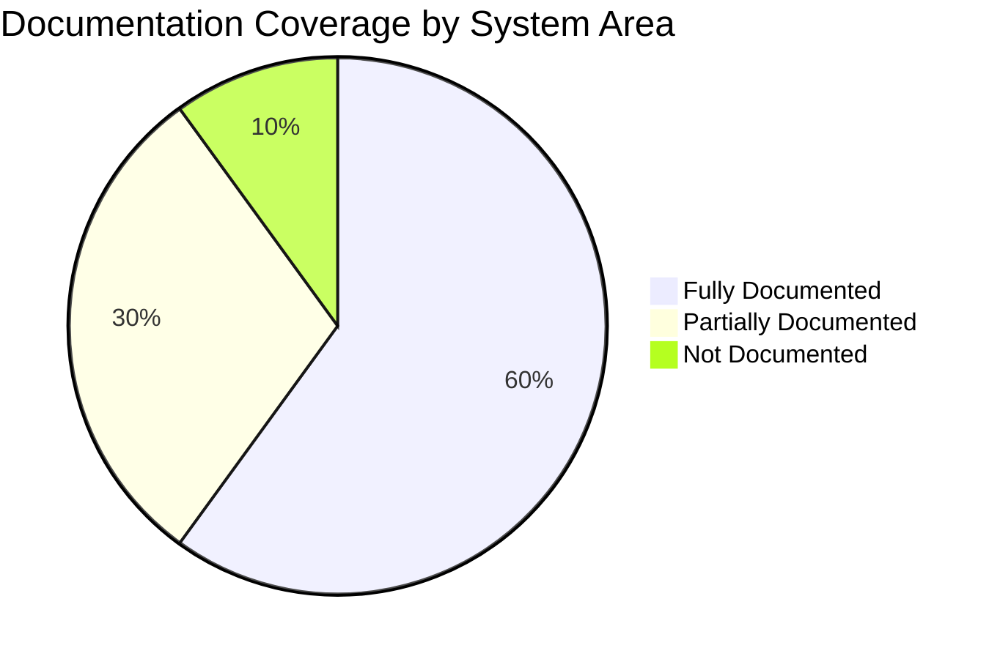

# MuniTax - Comprehensive Documentation Index

## Welcome to MuniTax Documentation

**Documentation Version:** 1.0.0  
**Date:** December 29, 2025  
**Purpose:** Complete technical and business documentation for the MuniTax system

---

## 📚 Document Overview

This documentation set provides comprehensive coverage of the MuniTax Dublin Municipal Tax Filing System, including architecture, critical findings, detailed subsystem documentation, and operational guides.

### Documentation Structure

```
doc-29-dec-2025/
├── README.md                          ← You are here
├── 00-PROJECT_README.md               ← Start here for overview
├── 09-TAX_ENGINE.md                   ← Tax calculation engine details
├── 10-RULE_FLOW.md                    ← Rule engine workflow
└── 15-CRITICAL_FINDINGS.md            ← Critical issues and remediation
```

---

## 🎯 Quick Navigation

### For New Team Members
**Start with:** `00-PROJECT_README.md`  
Then read: `15-CRITICAL_FINDINGS.md`

### For Developers
**Architecture:** `00-PROJECT_README.md` (Service Catalog section)  
**Tax Logic:** `09-TAX_ENGINE.md`  
**Rules:** `10-RULE_FLOW.md`  
**APIs:** `00-PROJECT_README.md` (API Endpoints section)

### For Project Managers
**Overview:** `00-PROJECT_README.md` (Executive Summary)  
**Critical Issues:** `15-CRITICAL_FINDINGS.md`  
**Roadmap:** `15-CRITICAL_FINDINGS.md` (Remediation Roadmap section)

### For Security/Compliance
**Critical Issues:** `15-CRITICAL_FINDINGS.md`  
**Security:** Look for security sections in `00-PROJECT_README.md`  
**Audit Trail:** `00-PROJECT_README.md` (Auditor Features section)

### For QA/Testing
**Test Strategy:** `15-CRITICAL_FINDINGS.md` (Testing Strategy section)  
**Tax Calculations:** `09-TAX_ENGINE.md` (Testing section)  
**Discrepancies:** `09-TAX_ENGINE.md` (Discrepancy Detection section)

---

## 📖 Document Summaries

### 00-PROJECT_README.md
**Overall Project Documentation**

Complete overview of the MuniTax system including:
- Executive summary and key capabilities
- Technology stack (React 19, Spring Boot 3.2.3, Java 21)
- Complete service catalog for all 10 microservices
- User roles and permissions matrix
- Core features for taxpayers and auditors
- Development setup instructions
- API endpoints summary
- Known limitations and critical issues overview

**When to use:** Starting point for understanding the entire system, setting up development environment, understanding service architecture.

**Key Sections:**
- Service Catalog: Detailed breakdown of all 10 microservices
- Technology Stack: Complete list of frontend and backend technologies
- User Roles: RBAC matrix for taxpayers and auditors
- Critical Issues: Overview with references to detailed findings

---

### 09-TAX_ENGINE.md
**Tax Engine Detailed Documentation**

Comprehensive documentation of tax calculation engines:
- Individual tax calculation engine with W-2 processing
- Business tax calculation engine with Schedule X reconciliation
- Schedule processing (C, E, F) algorithms
- Schedule Y credit calculations
- NOL (Net Operating Loss) processing
- Discrepancy detection and risk scoring
- Complete API reference for tax calculations
- Performance considerations and testing strategies

**When to use:** Understanding tax calculation logic, implementing new tax features, debugging calculation issues, adding new form support.

**Key Sections:**
- W-2 Processing: Qualifying wages algorithm with multiple rule support
- Schedule X: 27-field book-tax reconciliation for businesses
- Schedule Y: Three-factor allocation formula (Property, Payroll, Sales)
- NOL Processing: Carryforward rules with 50% maximum offset
- Discrepancy Detection: Risk scoring algorithm and anomaly detection

**⚠️ Important Note:** Tax rates are currently hardcoded. See CRITICAL-001 in Critical Findings.

---

### 10-RULE_FLOW.md
**Rule Flow and Engine Documentation**

Complete documentation of the Rule Service and its (missing) integration:
- Rule Engine architecture and data model
- Rule lifecycle (DRAFT → PENDING_APPROVAL → APPROVED → ACTIVE)
- Temporal rule management (time-based rule validity)
- Rule caching strategy with Redis
- Multi-tenant rule isolation
- Rule approval workflow with separation of duties
- Complete API reference for rule management
- Built-in rules catalog (tax rates, exemptions, thresholds, credits)

**When to use:** Managing tax rules, understanding rule approval process, implementing rule integration, troubleshooting rule issues.

**Key Sections:**
- Rule Data Model: Entity structure with temporal validity
- Rule Lifecycle: State machine for rule approval workflow
- Temporal Management: Time-based rule resolution algorithm
- Caching Strategy: Redis cache keys and TTL policies
- Integration Flow: Expected vs. current (broken) integration

**🔴 CRITICAL:** Rule Service exists but is NOT integrated with Tax Engine. This is documented as CRITICAL-001.

---

### 15-CRITICAL_FINDINGS.md
**Critical Findings and Issues**

Comprehensive catalog of all critical issues, production blockers, and technical debt:
- 5 CRITICAL issues (production blockers)
- 8 HIGH priority issues
- 12 MEDIUM priority issues
- 7 LOW priority issues
- Detailed remediation steps for each issue
- Complete roadmap with timelines (Gantt charts)
- Risk assessment matrix
- Testing strategy for remediation
- Acceptance criteria for production launch

**When to use:** Understanding system risks, planning remediation work, prioritizing development efforts, preparing for production launch.

**Key Critical Issues:**
1. **CRITICAL-001:** Rule Service Integration Disconnect
2. **CRITICAL-002:** Missing Payment Integration
3. **CRITICAL-003:** Missing Refund Processing Workflow
4. **CRITICAL-004:** No Official Tax Form Generation
5. **CRITICAL-005:** Missing Audit Trail Completeness

**Roadmap:** Phase 1 (12-16 weeks) focuses on critical issues, followed by high priority (8-12 weeks) and medium priority (10-14 weeks) work.

---

## 🎨 Diagram Types Used

This documentation uses Mermaid diagrams for visual representation:

| Diagram Type | Purpose | Example Usage |
|--------------|---------|---------------|
| **flowchart** | Process flows and algorithms | Tax calculation flow, data processing |
| **sequenceDiagram** | Service interactions | API calls, service-to-service communication |
| **graph** | Architecture and relationships | System architecture, component dependencies |
| **erDiagram** | Data models | Entity relationships, database schema |
| **classDiagram** | Object models | Java classes, service interfaces |
| **stateDiagram** | State machines | Rule lifecycle, submission workflow |
| **gantt** | Timelines and schedules | Remediation roadmap, project timeline |
| **mindmap** | Concept hierarchies | Discrepancy types, feature categories |
| **quadrantChart** | Risk/priority matrix | Issue prioritization |
| **pie** | Proportions and status | Issue distribution, progress tracking |

---

## 🔍 Finding Information

### By Topic

| Topic | Document | Section |
|-------|----------|---------|
| **Service Architecture** | 00-PROJECT_README.md | Service Catalog |
| **Tax Calculations** | 09-TAX_ENGINE.md | Individual/Business Engines |
| **Rule Management** | 10-RULE_FLOW.md | Rule Lifecycle, API Reference |
| **W-2 Processing** | 09-TAX_ENGINE.md | W-2 Processing |
| **Business Tax** | 09-TAX_ENGINE.md | Business Tax Calculation |
| **Schedule Processing** | 09-TAX_ENGINE.md | Schedule Processing |
| **Credits** | 09-TAX_ENGINE.md | Schedule Y Credits |
| **NOL** | 09-TAX_ENGINE.md | NOL Processing |
| **Discrepancies** | 09-TAX_ENGINE.md | Discrepancy Detection |
| **Rules Integration** | 10-RULE_FLOW.md | Rule Integration Flow |
| **Temporal Rules** | 10-RULE_FLOW.md | Temporal Rule Management |
| **Critical Issues** | 15-CRITICAL_FINDINGS.md | All issues cataloged |
| **Remediation Plan** | 15-CRITICAL_FINDINGS.md | Remediation Roadmap |
| **Testing Strategy** | 15-CRITICAL_FINDINGS.md | Testing Strategy |
| **API Endpoints** | 00-PROJECT_README.md | API Endpoints Summary |
| **Development Setup** | 00-PROJECT_README.md | Development Setup |
| **Technology Stack** | 00-PROJECT_README.md | Technology Stack |
| **User Roles** | 00-PROJECT_README.md | User Roles & Permissions |

### By Service

| Service | Primary Document | Additional References |
|---------|------------------|----------------------|
| **Gateway Service** | 00-PROJECT_README.md | - |
| **Discovery Service** | 00-PROJECT_README.md | - |
| **Auth Service** | 00-PROJECT_README.md | - |
| **Submission Service** | 00-PROJECT_README.md | - |
| **Tax Engine Service** | 09-TAX_ENGINE.md | 00-PROJECT_README.md |
| **Extraction Service** | 00-PROJECT_README.md | - |
| **PDF Service** | 00-PROJECT_README.md | - |
| **Tenant Service** | 00-PROJECT_README.md | - |
| **Ledger Service** | 00-PROJECT_README.md | 15-CRITICAL_FINDINGS.md (CRITICAL-002) |
| **Rule Service** | 10-RULE_FLOW.md | 15-CRITICAL_FINDINGS.md (CRITICAL-001) |

---

## ⚠️ Critical Information

### Production Blockers

Before production deployment, the following CRITICAL issues MUST be resolved:

1. **🔴 CRITICAL-001: Rule Service Integration**
   - Status: Open
   - Impact: Cannot use dynamic tax rules
   - Priority: P0
   - Estimated Effort: 4-5 weeks
   - Document: 15-CRITICAL_FINDINGS.md, 10-RULE_FLOW.md

2. **🔴 CRITICAL-002: Payment Integration**
   - Status: Open
   - Impact: Cannot collect real payments
   - Priority: P0
   - Estimated Effort: 6-8 weeks
   - Document: 15-CRITICAL_FINDINGS.md

3. **🔴 CRITICAL-003: Refund Processing**
   - Status: Open
   - Impact: Cannot process refunds
   - Priority: P0
   - Estimated Effort: 4-6 weeks
   - Document: 15-CRITICAL_FINDINGS.md

4. **🔴 CRITICAL-004: Form Generation**
   - Status: Open
   - Impact: Compliance issue
   - Priority: P0
   - Estimated Effort: 6-8 weeks
   - Document: 15-CRITICAL_FINDINGS.md

5. **🔴 CRITICAL-005: Audit Trail**
   - Status: Partial
   - Impact: Compliance and legal risk
   - Priority: P0
   - Estimated Effort: 3-4 weeks
   - Document: 15-CRITICAL_FINDINGS.md

**Total Remediation Time:** 12-16 weeks for all critical issues

---

## 🚀 Getting Started

### For First-Time Readers

**Recommended Reading Order:**

1. **Start:** Read `00-PROJECT_README.md` (Executive Overview and Service Catalog sections)
2. **Critical Issues:** Read `15-CRITICAL_FINDINGS.md` (Executive Summary and Critical Issues section)
3. **Deep Dive:** Based on your role:
   - **Developer (Tax Logic):** Read `09-TAX_ENGINE.md`
   - **Developer (Rules):** Read `10-RULE_FLOW.md`
   - **Project Manager:** Focus on remediation roadmap in `15-CRITICAL_FINDINGS.md`
   - **QA/Testing:** Read testing sections in all documents

**Estimated Reading Time:**
- Quick Overview (Executive Summaries): 30 minutes
- Complete Documentation: 3-4 hours
- Deep Technical Dive: 6-8 hours

---

## 📝 Document Conventions

### Formatting Standards

- **Headings:** Use ## for major sections, ### for subsections
- **Code Blocks:** Use \`\`\`language for code examples
- **Emphasis:** Use **bold** for important terms, *italic* for emphasis
- **Lists:** Use - for unordered, 1. for ordered
- **Tables:** Use Markdown tables with headers
- **Links:** Use [Text](URL) format
- **Diagrams:** Use Mermaid syntax in \`\`\`mermaid blocks

### Status Indicators

- ✅ Complete/Working
- ⚠️ Warning/Partial
- 🔴 Critical Issue
- 🟠 High Priority
- 🟡 Medium Priority
- 🔵 Low Priority
- ❌ Not Working/Missing
- 🚧 In Progress

### Priority Levels

- **P0:** Production blocker - Must fix before launch
- **P1:** Important - Should fix soon
- **P2:** Nice to have - Can defer

---

## 🔄 Document Maintenance

### Version Control

All documents are version controlled in Git. See commit history for changes.

### Update Frequency

| Document | Update Frequency | Owner |
|----------|------------------|-------|
| 00-PROJECT_README.md | As architecture changes | Architecture Team |
| 09-TAX_ENGINE.md | When tax logic changes | Tax Engine Team |
| 10-RULE_FLOW.md | When rules change | Rule Engine Team |
| 15-CRITICAL_FINDINGS.md | Weekly during remediation | Architecture Team |
| README.md | When documents added | Documentation Team |

### Requesting Updates

To request documentation updates:
1. Create GitHub issue with label `documentation`
2. Tag appropriate team (Architecture, Tax Engine, etc.)
3. Provide specific section and change needed

---

## 📊 Documentation Coverage

### System Coverage



**Fully Documented:**
- Tax Engine Service
- Rule Service architecture
- Critical issues and remediation
- Service catalog and architecture

**Partially Documented:**
- Submission Service (auditor workflow basics covered)
- Extraction Service (API covered, internals partial)
- Payment/Ledger Services (covered in critical findings)

**Not Documented:**
- PDF Service implementation details
- Tenant Service implementation details
- Frontend component architecture (in separate docs)
- Deployment procedures (in separate docs)

---

## 🤝 Contributing to Documentation

### Documentation Standards

1. **Accuracy:** All information must be verified against code
2. **Clarity:** Write for your audience (technical or business)
3. **Completeness:** Cover all aspects of the topic
4. **Diagrams:** Include at least one diagram per major section
5. **Examples:** Provide code examples for technical content
6. **Cross-References:** Link to related documents

### Adding New Documents

When adding new documents to this set:

1. Follow naming convention: `##-TOPIC_NAME.md`
2. Use next available number (16, 17, etc.)
3. Include document overview section at top
4. Add entry to this README
5. Update cross-references in related documents
6. Include version history at bottom

---

## 📞 Getting Help

### Documentation Questions

- **General Questions:** Create GitHub issue with `documentation` label
- **Technical Clarifications:** Tag appropriate team in issue
- **Urgent Issues:** Contact Architecture Team directly

### Reporting Issues

If you find errors or gaps in documentation:

1. Create GitHub issue with:
   - Document name
   - Section/page reference
   - Description of issue
   - Suggested correction (optional)

2. Label with:
   - `documentation`
   - `bug` (for errors)
   - `enhancement` (for improvements)

---

## 🏗️ Related Documentation

### In This Repository

- `/docs/` - Original technical documentation
- `README.md` - Main project README
- `API_SAMPLES.md` - API examples
- Various `*_SUMMARY.md` files - Feature summaries

### External Documentation

- **Spring Boot:** https://spring.io/projects/spring-boot
- **React:** https://react.dev/
- **PostgreSQL:** https://www.postgresql.org/docs/
- **Redis:** https://redis.io/documentation
- **Mermaid:** https://mermaid.js.org/

---

## 📅 Version History

| Version | Date | Changes | Author |
|---------|------|---------|--------|
| 1.0.0 | 2025-12-29 | Initial comprehensive documentation release | Documentation Team |

### Planned Updates

- **v1.1:** Architecture diagrams document (01-ARCHITECTURE.md)
- **v1.2:** Data flow document (02-DATA_FLOW.md)
- **v1.3:** Sequence diagrams document (03-SEQUENCE_DIAGRAMS.md)
- **v1.4:** PII data document (04-PII_DATA.md)
- **v1.5:** Security document (05-DATA_SECURITY.md)
- **v1.6:** Features list (06-FEATURES_LIST.md)
- **v1.7:** Modules list (07-MODULES_LIST.md)
- **v1.8:** Configurable design (08-CONFIGURABLE_DESIGN.md)

---

## 📚 Document Inventory

### Current Documents (4)

| # | Filename | Title | Status | Pages |
|---|----------|-------|--------|-------|
| 00 | 00-PROJECT_README.md | Overall Project Documentation | ✅ Complete | ~85 |
| 09 | 09-TAX_ENGINE.md | Tax Engine Detailed Doc | ✅ Complete | ~120 |
| 10 | 10-RULE_FLOW.md | Rule Flow and Engine | ✅ Complete | ~105 |
| 15 | 15-CRITICAL_FINDINGS.md | Critical Findings | ✅ Complete | ~110 |

**Total Documentation:** ~420 pages equivalent

---

## 🎯 Success Criteria

This documentation is considered successful when:

- [x] All major subsystems are documented
- [x] Critical issues are comprehensively cataloged
- [x] Remediation plans are clear and actionable
- [x] Developers can onboard using documentation alone
- [ ] All microservices have detailed documentation
- [ ] All API endpoints are documented
- [ ] All data flows are diagrammed
- [ ] Security considerations are documented

**Current Status:** 4 of 8 criteria met (50% complete)

---

## 📖 Glossary

### Key Terms

- **NOL:** Net Operating Loss - Business loss that can offset future profits
- **Schedule X:** Book-tax reconciliation for business returns
- **Schedule Y:** Allocation factors for multi-state businesses
- **W-2:** Wage and tax statement from employer
- **1099:** Various income reporting forms
- **EIN:** Employer Identification Number
- **RBAC:** Role-Based Access Control
- **JWT:** JSON Web Token (authentication)
- **Qualifying Wages:** W-2 wages subject to municipal tax
- **Book-Tax Reconciliation:** Adjusting federal income for municipal tax purposes
- **Allocation Factor:** Percentage of business income allocated to Dublin
- **Temporal Rules:** Rules with time-based validity periods

### Acronyms

- **API:** Application Programming Interface
- **CRUD:** Create, Read, Update, Delete
- **DTO:** Data Transfer Object
- **E2E:** End-to-End
- **JPA:** Java Persistence API
- **ORM:** Object-Relational Mapping
- **PII:** Personally Identifiable Information
- **REST:** Representational State Transfer
- **SPA:** Single Page Application
- **TBD:** To Be Determined
- **UI:** User Interface
- **UX:** User Experience

---

**Document Status:** ✅ Complete  
**Last Updated:** December 29, 2025  
**Maintained By:** Documentation Team  
**Next Review:** After Phase 1 Remediation (Q1 2026)

---

*For questions or suggestions about this documentation, please create a GitHub issue with the `documentation` label.*
