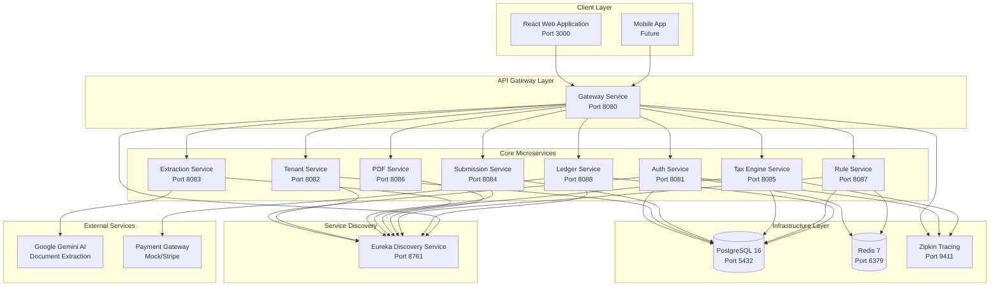
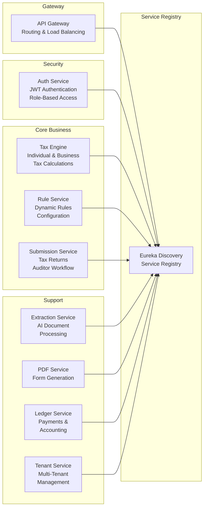
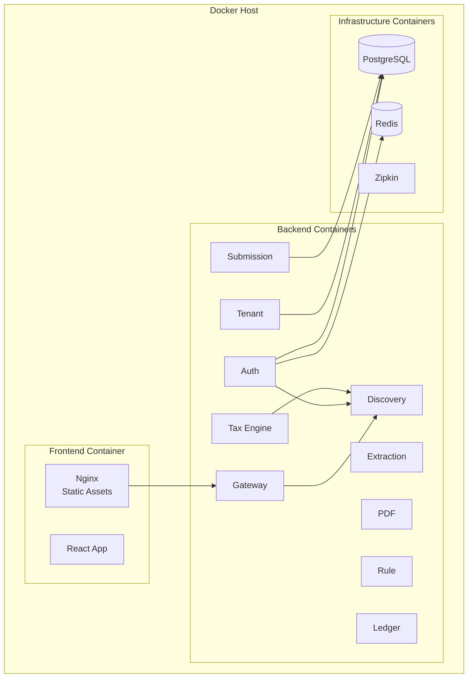
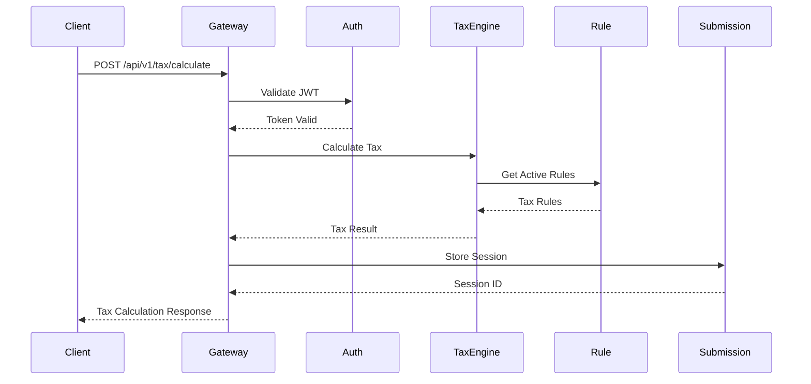
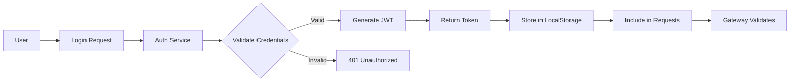

# MuniTax System Architecture

## Overview

MuniTax is a comprehensive municipal tax filing and auditing system built using a modern microservices architecture. The system supports individual and business tax filing for Dublin Municipality with features for automated document extraction, tax calculation, auditor workflow, and payment processing.

---

## 🔴 CRITICAL ISSUE: Rule Service Integration Disconnect

> **⚠️ CRITICAL ARCHITECTURAL DISCONNECT**
>
> The Rule Service is **NOT integrated** with tax calculators. While rules can be created, approved, and stored in the database, they are **never applied during tax calculations**. Tax rates and rules are **hardcoded** in:
> - `backend/tax-engine-service/src/main/java/com/munitax/taxengine/service/IndividualTaxCalculator.java`
> - `backend/tax-engine-service/src/main/java/com/munitax/taxengine/service/BusinessTaxCalculator.java`
>
> **Status:** Architectural disconnect - Rule service exists but is unused.
>
> **Resolution:** See Issue [#95](https://github.com/shashanksaxena-tz/munciplaityTax/issues/95) for integration work.

---

## High-Level Architecture Diagram

---

## Technology Stack

### Frontend
| Component | Technology | Version |
|-----------|------------|---------|
| Framework | React | 19.x |
| Language | TypeScript | 5.x |
| Build Tool | Vite | 5.x |
| Styling | Tailwind CSS | 3.x |
| State Management | React Context + useReducer | - |
| Routing | React Router | v7 |
| Icons | Lucide React | - |

### Backend
| Component | Technology | Version |
|-----------|------------|---------|
| Framework | Spring Boot | 3.2.3 |
| Language | Java | 21 |
| API Gateway | Spring Cloud Gateway | - |
| Service Discovery | Netflix Eureka | - |
| ORM | JPA/Hibernate | - |
| Security | Spring Security + JWT | - |

### Infrastructure
| Component | Technology | Version |
|-----------|------------|---------|
| Database | PostgreSQL | 16 |
| Cache | Redis | 7 |
| Tracing | Zipkin | - |
| Containerization | Docker | - |
| Orchestration | Docker Compose | - |
| Reverse Proxy | Nginx | - |

---

## Microservices Architecture

### Service Catalog

### Service Responsibilities

| Service | Port | Primary Responsibilities |
|---------|------|-------------------------|
| **Discovery Service** | 8761 | Service registration, health monitoring, load balancing coordination |
| **Gateway Service** | 8080 | API routing, rate limiting, request/response transformation |
| **Auth Service** | 8081 | User authentication, JWT token management, role-based access control |
| **Tenant Service** | 8082 | Multi-tenant management, session storage, address validation |
| **Extraction Service** | 8083 | AI-powered document extraction using Google Gemini |
| **Submission Service** | 8084 | Tax return submissions, auditor workflow, audit trail |
| **Tax Engine Service** | 8085 | Individual and business tax calculations, discrepancy detection |
| **PDF Service** | 8086 | Tax form PDF generation using Apache PDFBox |
| **Rule Service** | 8087 | Dynamic tax rule configuration, temporal rule management |
| **Ledger Service** | 8088 | Double-entry ledger, payment processing, reconciliation |

---

## Deployment Architecture

### Container Deployment

### Network Architecture

- **munitax-network**: Bridge network connecting all containers
- **External Ports**:
  - 3000: Frontend (Nginx)
  - 8080: API Gateway
  - 8761: Eureka Dashboard
  - 9411: Zipkin Dashboard
  - 5432: PostgreSQL (development only)
  - 6379: Redis (development only)

---

## Communication Patterns

### Synchronous Communication
- REST APIs over HTTP/HTTPS
- Service-to-service calls via Eureka service discovery
- JSON request/response format

### Asynchronous Communication (Planned)
- Event-driven messaging for audit trail
- Message queues for document processing
- WebSocket for real-time extraction updates

### Inter-Service Communication

---

## Scalability Considerations

### Horizontal Scaling
- All microservices are stateless and can be horizontally scaled
- Eureka handles service registration for multiple instances
- Gateway performs client-side load balancing

### Database Scaling
- PostgreSQL supports read replicas for read-heavy workloads
- Schema-per-tenant isolation enables database sharding
- Connection pooling via HikariCP

### Caching Strategy
- Redis caches frequently accessed tax rules
- Session data cached for performance
- Rule evaluation results cached per tax year/tenant

---

## High Availability

### Service Redundancy
- Multiple instances per service recommended for production
- Eureka self-preservation mode protects against network partitions
- Circuit breaker pattern (planned) for fault tolerance

### Data Persistence
- PostgreSQL with regular backups
- Volume persistence for container data
- 7-year audit trail retention per IRS requirements

---

## Security Architecture

### Authentication Flow

### Security Layers
1. **Transport Security**: TLS/SSL for all communications
2. **Authentication**: JWT tokens with configurable expiration
3. **Authorization**: Role-based access control (RBAC)
4. **API Security**: Rate limiting, request validation
5. **Data Security**: Encryption at rest, PII handling

---

## Monitoring & Observability

### Distributed Tracing
- Zipkin collects traces from all services
- Request correlation via trace IDs
- Performance bottleneck identification

### Health Checks
- Spring Boot Actuator endpoints
- Eureka health monitoring
- Docker healthcheck configurations

### Logging
- Structured JSON logging
- Centralized log aggregation (planned)
- Audit trail for compliance

---

## Version History

| Version | Date | Changes |
|---------|------|---------|
| 1.0 | 2025-12-01 | Initial architecture documentation |

---

**Document Owner:** Development Team  
**Last Updated:** December 1, 2025
