# MuniTax Configurable Design Documentation

## Overview

The MuniTax system is designed with configurability at its core, allowing municipalities to customize tax rules, rates, validation thresholds, and workflows without code changes. This document describes the configurable aspects of the system and how to customize them.

---

## Configuration Architecture

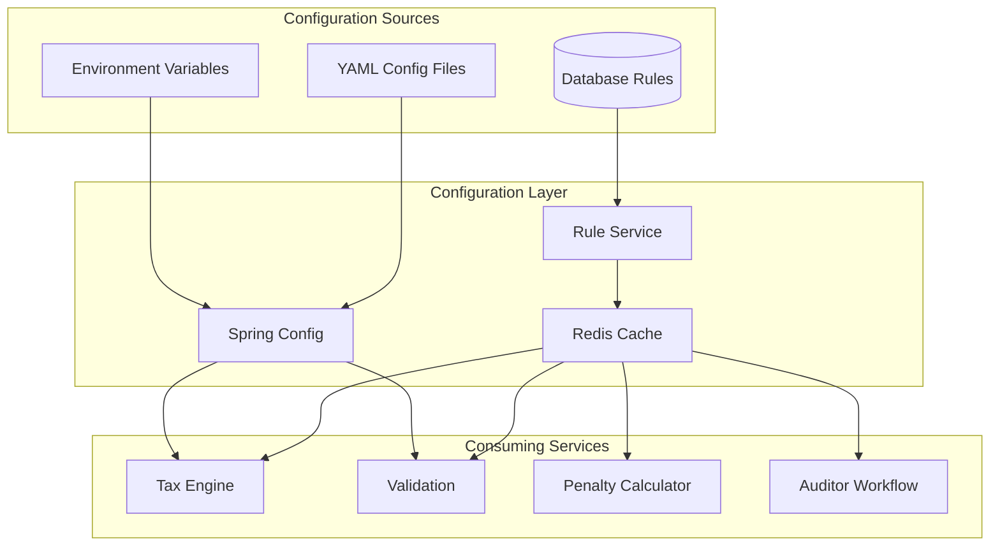

---

## Configurable Components

### 1. Tax Rates Configuration

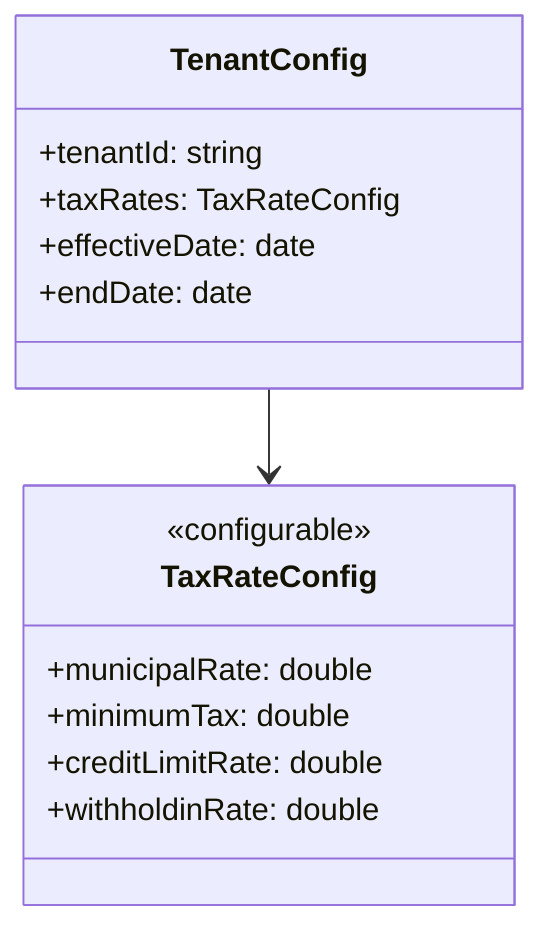

**Configurable Parameters:**

| Parameter | Default | Range | Description |
|-----------|---------|-------|-------------|
| `municipalRate` | 2.5% | 0-5% | Municipal income tax rate |
| `minimumTax` | $0 | $0-$500 | Minimum annual business tax |
| `creditLimitRate` | 2.5% | 0-5% | Maximum credit for taxes paid elsewhere |
| `withholdingRate` | 2.5% | 0-5% | Employer withholding rate |

**Configuration via Rule Engine:**
```json
{
  "ruleCode": "MUNICIPAL_TAX_RATE",
  "category": "TAX_RATES",
  "valueType": "PERCENTAGE",
  "value": {"scalar": 2.5, "unit": "percent"},
  "tenantId": "dublin",
  "effectiveDate": "2024-01-01"
}
```

### 2. Income Inclusion Configuration

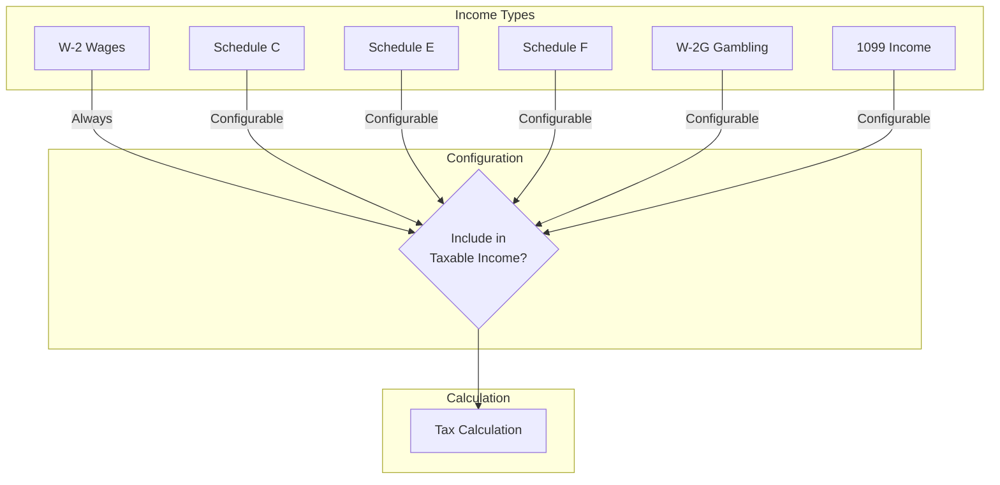

**Configurable Parameters:**

| Parameter | Default | Description |
|-----------|---------|-------------|
| `includeScheduleC` | true | Include self-employment income |
| `includeScheduleE` | true | Include rental/partnership income |
| `includeScheduleF` | true | Include farm income |
| `includeW2G` | true | Include gambling winnings |
| `include1099` | true | Include contractor income |

### 3. W-2 Qualifying Wages Configuration

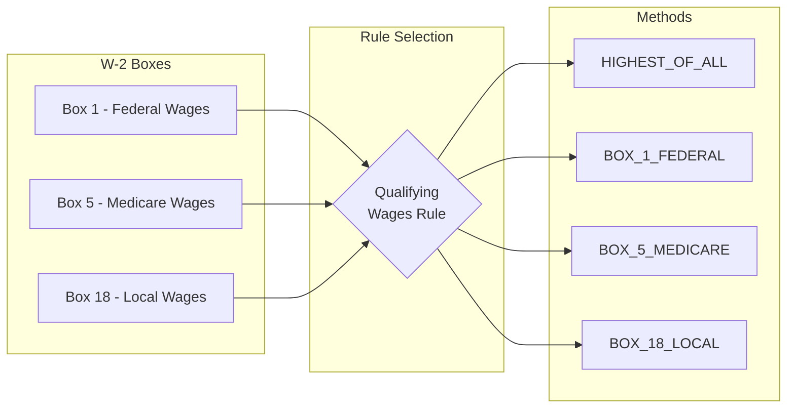

**Configuration:**
```json
{
  "ruleCode": "W2_QUALIFYING_WAGES_METHOD",
  "category": "INCOME_INCLUSION",
  "valueType": "ENUM",
  "value": {
    "option": "HIGHEST_OF_ALL",
    "allowedValues": [
      "HIGHEST_OF_ALL",
      "BOX_1_FEDERAL",
      "BOX_5_MEDICARE",
      "BOX_18_LOCAL"
    ]
  }
}
```

### 4. Allocation Factor Configuration (Business)

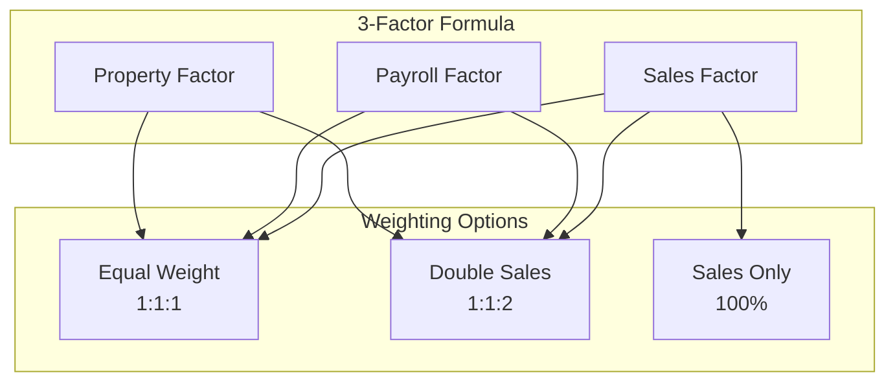

**Configurable Parameters:**

| Parameter | Default | Range | Description |
|-----------|---------|-------|-------------|
| `allocationMethod` | 3_FACTOR | 3_FACTOR, GROSS_RECEIPTS_ONLY | Apportionment method |
| `salesFactorWeight` | 1.0 | 1.0-3.0 | Weight applied to sales factor |

### 5. NOL (Net Operating Loss) Configuration

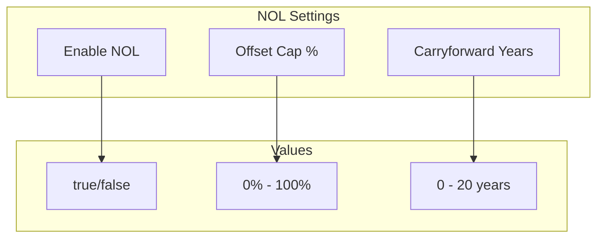

**Configurable Parameters:**

| Parameter | Default | Range | Description |
|-----------|---------|-------|-------------|
| `enableNOL` | true | boolean | Allow NOL deductions |
| `nolOffsetCapPercent` | 50% | 0-100% | Maximum income offset |
| `nolCarryforwardYears` | 20 | 5-20 | Years NOL can be carried forward |
| `nolCarrybackYears` | 0 | 0-2 | Years NOL can be carried back |

### 6. Penalty & Interest Configuration

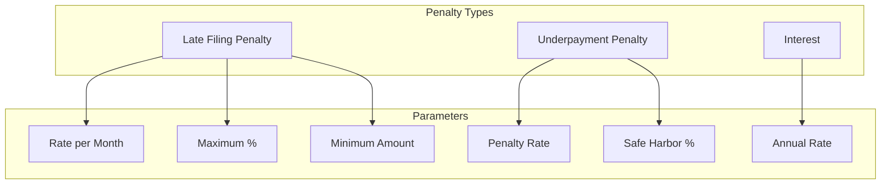

**Configurable Parameters:**

| Parameter | Default | Range | Description |
|-----------|---------|-------|-------------|
| `lateFilingRatePerMonth` | 5% | 0-10% | Monthly late filing penalty |
| `lateFilingMaxPercent` | 25% | 0-50% | Maximum late penalty |
| `lateFilingMinAmount` | $50 | $0-$100 | Minimum late penalty |
| `underpaymentRate` | 15% | 0-25% | Underpayment penalty rate |
| `safeHarborPercent` | 90% | 80-100% | Threshold to avoid penalty |
| `interestRateAnnual` | 7% | 0-15% | Annual interest rate |

### 7. Validation Threshold Configuration

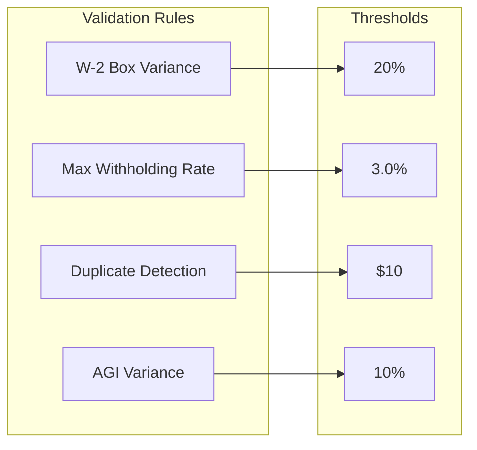

**Configurable Parameters:**

| Parameter | Default | Category | Description |
|-----------|---------|----------|-------------|
| `w2BoxVarianceThreshold` | 20% | VALIDATION | Max variance between Box 1 and 18 |
| `maxWithholdingRate` | 3.0% | VALIDATION | Maximum valid withholding rate |
| `duplicateWageThreshold` | $10 | VALIDATION | Threshold for duplicate W-2 detection |
| `agiVarianceThreshold` | 10% | VALIDATION | Max federal vs local income variance |
| `highWageThreshold` | $25,000 | VALIDATION | Threshold for zero withholding warning |

### 8. Filing Configuration

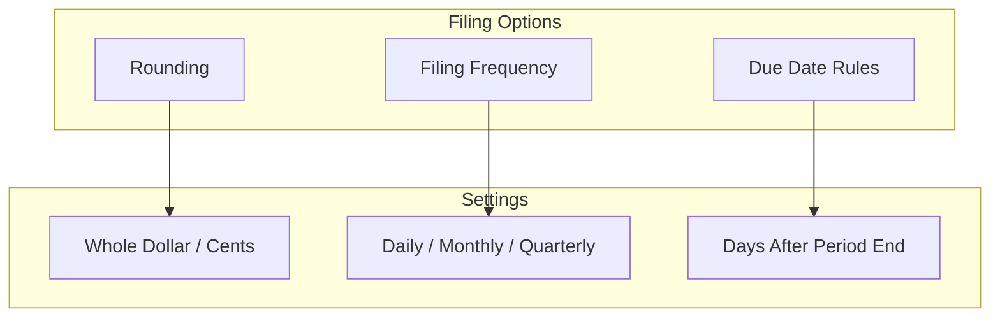

**Configurable Parameters:**

| Parameter | Default | Description |
|-----------|---------|-------------|
| `enableRounding` | false | Round to whole dollars |
| `quarterlyDueDays` | 30 | Days after quarter end for due date |
| `monthlyDueDay` | 15 | Day of following month for monthly |
| `dailyDueNextBusiness` | true | Due next business day for daily |

---

## Multi-Tenant Configuration

### Tenant Hierarchy

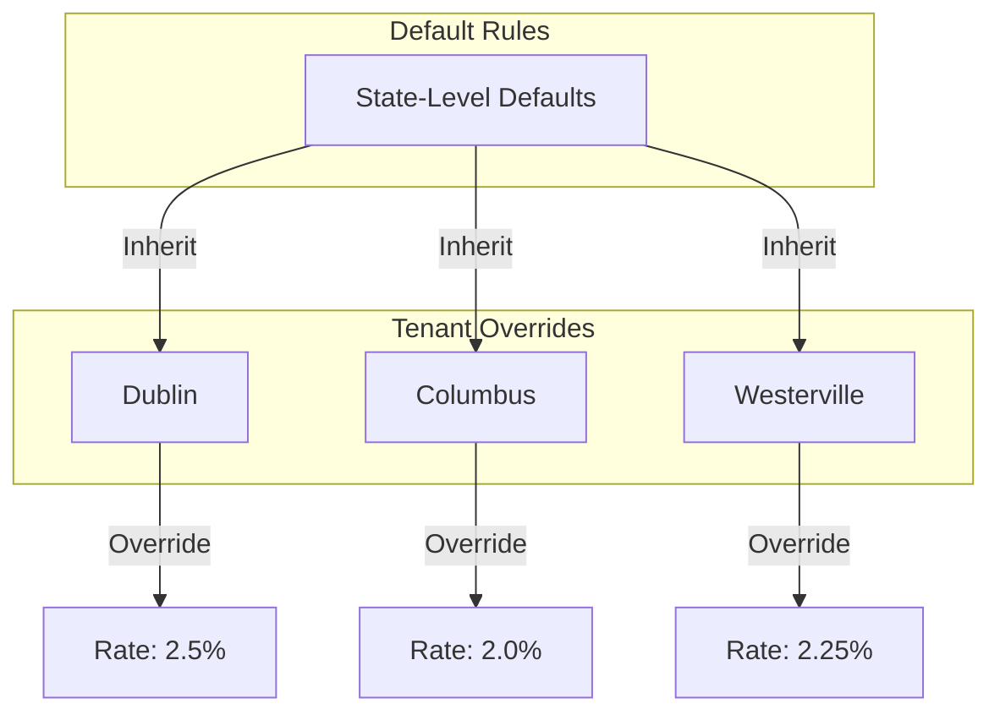

### Tenant-Specific Configuration

```json
{
  "tenantId": "dublin",
  "configuration": {
    "taxRates": {
      "municipalRate": 0.025,
      "creditLimitRate": 0.025
    },
    "filing": {
      "enableRounding": false,
      "quarterlyDueDays": 30
    },
    "penalties": {
      "lateFilingRatePerMonth": 0.05,
      "underpaymentRate": 0.15
    }
  }
}
```

### Rule Precedence

```
1. Tenant-specific rule with exact date match
2. Tenant-specific rule with date range match
3. Default (NULL tenant) rule with date match
4. Hardcoded system default
```

---

## Temporal Configuration

### Effective Date Management

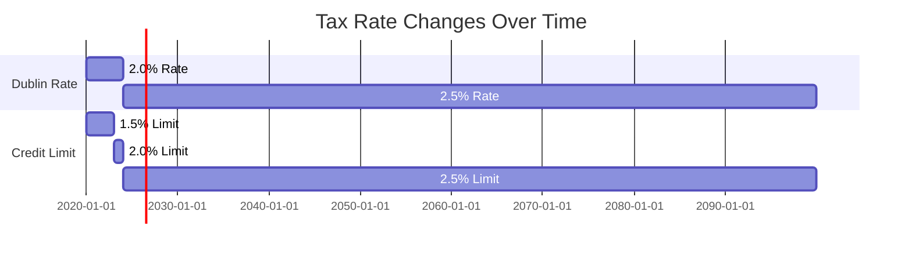

### Point-in-Time Queries

```java
// Get rules effective for tax year 2024
List<TaxRule> rules = temporalRuleService.getActiveRules(
    "dublin", 
    LocalDate.of(2024, 1, 1)
);

// Get historical rate for 2022 calculation
Optional<TaxRule> rate2022 = temporalRuleService.getActiveRuleByCode(
    "MUNICIPAL_TAX_RATE",
    "dublin",
    LocalDate.of(2022, 6, 15)
);
```

---

## Configuration via YAML

### Application Configuration

```yaml
# application.yml
munitax:
  tax:
    default-municipal-rate: 0.025
    default-credit-limit-rate: 0.025
    enable-rounding: false
    
  validation:
    w2-box-variance-threshold: 0.20
    max-withholding-rate: 0.03
    duplicate-wage-threshold: 10.0
    
  penalty:
    late-filing-rate-per-month: 0.05
    late-filing-max-percent: 0.25
    late-filing-min-amount: 50.0
    underpayment-rate: 0.15
    safe-harbor-percent: 0.90
    interest-rate-annual: 0.07
    
  business:
    allocation-method: 3_FACTOR
    sales-factor-weight: 1.0
    enable-nol: true
    nol-offset-cap-percent: 0.50
    minimum-tax: 0.0
```

### Environment Variable Override

```bash
# Override municipal rate
MUNITAX_TAX_DEFAULT_MUNICIPAL_RATE=0.03

# Override penalty rate
MUNITAX_PENALTY_LATE_FILING_RATE_PER_MONTH=0.10

# Override validation threshold
MUNITAX_VALIDATION_W2_BOX_VARIANCE_THRESHOLD=0.25
```

---

## Auditor Workflow Configuration

### Configurable Workflow Parameters

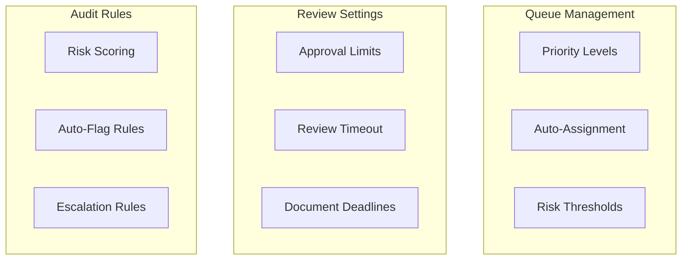

**Configurable Parameters:**

| Parameter | Default | Description |
|-----------|---------|-------------|
| `autoAssignEnabled` | false | Automatically assign returns |
| `seniorApprovalLimit` | $50,000 | Max amount senior auditor can approve |
| `documentRequestDays` | 30 | Default deadline for document requests |
| `reviewTimeoutDays` | 14 | Days before review times out |
| `highRiskThreshold` | 60 | Score above which is HIGH risk |
| `mediumRiskThreshold` | 20 | Score above which is MEDIUM risk |

---

## UI Configuration

### Display Settings

| Parameter | Default | Description |
|-----------|---------|-------------|
| `showConfidenceScores` | true | Display AI extraction confidence |
| `allowManualOverride` | true | Allow editing extracted data |
| `showDiscrepancyWarnings` | true | Display validation warnings |
| `resultsDecimalPlaces` | 2 | Decimal places for currency |

### Theme Configuration

```json
{
  "branding": {
    "primaryColor": "#1e40af",
    "logo": "/assets/dublin-logo.png",
    "municipalityName": "City of Dublin"
  },
  "features": {
    "enableDarkMode": true,
    "enablePdfPreview": true,
    "enableBulkActions": false
  }
}
```

---

## Configuration Best Practices

### 1. Rule Management

- **Version all changes**: Every rule change creates a new version
- **Document reasons**: Always provide change reason and ordinance reference
- **Test before production**: Use staging tenant to test new rules
- **Plan effective dates**: Schedule rule changes for tax year boundaries

### 2. Multi-Tenant Setup

- **Start with defaults**: Define sensible state-level defaults
- **Override minimally**: Only override what's different per tenant
- **Test isolation**: Verify tenant rules don't affect other tenants

### 3. Temporal Rules

- **No overlaps**: Ensure date ranges don't overlap for same rule code
- **Plan transitions**: Schedule new rules well before effective date
- **Keep history**: Don't delete old rules, let them expire

### 4. Validation Thresholds

- **Balance strictness**: Too strict = false positives, too loose = missed errors
- **Monitor metrics**: Track discrepancy detection rates
- **Adjust based on feedback**: Use auditor feedback to tune thresholds

---

## Configuration API Reference

### Get Current Configuration

```http
GET /api/v1/configuration?tenantId=dublin
Authorization: Bearer {token}
```

### Update Configuration

```http
PUT /api/v1/configuration
Content-Type: application/json
Authorization: Bearer {token}

{
  "tenantId": "dublin",
  "setting": "MUNICIPAL_TAX_RATE",
  "value": 0.025,
  "effectiveDate": "2025-01-01",
  "changeReason": "Annual rate adjustment"
}
```

---

## Version History

| Version | Date | Changes |
|---------|------|---------|
| 1.0 | 2025-12-01 | Initial configurable design documentation |

---

**Document Owner:** Development Team  
**Last Updated:** December 1, 2025
