# MuniTax Data Flow Documentation

## Overview

This document describes the data flows within the MuniTax system, covering key workflows from tax filing to auditor review.

---

## High-Level Data Flow

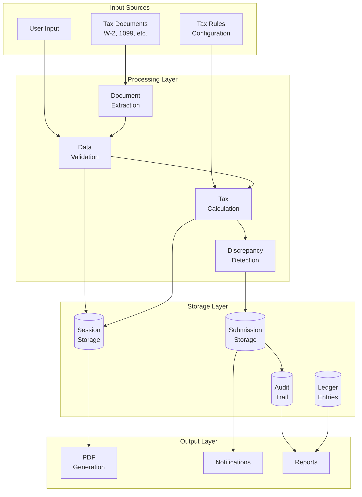

---

## Core Data Flow Scenarios

### 1. Individual Tax Filing Flow

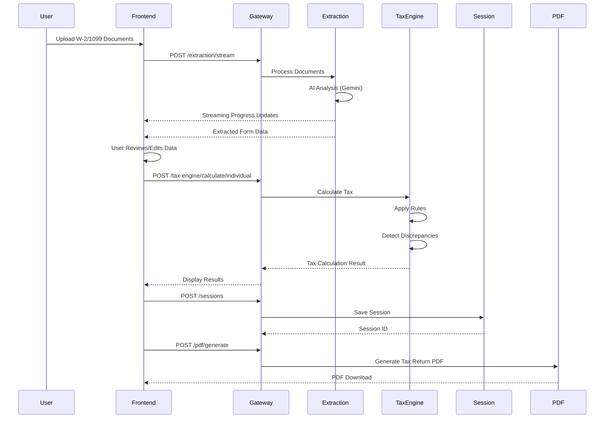

### 2. Business Tax Filing Flow

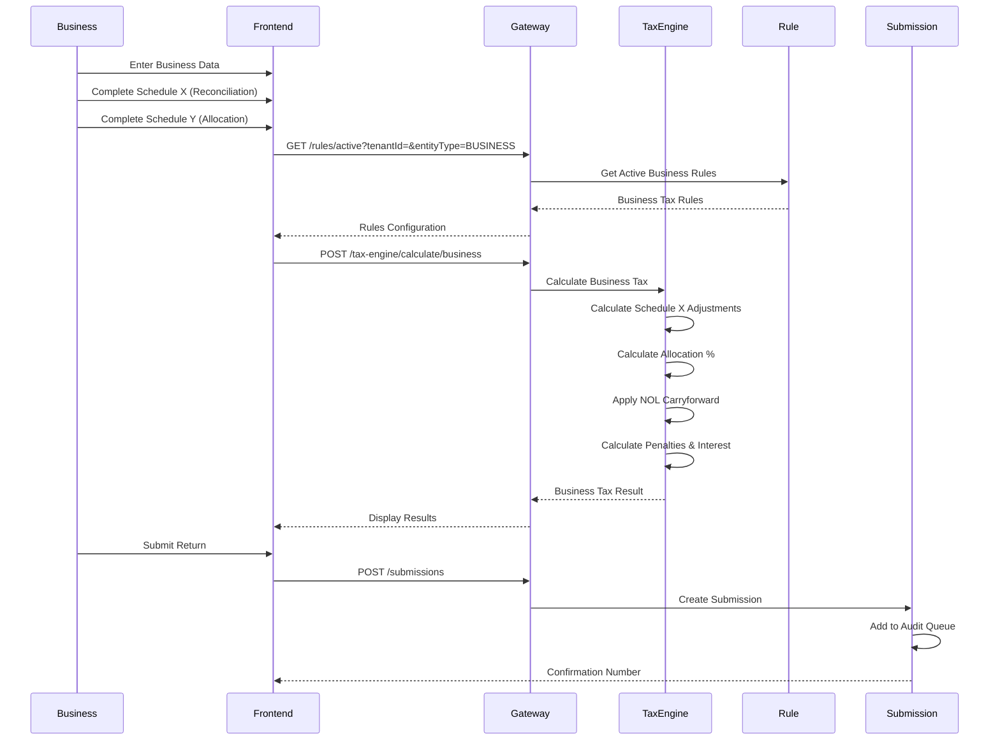

### 3. Document Extraction Flow

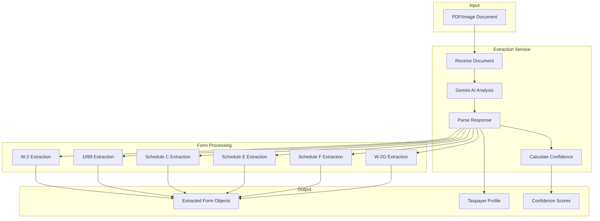

### 4. Auditor Workflow Data Flow

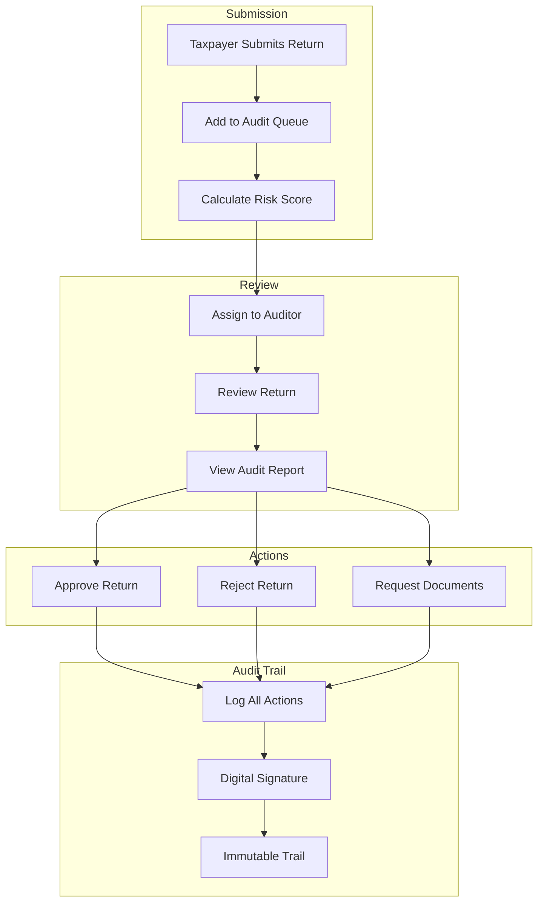

---

## Data Transformation Pipeline

### Tax Calculation Data Flow

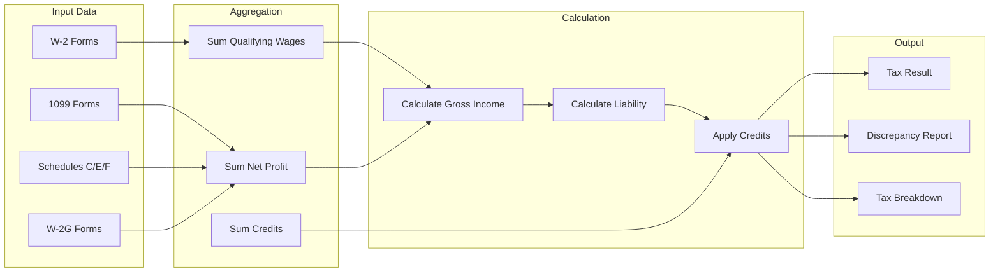

### Schedule X Calculation (Business)

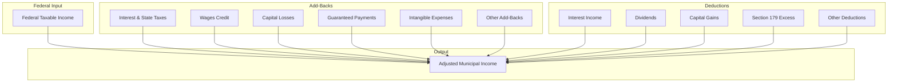

---

## Data Storage Flow

### Session Lifecycle

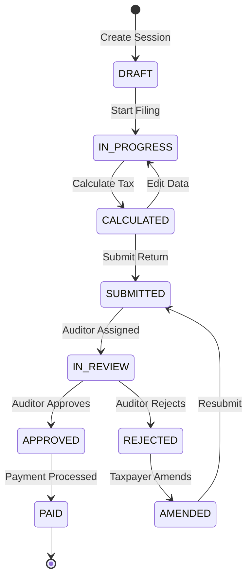

### Audit Trail Data Flow

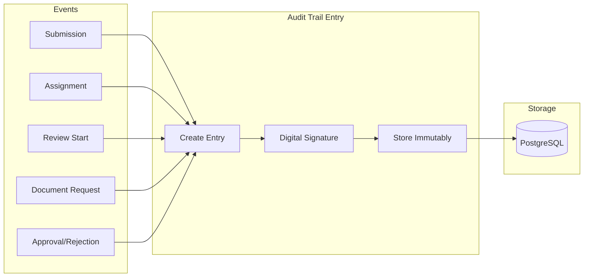

---

## Integration Data Flows

### External System Integration

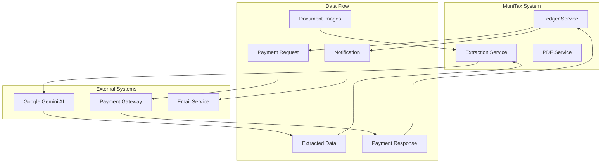

---

## Data Validation Flow

### Discrepancy Detection

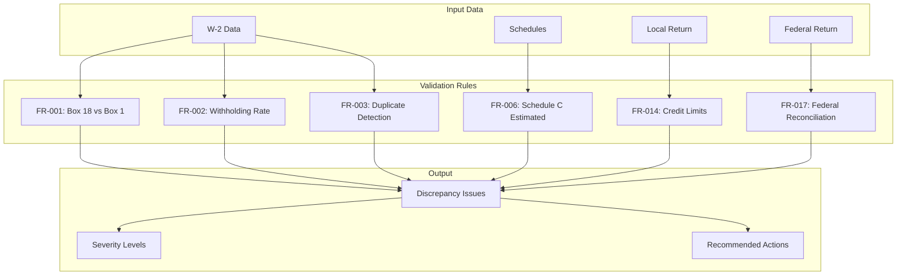

---

## Batch Processing Data Flows

### End-of-Period Processing

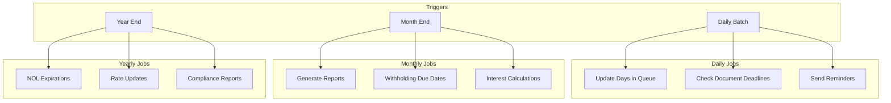

---

## Version History

| Version | Date | Changes |
|---------|------|---------|
| 1.0 | 2025-12-01 | Initial data flow documentation |

---

**Document Owner:** Development Team  
**Last Updated:** December 1, 2025
