# MuniTax Data Security Documentation

## Overview

This document outlines the security architecture, controls, and best practices implemented in the MuniTax system to protect sensitive tax data.

---

## Security Architecture


---

## Authentication & Authorization

### JWT-Based Authentication


### JWT Token Structure

```json
{
  "header": {
    "alg": "HS256",
    "typ": "JWT"
  },
  "payload": {
    "sub": "user-uuid",
    "username": "john.doe",
    "roles": ["ROLE_TAXPAYER"],
    "tenantId": "dublin",
    "iat": 1701388800,
    "exp": 1701392400
  },
  "signature": "..."
}
```

### Role-Based Access Control (RBAC)


### Permission Matrix

| Resource | Individual | Business | Auditor | Senior Auditor | Supervisor | Manager | Admin |
|----------|:----------:|:--------:|:-------:|:--------------:|:----------:|:-------:|:-----:|
| Own Tax Returns | ✅ | ✅ | ❌ | ❌ | ❌ | ❌ | ✅ |
| Assigned Returns | ❌ | ❌ | ✅ | ✅ | ✅ | ✅ | ✅ |
| Approve < $50K | ❌ | ❌ | ❌ | ✅ | ✅ | ✅ | ✅ |
| Approve Any | ❌ | ❌ | ❌ | ❌ | ✅ | ✅ | ✅ |
| Assign Auditors | ❌ | ❌ | ❌ | ❌ | ✅ | ✅ | ✅ |
| Configure Rules | ❌ | ❌ | ❌ | ❌ | ❌ | ✅ | ✅ |
| User Management | ❌ | ❌ | ❌ | ❌ | ❌ | ❌ | ✅ |

---

## Data Encryption

### Encryption at Rest


**Implementation:**
- PostgreSQL Transparent Data Encryption (TDE)
- AES-256 encryption for database files
- LUKS encryption for Docker volumes
- Encrypted backups with separate key management

### Encryption in Transit

```mermaid
flowchart LR
    subgraph "Client"
        BROWSER[Browser<br/>TLS 1.3]
    end

    subgraph "API Gateway"
        GW[Gateway<br/>TLS Termination]
    end

    subgraph "Services"
        SVC[Microservices<br/>mTLS]
    end

    subgraph "Database"
        DB[(PostgreSQL<br/>TLS)]
    end

    BROWSER -->|HTTPS| GW
    GW -->|TLS| SVC
    SVC -->|TLS| DB
```



**Implementation:**
- TLS 1.3 for all external connections
- Certificate-based authentication (mTLS) for internal services
- Strong cipher suites only
- HSTS headers enforced

---

## Network Security

### Network Segmentation


### Firewall Rules

| Source | Destination | Port | Protocol | Purpose |
|--------|-------------|------|----------|---------|
| Internet | Load Balancer | 443 | HTTPS | User access |
| Load Balancer | Gateway | 8080 | HTTP | Internal routing |
| Gateway | Services | 8081-8088 | HTTP | Service communication |
| Services | PostgreSQL | 5432 | PostgreSQL | Database access |
| Services | Redis | 6379 | Redis | Cache access |

---

## Application Security

### Input Validation

```java
// Example: Validation on SSN field
@Pattern(regexp = "^\\d{3}-\\d{2}-\\d{4}$", message = "Invalid SSN format")
@NotBlank(message = "SSN is required")
private String ssn;

// Example: Validation on tax amounts
@PositiveOrZero(message = "Amount must be positive")
@DecimalMax(value = "999999999.99", message = "Amount exceeds maximum")
private BigDecimal taxableIncome;
```

### SQL Injection Prevention
- JPA/Hibernate parameterized queries
- No raw SQL construction
- Input sanitization at API layer

### XSS Prevention
- React automatic escaping
- Content Security Policy headers
- Input sanitization

### CSRF Protection
- JWT tokens instead of cookies
- SameSite cookie attributes
- Custom headers required

---

## Audit Logging

### Audit Trail Schema


### Logged Events

| Event Category | Events Logged | Retention |
|----------------|---------------|-----------|
| Authentication | Login, Logout, Failed Attempts | 2 years |
| Tax Returns | Create, Update, Submit, Amend | 7 years |
| Auditor Actions | Assign, Review, Approve, Reject | 7 years |
| Document Requests | Request, Receive, Waive | 7 years |
| Payments | Initiate, Complete, Refund | 7 years |
| Admin Actions | Rule Changes, User Management | 7 years |

### Audit Log Security
- Append-only storage
- Cryptographic signing
- Tamper detection
- Separate audit database (planned)

---

## Secret Management

### Secret Categories

| Secret Type | Storage | Rotation | Access |
|-------------|---------|----------|--------|
| JWT Secret | Environment | 90 days | Auth Service only |
| Database Password | Environment | 90 days | Database services |
| API Keys | Environment | On compromise | Service-specific |
| Encryption Keys | HSM (planned) | Annually | Encryption layer |

### Current Implementation

```yaml
# docker-compose.yml (development)
environment:
  JWT_SECRET: ${JWT_SECRET}
  SPRING_DATASOURCE_PASSWORD: ${DB_PASSWORD}
  GEMINI_API_KEY: ${GEMINI_API_KEY}
```

### Production Recommendations
- Use HashiCorp Vault or AWS Secrets Manager
- Implement automatic secret rotation
- Never commit secrets to source control
- Use service accounts with minimal permissions

---

## Security Headers

### HTTP Security Headers

```nginx
# nginx.conf
add_header X-Frame-Options "DENY" always;
add_header X-Content-Type-Options "nosniff" always;
add_header X-XSS-Protection "1; mode=block" always;
add_header Strict-Transport-Security "max-age=31536000; includeSubDomains" always;
add_header Content-Security-Policy "default-src 'self'; script-src 'self' 'unsafe-inline'; style-src 'self' 'unsafe-inline';" always;
add_header Referrer-Policy "strict-origin-when-cross-origin" always;
```

---

## API Security

### Rate Limiting

| Endpoint Category | Rate Limit | Window | Penalty |
|-------------------|------------|--------|---------|
| Authentication | 5 requests | 1 minute | 15 min lockout |
| Tax Calculation | 20 requests | 1 minute | Slow down |
| Document Extraction | 10 requests | 5 minutes | Slow down |
| General API | 100 requests | 1 minute | 429 response |

### Request Validation


---

## Vulnerability Management

### Security Scanning

| Scan Type | Tool | Frequency | Target |
|-----------|------|-----------|--------|
| SAST | CodeQL | Every commit | Source code |
| SCA | Dependabot | Daily | Dependencies |
| DAST | OWASP ZAP | Weekly | Running app |
| Container | Trivy | Every build | Docker images |

### Patch Management
- Critical vulnerabilities: 24 hours
- High vulnerabilities: 7 days
- Medium vulnerabilities: 30 days
- Low vulnerabilities: 90 days

---

## Incident Response

### Security Incident Categories

| Severity | Examples | Response Time | Escalation |
|----------|----------|---------------|------------|
| Critical | Data breach, System compromise | Immediate | Executive team |
| High | Authentication bypass, Privilege escalation | 4 hours | Security lead |
| Medium | Excessive access, Policy violation | 24 hours | Team lead |
| Low | Failed login attempts, Minor policy gaps | 72 hours | Regular process |

### Incident Response Steps


---

## Compliance Controls

### IRS Publication 1075 Alignment

| Control | Implementation |
|---------|----------------|
| Access Controls | RBAC, MFA (planned) |
| Audit Trails | Immutable logging |
| Data Encryption | TLS + TDE |
| Physical Security | Cloud provider (AWS/GCP) |
| Personnel Security | Background checks (organizational) |
| Incident Response | Documented procedures |

### SOC 2 Considerations

- Security: Access controls, encryption
- Availability: Redundancy, backups
- Processing Integrity: Validation, audit trails
- Confidentiality: Encryption, access controls
- Privacy: PII handling, consent management

---

## Security Checklist

### Pre-Production

- [ ] All secrets in secure vault
- [ ] TLS certificates valid and monitored
- [ ] Rate limiting enabled
- [ ] Audit logging enabled
- [ ] Security headers configured
- [ ] Input validation on all endpoints
- [ ] SQL injection prevention verified
- [ ] XSS prevention verified
- [ ] CSRF protection enabled
- [ ] Error messages sanitized
- [ ] Dependency vulnerabilities addressed
- [ ] Container images scanned
- [ ] Network segmentation in place
- [ ] Backup encryption verified

### Ongoing

- [ ] Security patches applied within SLA
- [ ] Access reviews quarterly
- [ ] Penetration testing annually
- [ ] Incident response drills semi-annually
- [ ] Security training for developers
- [ ] Audit log reviews weekly

---

## Version History

| Version | Date | Changes |
|---------|------|---------|
| 1.0 | 2025-12-01 | Initial security documentation |

---

**Document Owner:** Security Team  
**Last Updated:** December 1, 2025  
**Review Frequency:** Quarterly  
**Classification:** Internal Use Only
