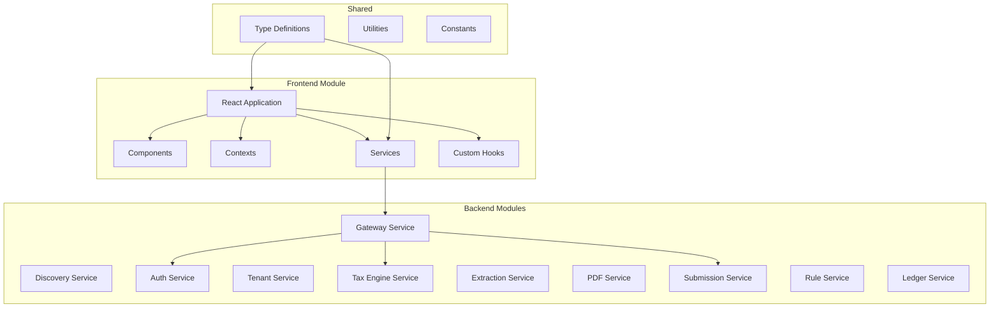
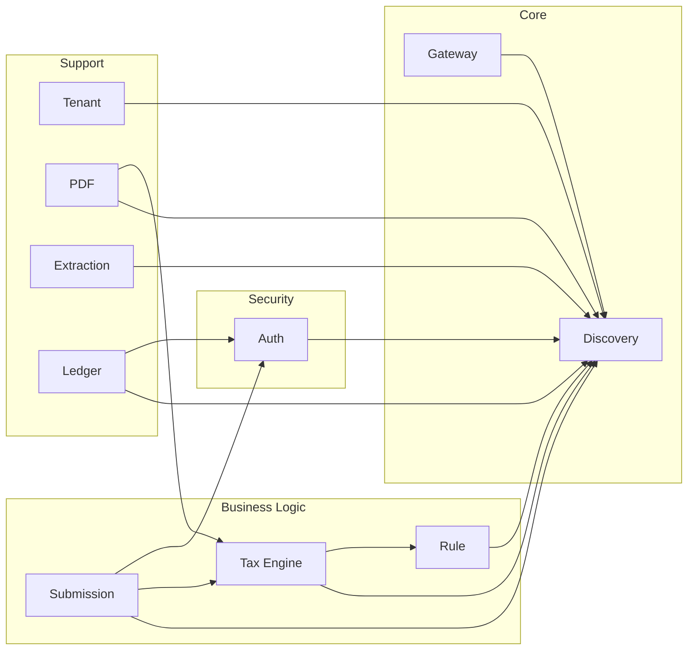

# MuniTax Modules List

## Overview

This document provides a detailed breakdown of all modules in the MuniTax system, including their responsibilities, dependencies, and key components.

---

## Module Architecture Overview



---

## Frontend Modules

### 1. Core Application Module

| Component | File | Description |
|-----------|------|-------------|
| Main App | `App.tsx` | Root application component with routing |
| Tax Filing App | `TaxFilingApp.tsx` | Tax filing workflow coordinator |
| Index | `index.tsx` | Application entry point |
| Styles | `index.css` | Global CSS styles |

### 2. Components Module

```
/components
├── AuditorDashboard.tsx          # Auditor queue management
├── BusinessDashboard.tsx         # Business filer dashboard
├── BusinessRegistration.tsx      # Business registration wizard
├── DocumentUpload.tsx            # File upload component
├── NetProfitsWizard.tsx          # Net profits form wizard
├── ReconciliationWizard.tsx      # W-3 reconciliation
├── ResultsDisplay.tsx            # Tax calculation results
├── ReturnReviewPanel.tsx         # Auditor review interface
├── ReviewSection.tsx             # Form review display
├── RuleConfiguration.tsx         # Rule management UI
├── SubmissionQueue.tsx           # Auditor submission queue
├── TaxPayerProfileForm.tsx       # Taxpayer profile input
├── WithholdingWizard.tsx         # W-1 withholding wizard
└── ...
```

### 3. Contexts Module

| Context | File | Purpose |
|---------|------|---------|
| Auth Context | `contexts/AuthContext.tsx` | Authentication state management |
| Session Context | `contexts/SessionContext.tsx` | Tax filing session state |
| Theme Context | `contexts/ThemeContext.tsx` | UI theme configuration |

### 4. Services Module

| Service | File | Purpose |
|---------|------|---------|
| API Service | `services/api.ts` | HTTP client for backend |
| Auth Service | `services/auth.ts` | Authentication operations |
| Tax Service | `services/tax.ts` | Tax calculation requests |
| Session Service | `services/session.ts` | Session CRUD operations |

### 5. Hooks Module

| Hook | File | Purpose |
|------|------|---------|
| useAuth | `hooks/useAuth.ts` | Authentication hook |
| useSession | `hooks/useSession.ts` | Session management hook |
| useLocalStorage | `hooks/useLocalStorage.ts` | Local storage persistence |

### 6. Types Module

| Type File | Contents |
|-----------|----------|
| `types.ts` | Core TypeScript type definitions |
| `src/types/` | Additional type modules |

**Key Type Definitions:**
- `TaxFormType` - Enum of supported tax forms
- `TaxReturnStatus` - Return status states
- `TaxPayerProfile` - Taxpayer information
- `BusinessProfile` - Business information
- `TaxCalculationResult` - Calculation results
- `AuditQueue` - Auditor queue items
- `TaxRule` - Rule configuration

### 7. Utilities Module

| Utility | File | Purpose |
|---------|------|---------|
| Formatters | `utils/formatters.ts` | Currency/date formatting |
| Validators | `utils/validators.ts` | Input validation |
| Helpers | `utils/helpers.ts` | Common helper functions |

---

## Backend Modules

### 1. Discovery Service Module

**Package:** `com.munitax.discovery`

| Component | Class | Responsibility |
|-----------|-------|----------------|
| Application | `DiscoveryServiceApplication` | Service entry point |
| Config | `EurekaServerConfig` | Eureka server configuration |

**Port:** 8761

**Dependencies:** Spring Cloud Netflix Eureka Server

### 2. Gateway Service Module

**Package:** `com.munitax.gateway`

| Component | Class | Responsibility |
|-----------|-------|----------------|
| Application | `GatewayServiceApplication` | Service entry point |
| Routes | `GatewayConfig` | Route definitions |
| Filters | `AuthenticationFilter` | JWT validation filter |

**Port:** 8080

**Key Routes:**
- `/api/v1/auth/**` → Auth Service
- `/api/v1/tax-engine/**` → Tax Engine Service
- `/api/v1/submissions/**` → Submission Service
- `/api/v1/rules/**` → Rule Service
- `/api/v1/ledger/**` → Ledger Service

### 3. Auth Service Module

**Package:** `com.munitax.auth`

```
auth-service/
├── config/
│   ├── SecurityConfig.java       # Spring Security configuration
│   └── JwtConfig.java           # JWT settings
├── controller/
│   └── AuthController.java      # Login/register endpoints
├── model/
│   ├── User.java                # User entity
│   └── Role.java                # Role entity
├── repository/
│   └── UserRepository.java      # User data access
├── service/
│   ├── UserService.java         # User management
│   └── JwtService.java          # Token operations
└── util/
    └── JwtUtil.java             # JWT helper utilities
```

**Port:** 8081

**Endpoints:**
- `POST /api/v1/auth/login` - User login
- `POST /api/v1/auth/register` - User registration
- `POST /api/v1/auth/refresh` - Token refresh
- `GET /api/v1/auth/me` - Current user info

### 4. Tenant Service Module

**Package:** `com.munitax.tenant`

```
tenant-service/
├── config/
│   └── TenantConfig.java        # Multi-tenant configuration
├── controller/
│   ├── SessionController.java   # Session endpoints
│   └── AddressController.java   # Address validation
├── model/
│   ├── Tenant.java              # Tenant entity
│   └── TaxReturnSession.java    # Session entity
├── repository/
│   ├── TenantRepository.java
│   └── SessionRepository.java
└── service/
    ├── TenantService.java       # Tenant management
    ├── SessionService.java      # Session CRUD
    └── AddressValidationService.java
```

**Port:** 8082

**Endpoints:**
- `POST /api/v1/sessions` - Create session
- `GET /api/v1/sessions/{id}` - Get session
- `PUT /api/v1/sessions/{id}` - Update session
- `DELETE /api/v1/sessions/{id}` - Delete session
- `POST /api/v1/address/validate` - Validate address

### 5. Extraction Service Module

**Package:** `com.munitax.extraction`

```
extraction-service/
├── config/
│   └── GeminiConfig.java        # Gemini AI configuration
├── controller/
│   └── ExtractionController.java # SSE streaming endpoint
├── service/
│   ├── GeminiService.java       # Gemini API integration
│   ├── ExtractionService.java   # Document processing
│   └── FormParserService.java   # Response parsing
└── dto/
    └── ExtractionResult.java    # Extraction response
```

**Port:** 8084

**Endpoints:**
- `GET /extraction/stream?fileName={name}` - SSE extraction stream

### 6. Submission Service Module

**Package:** `com.munitax.submission`

```
submission-service/
├── config/
│   └── AuditConfig.java         # Audit configuration
├── controller/
│   ├── SubmissionController.java # Tax return submissions
│   └── AuditController.java     # Auditor workflow
├── model/
│   ├── AuditQueue.java          # Queue entity
│   ├── AuditAction.java         # Action log entity
│   ├── AuditTrail.java          # Audit trail entity
│   ├── AuditReport.java         # Risk report entity
│   └── DocumentRequest.java     # Doc request entity
├── repository/
│   ├── AuditQueueRepository.java
│   ├── AuditTrailRepository.java
│   └── DocumentRequestRepository.java
└── service/
    ├── SubmissionService.java   # Return submission
    ├── AuditQueueService.java   # Queue management
    ├── AuditTrailService.java   # Audit logging
    └── RiskScoringService.java  # Risk calculation
```

**Port:** 8082

**Endpoints:**
- `POST /api/v1/submissions` - Submit return
- `GET /api/v1/audit/queue` - Get audit queue
- `POST /api/v1/audit/assign` - Assign auditor
- `POST /api/v1/audit/approve` - Approve return
- `POST /api/v1/audit/reject` - Reject return
- `POST /api/v1/audit/request-docs` - Request documents
- `GET /api/v1/audit/trail/{returnId}` - Get audit trail
- `GET /api/v1/audit/report/{returnId}` - Get audit report

### 7. Tax Engine Service Module

**Package:** `com.munitax.taxengine`

```
tax-engine-service/
├── config/
│   └── TaxEngineConfig.java     # Engine configuration
├── controller/
│   ├── TaxEngineController.java # Calculation endpoints
│   └── ScheduleYController.java # Schedule Y allocation endpoints
├── model/
│   ├── W2Form.java
│   ├── Form1099.java
│   ├── ScheduleC.java
│   ├── ScheduleE.java
│   ├── ScheduleF.java
│   ├── TaxCalculationResult.java
│   ├── TaxRulesConfig.java
│   └── BusinessTaxRulesConfig.java
├── repository/
│   ├── ApportionmentAuditLogRepository.java
│   ├── NexusTrackingRepository.java
│   ├── PayrollFactorRepository.java
│   ├── PropertyFactorRepository.java
│   ├── SalesFactorRepository.java
│   ├── SaleTransactionRepository.java
│   ├── ScheduleYRepository.java
│   ├── NOLRepository.java
│   ├── NOLScheduleRepository.java
│   ├── NOLUsageRepository.java
│   ├── NOLCarrybackRepository.java
│   ├── NOLAmendmentRepository.java
│   ├── NOLExpirationAlertRepository.java
│   ├── W1FilingRepository.java
│   ├── WithholdingPaymentRepository.java
│   ├── WithholdingReconciliationRepository.java
│   ├── WithholdingAuditLogRepository.java
│   ├── CumulativeWithholdingTotalsRepository.java
│   ├── PenaltyRepository.java
│   ├── PenaltyAbatementRepository.java
│   ├── PenaltyAuditLogRepository.java
│   ├── EstimatedTaxPenaltyRepository.java
│   ├── InterestRepository.java
│   ├── QuarterlyInterestRepository.java
│   ├── QuarterlyUnderpaymentRepository.java
│   ├── PaymentAllocationRepository.java
│   └── IgnoredW2Repository.java
├── service/
│   ├── IndividualTaxCalculator.java  # Individual calculation
│   ├── BusinessTaxCalculator.java    # Business calculation
│   ├── ScheduleXCalculationService.java
│   ├── ScheduleXValidationService.java
│   ├── ApportionmentService.java     # Allocation factors
│   ├── NOLService.java               # NOL management
│   ├── NOLScheduleService.java
│   ├── NOLCarrybackService.java
│   ├── W1FilingService.java          # Withholding filings
│   ├── PropertyFactorService.java
│   ├── PayrollFactorService.java
│   ├── SalesFactorService.java
│   ├── SourcingService.java
│   ├── ThrowbackService.java
│   ├── NexusService.java
│   └── penalty/
│       ├── PenaltyCalculator.java
│       └── InterestCalculator.java
└── dto/
    ├── IndividualTaxRequest.java
    ├── BusinessTaxRequest.java
    └── W1FilingRequest.java
```

**Port:** 8085

**Endpoints:**
- `POST /api/v1/tax-engine/calculate/individual` - Calculate individual tax
- `POST /api/v1/tax-engine/calculate/business` - Calculate business tax
- `POST /api/v1/w1-filings` - File W-1 return
- `GET /api/v1/w1-filings` - List W-1 filings
- `POST /api/v1/w1-filings/{id}/amend` - Amend W-1
- `GET /api/v1/schedule-y` - Get Schedule Y allocations

### 8. PDF Service Module

**Package:** `com.munitax.pdf`

```
pdf-service/
├── config/
│   └── PdfConfig.java           # PDFBox configuration
├── controller/
│   └── PdfController.java       # PDF generation endpoint
├── service/
│   ├── PdfGenerationService.java
│   └── FormTemplateService.java
└── template/
    └── Dublin1040Template.java  # Form template
```

**Port:** 8086

**Endpoints:**
- `POST /api/v1/pdf/generate/tax-return` - Generate tax return PDF

### 9. Rule Service Module

**Package:** `com.munitax.rules`

> **⚠️ Note:** See `/RULE_ENGINE_DISCONNECT_ANALYSIS.md` for known integration issues with this service.

```
rule-service/
├── config/
│   └── RuleConfig.java          # Rule engine configuration
├── controller/
│   └── RuleController.java      # Rule CRUD endpoints
├── model/
│   ├── TaxRule.java             # Rule entity
│   ├── RuleCategory.java        # Category enum
│   ├── RuleValueType.java       # Value type enum
│   ├── ApprovalStatus.java      # Status enum
│   ├── ChangeType.java          # Change type enum
│   └── RuleChangeLog.java       # Change log entity
├── repository/
│   ├── TaxRuleRepository.java
│   └── RuleChangeLogRepository.java
├── service/
│   ├── RuleFacadeService.java   # API facade
│   ├── RuleManagementService.java
│   ├── TemporalRuleService.java
│   ├── RuleValidationService.java
│   └── RuleCacheService.java    # Redis caching
├── mapper/
│   └── RuleMapper.java          # DTO mapping
└── dto/
    ├── CreateRuleRequest.java
    ├── UpdateRuleRequest.java
    └── RuleResponse.java
```

**Port:** 8087

**Endpoints:**
- `GET /api/v1/rules` - List rules
- `GET /api/v1/rules/{id}` - Get rule
- `POST /api/v1/rules` - Create rule
- `PUT /api/v1/rules/{id}` - Update rule
- `POST /api/v1/rules/{id}/approve` - Approve rule
- `POST /api/v1/rules/{id}/reject` - Reject rule
- `DELETE /api/v1/rules/{id}` - Void rule
- `GET /api/v1/rules/active` - Get active rules for date

### 10. Ledger Service Module

**Package:** `com.munitax.ledger`

```
ledger-service/
├── config/
│   └── LedgerConfig.java        # Ledger configuration
├── controller/
│   ├── PaymentController.java   # Payment endpoints
│   ├── LedgerController.java    # Ledger endpoints
│   └── ReconciliationController.java
├── model/
│   ├── JournalEntry.java        # Journal entry entity
│   ├── JournalEntryLine.java    # Line item entity
│   ├── ChartOfAccounts.java     # COA entity
│   ├── AccountBalance.java      # Balance entity
│   ├── PaymentTransaction.java  # Payment entity
│   └── ReconciliationReport.java
├── repository/
│   ├── JournalEntryRepository.java
│   ├── AccountBalanceRepository.java
│   └── PaymentRepository.java
├── service/
│   ├── JournalEntryService.java
│   ├── AccountStatementService.java
│   ├── TrialBalanceService.java
│   ├── PaymentService.java
│   ├── RefundService.java
│   ├── TaxAssessmentService.java
│   ├── ReconciliationService.java
│   ├── MockPaymentProviderService.java
│   └── AuditLogService.java
├── enums/
│   ├── AccountType.java
│   ├── TransactionType.java
│   └── PaymentStatus.java
└── dto/
    ├── PaymentRequest.java
    ├── StatementResponse.java
    └── ReconciliationResult.java
```

**Port:** 8088

**Endpoints:**
- `POST /api/v1/ledger/payments` - Process payment
- `GET /api/v1/ledger/account/{id}` - Get account statement
- `GET /api/v1/ledger/trial-balance` - Get trial balance
- `POST /api/v1/ledger/journal-entries` - Create journal entry
- `GET /api/v1/ledger/reconciliation` - Run reconciliation
- `POST /api/v1/ledger/refunds` - Process refund

---

## Module Dependencies

### Backend Service Dependencies



### Database Dependencies

| Service | Database | Tables |
|---------|----------|--------|
| Auth Service | PostgreSQL | users, roles, user_roles |
| Tenant Service | PostgreSQL | tenants, tax_return_sessions, addresses |
| Submission Service | PostgreSQL | audit_queue, audit_trail, audit_reports, document_requests |
| Rule Service | PostgreSQL | tax_rules, rule_change_logs |
| Ledger Service | PostgreSQL | journal_entries, journal_entry_lines, chart_of_accounts, account_balances, payment_transactions |
| Tax Engine | PostgreSQL | w1_filings, nols, nol_usages |

---

## Shared Libraries

### Common DTOs
- Request/Response objects shared across services
- Standardized error responses
- Pagination wrappers

### Security Commons
- JWT utilities
- Role definitions
- Security annotations

### Validation Commons
- Bean validation annotations
- Custom validators
- Validation messages

---

## Version History

| Version | Date | Changes |
|---------|------|---------|
| 1.0 | 2025-12-01 | Initial modules documentation |

---

**Document Owner:** Development Team  
**Last Updated:** December 1, 2025
