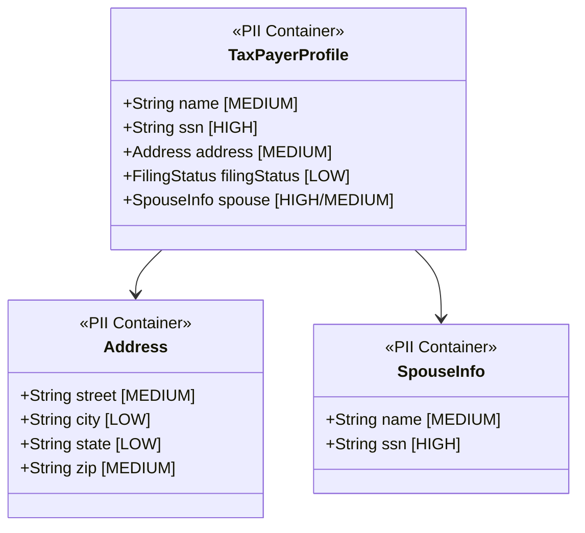
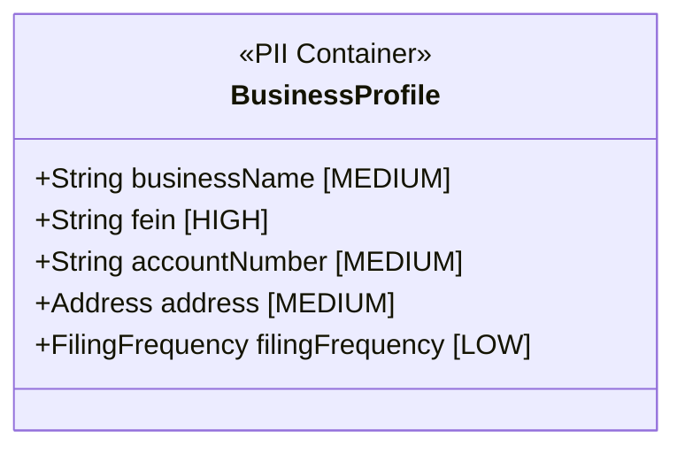
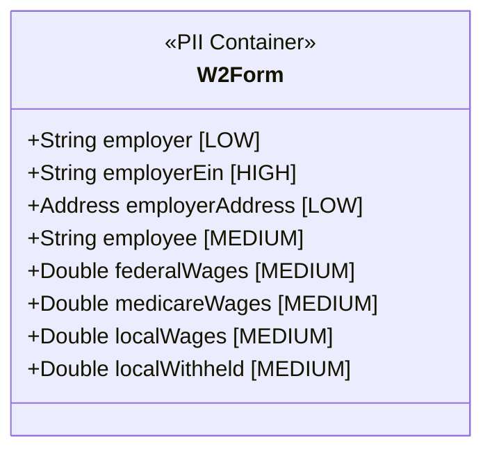
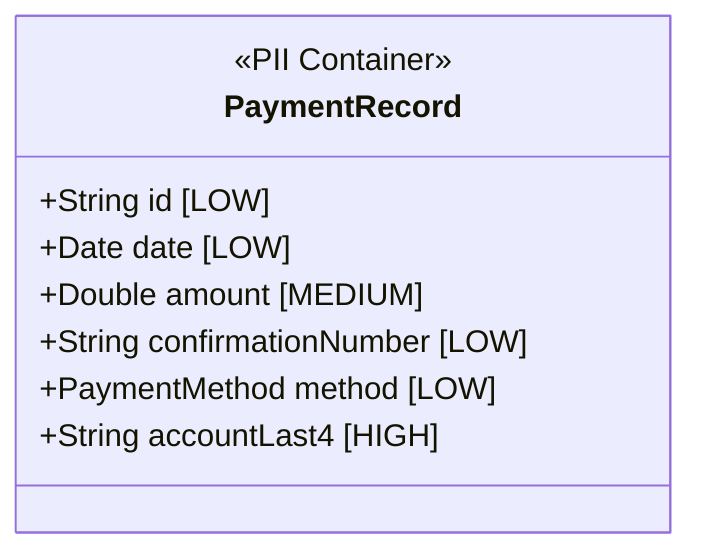
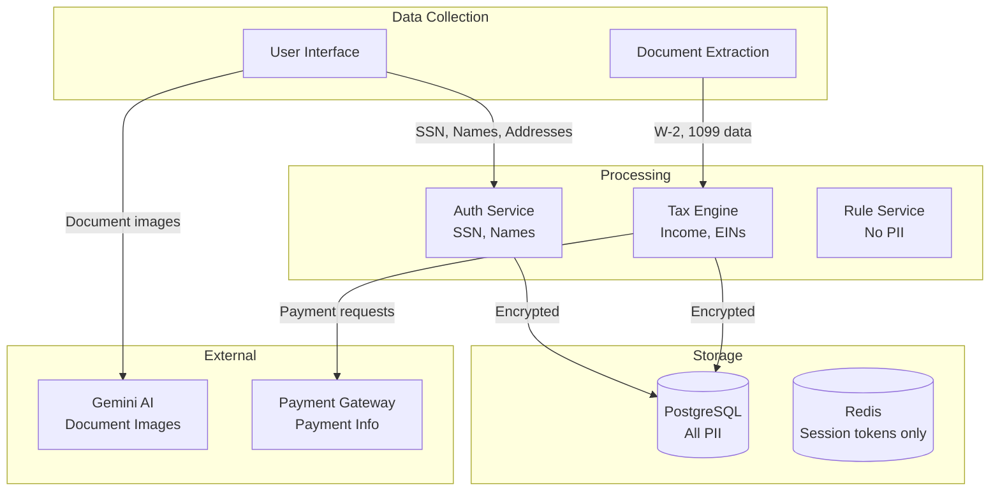
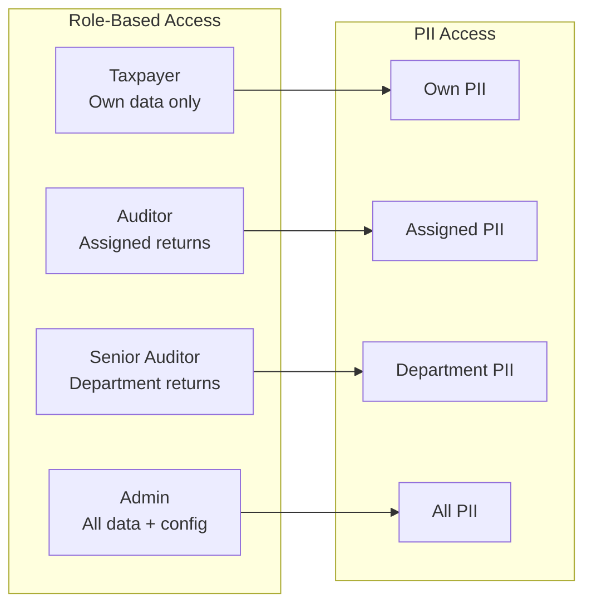

# MuniTax PII Data Documentation

## Overview

This document identifies and classifies all Personally Identifiable Information (PII) handled by the MuniTax system, along with data handling requirements and protection measures.

---

## PII Classification Levels

| Level | Description | Examples | Protection Requirements |
|-------|-------------|----------|------------------------|
| **HIGH** | Highly sensitive data that could enable identity theft or financial fraud | SSN, Bank account numbers, Tax IDs | Encryption at rest and in transit, access logging, masking in logs/UI |
| **MEDIUM** | Sensitive personal data requiring protection | Names, Addresses, Income amounts | Encryption in transit, role-based access |
| **LOW** | Personal data with lower sensitivity | Email addresses, Phone numbers | Standard protection, privacy controls |

---

## PII Data Inventory

### 1. Taxpayer Profile Data

| Field | Classification | Storage Location | Encryption | Masking |
|-------|---------------|------------------|------------|---------|
| `name` | MEDIUM | PostgreSQL | At rest | Display full |
| `ssn` | HIGH | PostgreSQL | At rest + transit | Last 4 only (XXX-XX-1234) |
| `address.street` | MEDIUM | PostgreSQL | At rest | Full display |
| `address.zip` | MEDIUM | PostgreSQL | At rest | Full display |
| `spouse.name` | MEDIUM | PostgreSQL | At rest | Display full |
| `spouse.ssn` | HIGH | PostgreSQL | At rest + transit | Last 4 only |

---

### 2. Business Profile Data

| Field | Classification | Storage Location | Encryption | Masking |
|-------|---------------|------------------|------------|---------|
| `businessName` | MEDIUM | PostgreSQL | At rest | Full display |
| `fein` | HIGH | PostgreSQL | At rest + transit | Last 4 only (XX-XXX1234) |
| `accountNumber` | MEDIUM | PostgreSQL | At rest | Full display |
| `address` | MEDIUM | PostgreSQL | At rest | Full display |

---

### 3. Tax Form Data (W-2)

| Field | Classification | Storage Location | Encryption | Masking |
|-------|---------------|------------------|------------|---------|
| `employer` | LOW | PostgreSQL | At rest | Full display |
| `employerEin` | HIGH | PostgreSQL | At rest + transit | Last 4 only |
| `employee` | MEDIUM | PostgreSQL | At rest | Full display |
| `federalWages` | MEDIUM | PostgreSQL | At rest | Full display |
| `localWithheld` | MEDIUM | PostgreSQL | At rest | Full display |

---

### 4. Tax Form Data (1099)

| Field | Classification | Storage Location | Encryption | Masking |
|-------|---------------|------------------|------------|---------|
| `payer` | LOW | PostgreSQL | At rest | Full display |
| `payerTin` | HIGH | PostgreSQL | At rest + transit | Last 4 only |
| `recipient` | MEDIUM | PostgreSQL | At rest | Full display |
| `incomeAmount` | MEDIUM | PostgreSQL | At rest | Full display |

---

### 5. Schedule E Data (Rentals/Partnerships)

| Field | Classification | Storage Location | Encryption | Masking |
|-------|---------------|------------------|------------|---------|
| `streetAddress` | MEDIUM | PostgreSQL | At rest | Full display |
| `partnershipEin` | HIGH | PostgreSQL | At rest + transit | Last 4 only |
| `netProfit` | MEDIUM | PostgreSQL | At rest | Full display |

---

### 6. Payment Data

| Field | Classification | Storage Location | Encryption | Masking |
|-------|---------------|------------------|------------|---------|
| `amount` | MEDIUM | PostgreSQL | At rest | Full display |
| `accountLast4` | HIGH | PostgreSQL (if stored) | At rest + transit | Only last 4 stored |
| `confirmationNumber` | LOW | PostgreSQL | At rest | Full display |

---

### 7. Audit Trail Data

| Field | Classification | Storage Location | Encryption | Masking |
|-------|---------------|------------------|------------|---------|
| `userId` | LOW | PostgreSQL | At rest | Full display (internal) |
| `ipAddress` | MEDIUM | PostgreSQL | At rest | Logged for audit |
| `userAgent` | LOW | PostgreSQL | At rest | Logged for audit |
| `digitalSignature` | HIGH | PostgreSQL | At rest + transit | Hash only stored |

---

## Data Flow Map with PII Indicators

---

## PII Protection Measures

### 1. Encryption

**At Rest:**
- PostgreSQL transparent data encryption (TDE)
- Encrypted database backups
- Volume encryption for Docker volumes

**In Transit:**
- TLS 1.3 for all API communications
- HTTPS enforced at Gateway
- Inter-service communication over TLS

### 2. Access Controls

### 3. Data Masking Rules

| Data Type | Display Format | Logging Format | Export Format |
|-----------|---------------|----------------|---------------|
| SSN | XXX-XX-1234 | XXX-XX-XXXX | Encrypted |
| FEIN | XX-XXX1234 | XX-XXXXXXX | Encrypted |
| Bank Account | XXXX1234 | XXXXXXXX | Not exported |
| Credit Card | XXXX-XXXX-XXXX-1234 | XXXX-XXXX-XXXX-XXXX | Not exported |

### 4. Data Retention

| Data Category | Retention Period | Legal Basis |
|---------------|------------------|-------------|
| Tax Returns | 7 years | IRS requirements |
| Audit Trails | 7 years | Compliance |
| Payment Records | 7 years | Financial regulations |
| Session Data | 90 days | Operational |
| Extraction Logs | 1 year | Debugging |

### 5. Data Minimization

- Only collect PII necessary for tax filing
- Do not store full payment credentials
- Limit AI extraction to form fields only
- Anonymize data for analytics

---

## PII Handling by Service

### Auth Service
- **Collects:** User credentials, SSN for identity verification
- **Stores:** Hashed passwords, user profiles
- **Transmits:** JWT tokens (no PII in payload)

### Extraction Service
- **Processes:** Document images containing PII
- **Transmits:** Extracted form data to frontend
- **Note:** Document images sent to Google Gemini

### Tax Engine Service
- **Receives:** All tax form data with PII
- **Processes:** Calculations only (no storage)
- **Returns:** Calculated results (includes income data)

### Submission Service
- **Stores:** Complete tax returns with PII
- **Maintains:** Audit trail with user actions
- **Access:** Controlled by role permissions

### Ledger Service
- **Stores:** Payment amounts (no full card numbers)
- **Processes:** Financial transactions
- **Access:** Limited to financial admins

---

## Compliance Requirements

### GDPR (if applicable)
- Right to access personal data
- Right to erasure (within retention limits)
- Data portability
- Consent management

### IRS Requirements
- 7-year retention for tax records
- Audit trail maintenance
- Secure transmission (TLS)
- Access logging

### State/Local Requirements
- Ohio tax filing requirements
- Dublin Municipality data handling
- Multi-tenant data isolation

---

## PII Incident Response

### Detection
- Automated monitoring for unusual access patterns
- Audit log analysis
- User-reported incidents

### Response Steps
1. Contain the breach
2. Assess scope of exposed PII
3. Notify affected individuals (if required)
4. Report to regulatory authorities (if required)
5. Remediate vulnerabilities
6. Document lessons learned

### Notification Thresholds
- SSN exposure: Immediate notification
- Address/Name exposure: 72-hour assessment
- Income data exposure: Case-by-case evaluation

---

## PII Access Audit Checklist

- [ ] All PII access is logged
- [ ] Logs include user, timestamp, data accessed
- [ ] Logs are immutable and retained 7 years
- [ ] Access logs are reviewed weekly
- [ ] Unusual access triggers alerts
- [ ] Access is restricted to business need
- [ ] Principle of least privilege enforced

---

## Version History

| Version | Date | Changes |
|---------|------|---------|
| 1.0 | 2025-12-01 | Initial PII documentation |

---

**Document Owner:** Security Team  
**Last Updated:** December 1, 2025  
**Review Frequency:** Quarterly
