# MuniTax Rule Engine Documentation

## Overview

The MuniTax Rule Engine is a dynamic, configurable system that manages all tax-related business rules. It supports temporal effective dating, multi-tenant isolation, and approval workflows for rule changes.

---

## Rule Engine Architecture

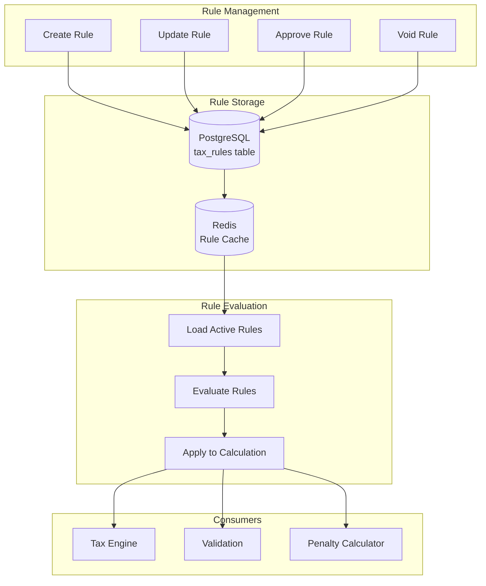

---

## Rule Engine Components

### Component Diagram

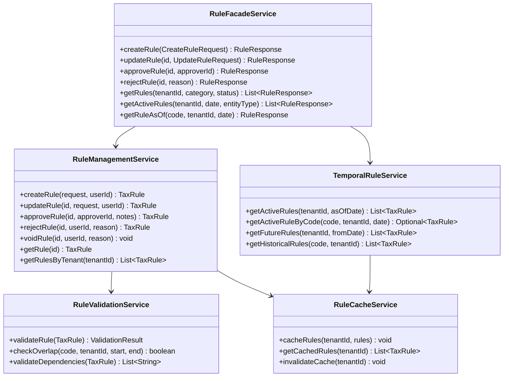

---

## Rule Data Model

### TaxRule Entity

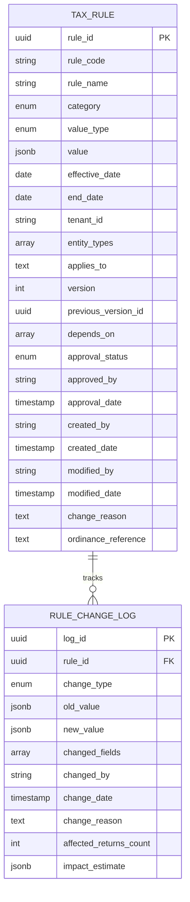

---

## Rule Categories

### Category Hierarchy

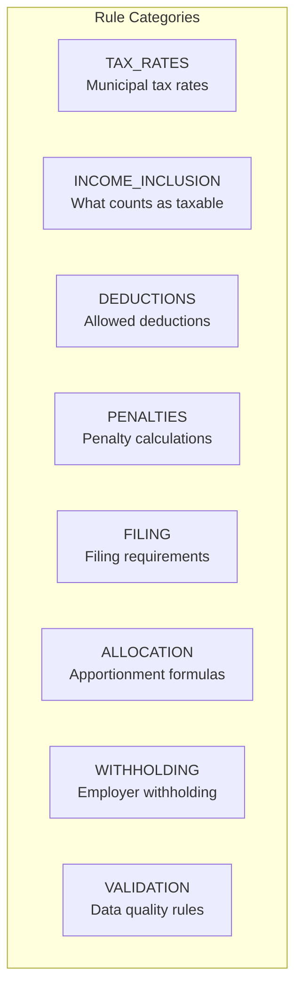

### Category Details

| Category | Description | Example Rules |
|----------|-------------|---------------|
| **TAX_RATES** | Municipal and state tax rates | Dublin municipal rate 2.5%, Credit limit rate 2.5% |
| **INCOME_INCLUSION** | Which income types are taxable | Include Schedule C, Include gambling winnings |
| **DEDUCTIONS** | Allowed deductions and limitations | NOL offset cap 50%, Section 179 limits |
| **PENALTIES** | Penalty calculation parameters | Late filing 5% per month, Underpayment 15% |
| **FILING** | Filing thresholds and requirements | Minimum income threshold, Filing frequency |
| **ALLOCATION** | Business apportionment rules | Sales factor weight, Joyce/Finnigan election |
| **WITHHOLDING** | Employer withholding rules | Withholding rate, Deposit frequency |
| **VALIDATION** | Data validation rules | W-2 Box variance threshold, Duplicate detection |

---

## Rule Value Types

### Value Type Structure

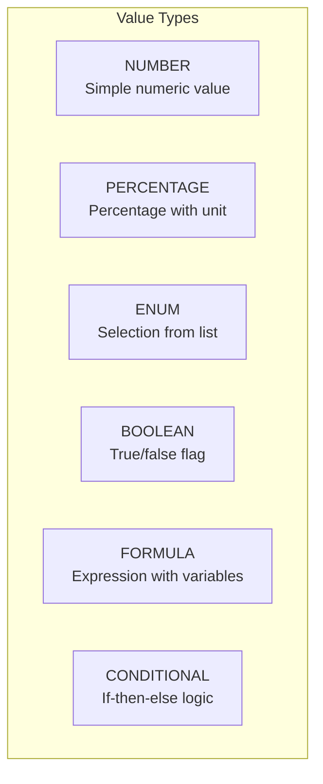

### Value Type Examples

**NUMBER:**
```json
{
  "scalar": 50000
}
```

**PERCENTAGE:**
```json
{
  "scalar": 2.5,
  "unit": "percent"
}
```

**ENUM:**
```json
{
  "option": "BOX_5_MEDICARE",
  "allowedValues": ["HIGHEST_OF_ALL", "BOX_5_MEDICARE", "BOX_18_LOCAL", "BOX_1_FEDERAL"]
}
```

**BOOLEAN:**
```json
{
  "flag": true
}
```

**FORMULA:**
```json
{
  "expression": "taxableIncome * rate * (1 - creditRate)",
  "variables": ["taxableIncome", "rate", "creditRate"],
  "returnType": "number"
}
```

**CONDITIONAL:**
```json
{
  "condition": "income > 150000",
  "thenValue": 0,
  "elseValue": 25000,
  "returnType": "number"
}
```

---

## Rule Lifecycle

### Lifecycle Diagram

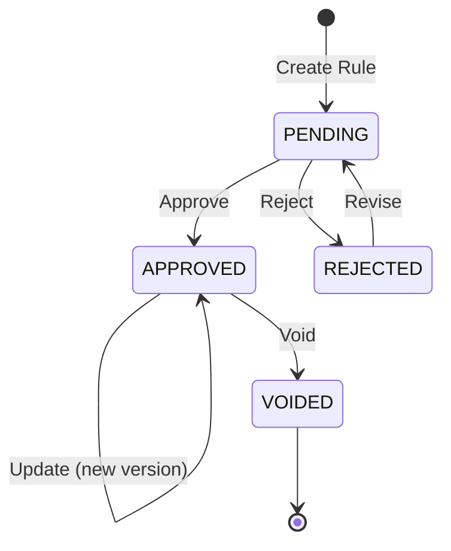

### Approval Workflow

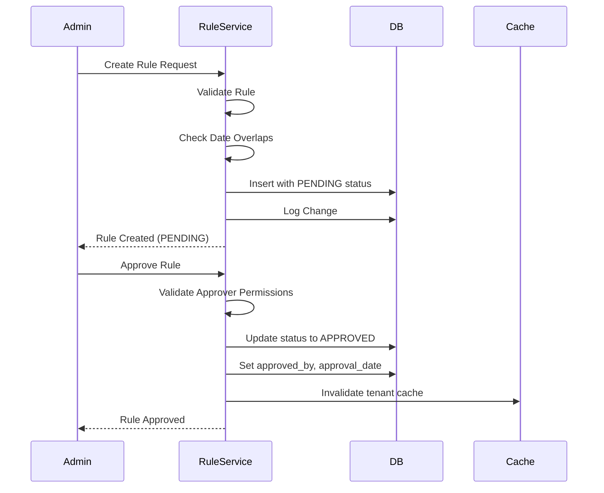

---

## Temporal Rule Management

### Effective Date Handling

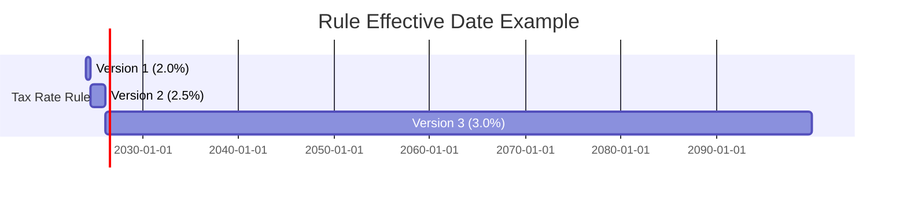

### Point-in-Time Query

```java
// Get rule active on specific date
public Optional<TaxRule> getActiveRuleByCode(
    String ruleCode, 
    String tenantId, 
    LocalDate asOfDate
) {
    return ruleRepository.findByRuleCodeAndTenantId(ruleCode, tenantId)
        .stream()
        .filter(rule -> rule.isActiveOn(asOfDate))
        .findFirst();
}
```

### Overlap Prevention

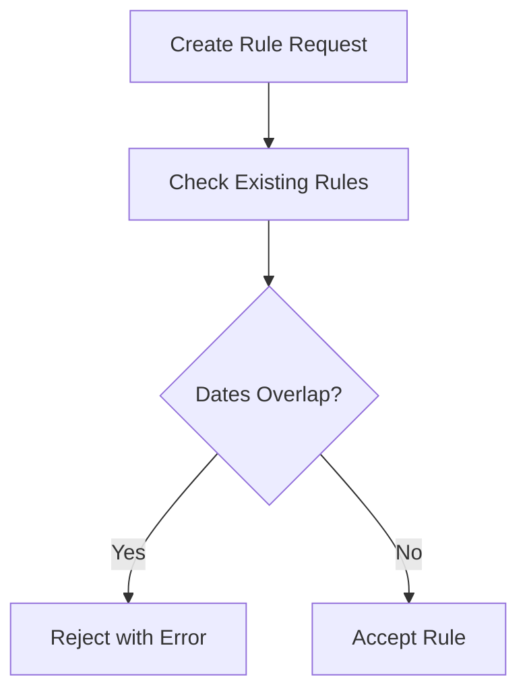

---

## Rule Integration with Tax Engine

### Integration Flow

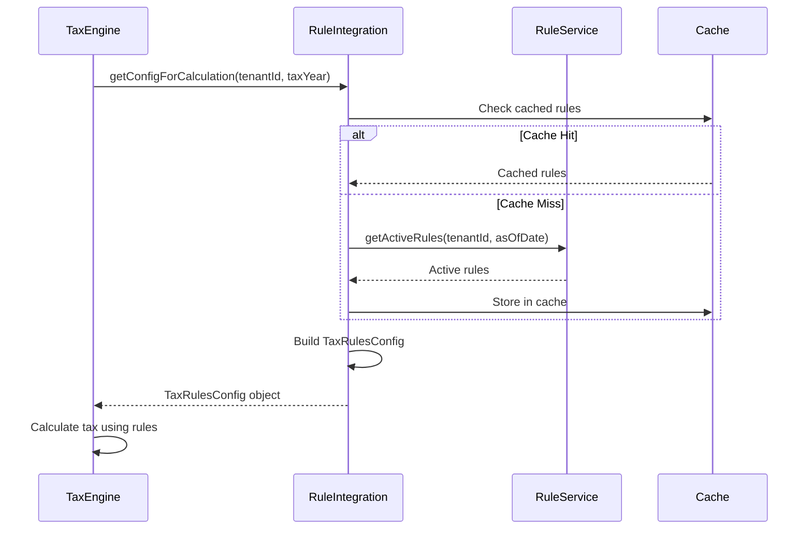

### TaxRulesConfig Structure

```java
public interface TaxRulesConfig {
    double municipalRate();           // From TAX_RATES category
    double municipalCreditLimitRate();
    Map<String, Double> municipalRates();
    
    W2QualifyingWagesRule w2QualifyingWagesRule();  // From INCOME_INCLUSION
    IncomeInclusion incomeInclusion();
    
    boolean enableRounding();         // From FILING category
}

public interface BusinessTaxRulesConfig {
    double municipalRate();           // From TAX_RATES
    double minimumTax();
    
    String allocationMethod();        // From ALLOCATION
    double allocationSalesFactorWeight();
    
    boolean enableNOL();              // From DEDUCTIONS
    double nolOffsetCapPercent();
    
    double penaltyRateLateFiling();   // From PENALTIES
    double penaltyRateUnderpayment();
    double interestRateAnnual();
    double safeHarborPercent();
}
```

---

## Built-in Rules (Default Configuration)

### Tax Rate Rules

| Rule Code | Category | Default Value | Description |
|-----------|----------|---------------|-------------|
| `MUNICIPAL_TAX_RATE` | TAX_RATES | 2.5% | Dublin municipal tax rate |
| `CREDIT_LIMIT_RATE` | TAX_RATES | 2.5% | Maximum credit rate |
| `MINIMUM_BUSINESS_TAX` | TAX_RATES | $0 | Minimum annual business tax |

### Income Inclusion Rules

| Rule Code | Category | Default Value | Description |
|-----------|----------|---------------|-------------|
| `W2_QUALIFYING_WAGES_METHOD` | INCOME_INCLUSION | HIGHEST_OF_ALL | How to determine qualifying wages |
| `INCLUDE_SCHEDULE_C` | INCOME_INCLUSION | true | Include Schedule C income |
| `INCLUDE_SCHEDULE_E` | INCOME_INCLUSION | true | Include Schedule E income |
| `INCLUDE_SCHEDULE_F` | INCOME_INCLUSION | true | Include Schedule F income |
| `INCLUDE_GAMBLING` | INCOME_INCLUSION | true | Include W-2G gambling winnings |
| `INCLUDE_1099` | INCOME_INCLUSION | true | Include 1099 income |

### Deduction Rules

| Rule Code | Category | Default Value | Description |
|-----------|----------|---------------|-------------|
| `NOL_ENABLED` | DEDUCTIONS | true | Allow NOL carryforward |
| `NOL_OFFSET_CAP` | DEDUCTIONS | 50% | Maximum NOL offset percentage |
| `INTANGIBLE_EXPENSE_RATE` | DEDUCTIONS | 5% | 5% rule for intangible expenses |

### Penalty Rules

| Rule Code | Category | Default Value | Description |
|-----------|----------|---------------|-------------|
| `LATE_FILING_RATE` | PENALTIES | 5% | Monthly late filing penalty |
| `LATE_FILING_MAX` | PENALTIES | 25% | Maximum late filing penalty |
| `LATE_FILING_MIN` | PENALTIES | $50 | Minimum penalty amount |
| `UNDERPAYMENT_RATE` | PENALTIES | 15% | Underpayment penalty rate |
| `INTEREST_RATE_ANNUAL` | PENALTIES | 7% | Annual interest rate |
| `SAFE_HARBOR_PERCENT` | PENALTIES | 90% | Safe harbor threshold |

### Filing Rules

| Rule Code | Category | Default Value | Description |
|-----------|----------|---------------|-------------|
| `ENABLE_ROUNDING` | FILING | false | Round to whole dollars |
| `QUARTERLY_DUE_DAYS` | FILING | 30 | Days after quarter end |
| `MONTHLY_DUE_DAY` | FILING | 15 | Day of following month |

### Allocation Rules

| Rule Code | Category | Default Value | Description |
|-----------|----------|---------------|-------------|
| `ALLOCATION_METHOD` | ALLOCATION | 3_FACTOR | Apportionment method |
| `SALES_FACTOR_WEIGHT` | ALLOCATION | 1.0 | Double weighting for sales |

### Validation Rules

| Rule Code | Category | Default Value | Description |
|-----------|----------|---------------|-------------|
| `W2_BOX_VARIANCE_THRESHOLD` | VALIDATION | 20% | Max variance between Box 1 and 18 |
| `MAX_WITHHOLDING_RATE` | VALIDATION | 3.0% | Maximum valid withholding rate |
| `DUPLICATE_WAGE_THRESHOLD` | VALIDATION | $10 | Threshold for duplicate detection |

---

## Adding Custom Rules

### Rule Creation Process

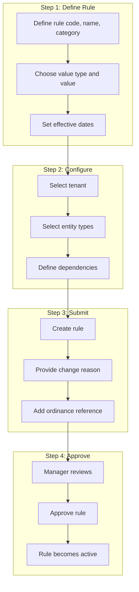

### Example: Adding New Penalty Rule

```json
{
  "ruleCode": "EXTENSION_PENALTY_RATE",
  "ruleName": "Filing Extension Penalty Rate",
  "category": "PENALTIES",
  "valueType": "PERCENTAGE",
  "value": {
    "scalar": 2.0,
    "unit": "percent"
  },
  "effectiveDate": "2025-01-01",
  "tenantId": "dublin",
  "entityTypes": ["INDIVIDUAL", "BUSINESS"],
  "changeReason": "Adding penalty for late extension requests per City Council Resolution 2024-123",
  "ordinanceReference": "Dublin City Code §1234.56"
}
```

### Example: Adding Formula Rule

```json
{
  "ruleCode": "TIERED_RATE_CALCULATION",
  "ruleName": "Tiered Tax Rate Calculation",
  "category": "TAX_RATES",
  "valueType": "CONDITIONAL",
  "value": {
    "condition": "taxableIncome > 500000",
    "thenValue": 0.03,
    "elseValue": 0.025,
    "returnType": "number"
  },
  "effectiveDate": "2026-01-01",
  "tenantId": "dublin",
  "entityTypes": ["BUSINESS"],
  "changeReason": "Implementing tiered rate structure for high-income businesses",
  "ordinanceReference": "Dublin City Ordinance 2025-789"
}
```

---

## Rule API Reference

### Create Rule

```http
POST /api/v1/rules
Content-Type: application/json
Authorization: Bearer {token}

{
  "ruleCode": "NEW_RULE_CODE",
  "ruleName": "New Rule Name",
  "category": "TAX_RATES",
  "valueType": "PERCENTAGE",
  "value": {"scalar": 2.5, "unit": "percent"},
  "effectiveDate": "2025-01-01",
  "tenantId": "dublin",
  "entityTypes": ["INDIVIDUAL", "BUSINESS"],
  "changeReason": "Adding new rule for tax calculation"
}
```

### Get Active Rules

```http
GET /api/v1/rules/active?tenantId=dublin&asOfDate=2025-01-15&entityType=BUSINESS
Authorization: Bearer {token}
```

### Approve Rule

```http
POST /api/v1/rules/{ruleId}/approve
Content-Type: application/json
Authorization: Bearer {token}

{
  "approverId": "manager-uuid"
}
```

---

## Integration Status & Known Issues

> **Reference:** See `/RULE_ENGINE_DISCONNECT_ANALYSIS.md` for detailed analysis.

### Current Integration Architecture

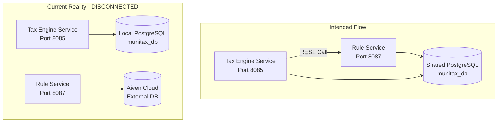

### Known Issues

| Issue | Severity | Status | Description |
|-------|----------|--------|-------------|
| Database Disconnect | CRITICAL | Open | Rule service connects to external cloud DB instead of local Docker postgres |
| Missing Schema | CRITICAL | Open | tax_rules table not created in munitax_db |
| Enum Mismatch | LOW | Documented | Spec uses PascalCase, code uses SCREAMING_SNAKE_CASE (code is correct) |
| Service Isolation | HIGH | Open | Rule service cannot integrate with tax-engine due to separate databases |

### Recommended Fixes

1. **Fix rule-service database configuration** to use local Docker postgres
2. **Run migrations** to create tax_rules tables in munitax_db
3. **Update specs** to match actual code enum conventions

For detailed remediation steps, see `/RULE_ENGINE_DISCONNECT_ANALYSIS.md`.

---

## Version History

| Version | Date | Changes |
|---------|------|---------|
| 1.1 | 2025-12-01 | Added integration status and known issues section |
| 1.0 | 2025-12-01 | Initial rule engine documentation |

---

**Document Owner:** Development Team  
**Last Updated:** December 1, 2025
