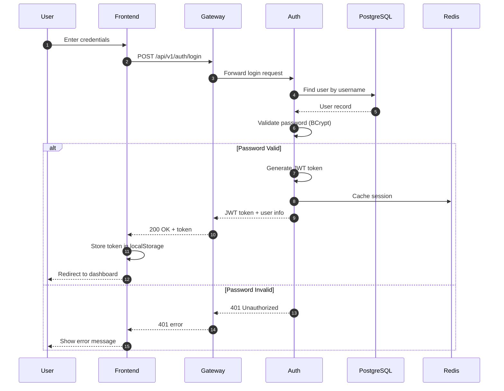
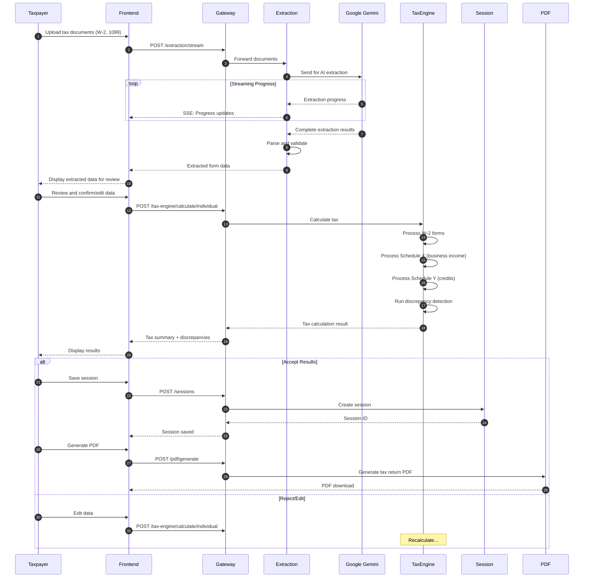
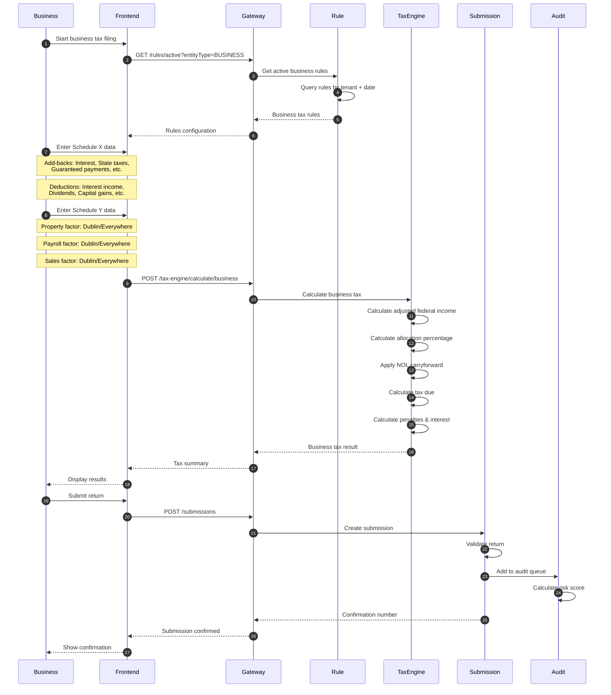
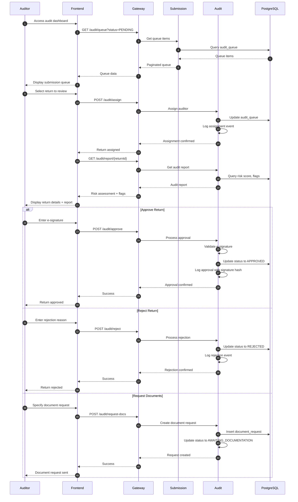
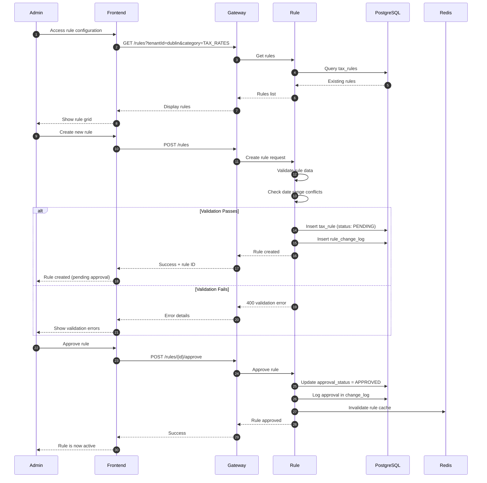
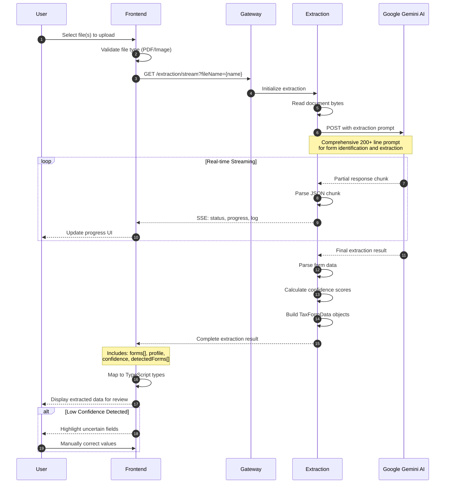
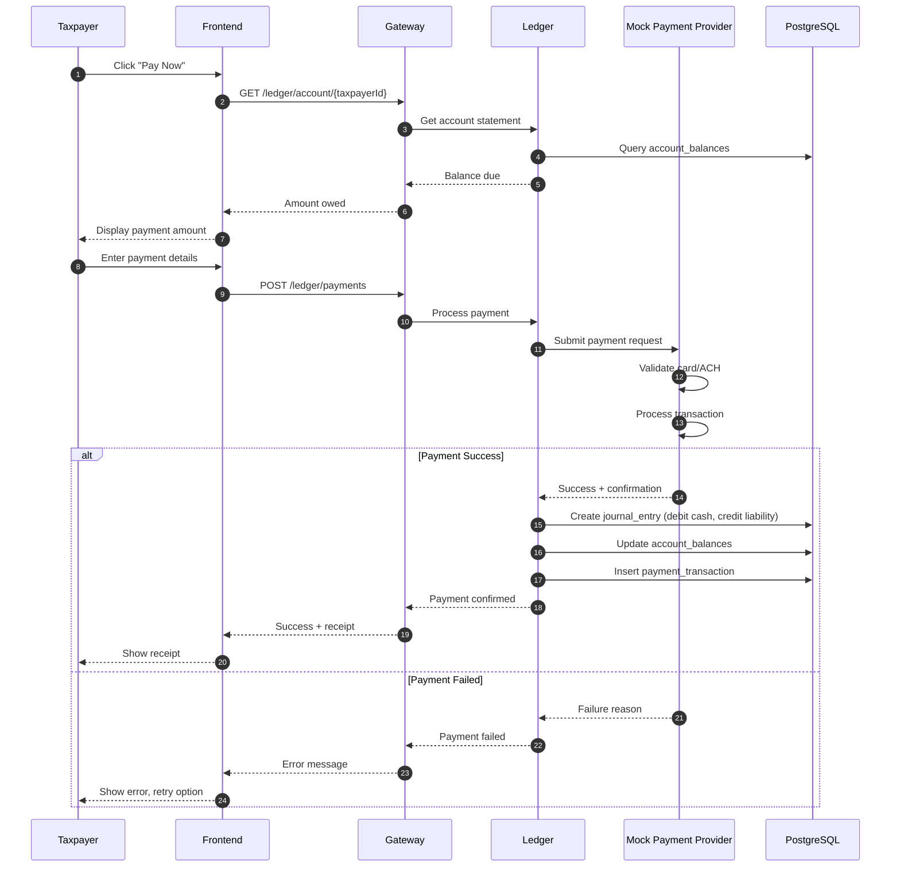
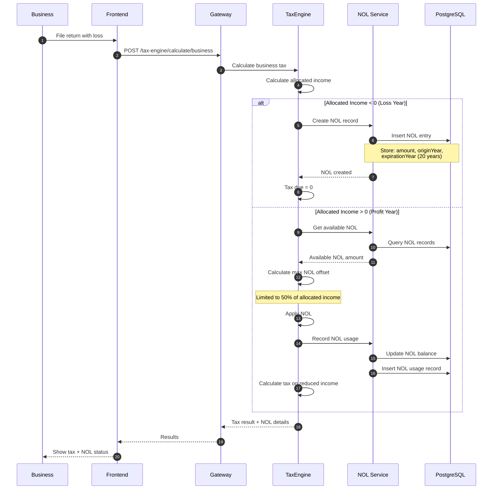
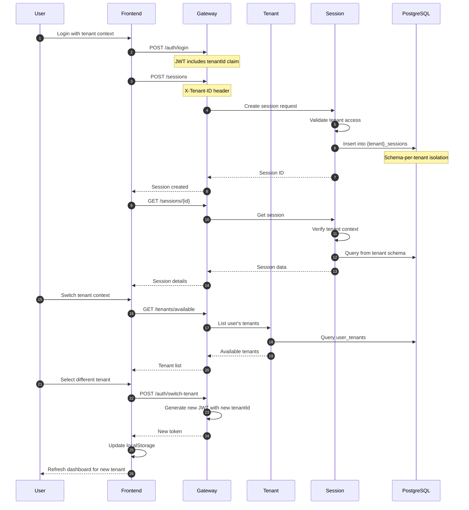
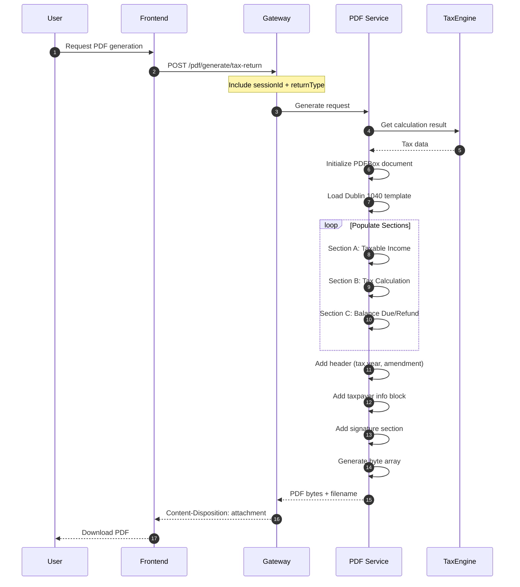

# MuniTax Sequence Diagrams

## Overview

This document contains detailed sequence diagrams for key workflows in the MuniTax system.

---

## 1. User Authentication Flow

---

## 2. Individual Tax Return Filing

---

## 3. Business Tax Return Filing

---

## 4. Auditor Review Workflow

---

## 5. Tax Rule Configuration

---

## 6. Document Extraction Flow

---

## 7. Payment Processing Flow

---

## 8. NOL Carryforward Processing

---

## 9. Multi-Tenant Session Management

---

## 10. PDF Generation Flow

---

## Known Limitations

### Individual Tax Return Filing (Section 2)

#### Payment Processing Not Implemented (Steps 26-30)

**Description:**  
The sequence diagram documents a complete payment flow from payment submission through confirmation to receipt generation (steps 26-30). However, this workflow is **not currently implemented** in the frontend application.

**Documented but Not Implemented:**
- Step 26: `Taxpayer->>Frontend: Click "Pay Now"`
- Step 27: `Frontend->>Gateway: POST /ledger/payments`
- Step 28: `Gateway->>Ledger: Process payment`
- Step 29: Payment provider interaction and ledger updates
- Step 30: Receipt generation and display

**Current Status:**
- ✅ Backend APIs fully implemented:
  - `POST /api/v1/payments/process` - Payment processing
  - `POST /api/v1/payments/{id}/confirm` - Payment confirmation
  - `GET /api/v1/payments/{paymentId}/receipt` - Receipt generation
- ❌ Frontend components not implemented:
  - Payment form UI
  - Payment confirmation screen
  - Receipt display and download

**Impact:**
- Taxpayers must submit payment separately after filing their return
- No online payment capability within the application
- Manual processing required by municipality staff

**Workaround:**
1. Taxpayer completes tax calculation using the application
2. Generate and download PDF tax return using `POST /api/v1/pdf/generate/tax-return`
3. Submit payment separately through:
   - Check mailed to municipality
   - In-person payment at tax office
   - Wire transfer or ACH (arranged separately)
4. Municipality staff manually records payment in ledger system

**Tracking Issues:**
- [shashanksaxena-tz/munciplaityTax#94](https://github.com/shashanksaxena-tz/munciplaityTax/issues/94) - Implement payment processing workflow
- [shashanksaxena-tz/munciplaityTax#102](https://github.com/shashanksaxena-tz/munciplaityTax/issues/102) - Create payment confirmation and receipt UI

**Backend Reference:**  
`backend/ledger-service/src/main/java/com/munitax/ledger/controller/PaymentController.java`

---

### Auditor Review Workflow (Section 4)

#### Document Request System Not Used (Step 17-24)

**Description:**  
The sequence diagram shows auditors can request additional documents from taxpayers, but this feature is not currently accessible in the UI.

**Documented but Not Implemented in UI:**
- Step 17-24: Document request creation and tracking
- `POST /api/v1/audit/request-docs` endpoint exists but not used
- `GET /api/v1/audit/document-requests/{returnId}` endpoint exists but not used
- `POST /api/v1/audit/document-requests/{requestId}/received` endpoint exists but not used

**Current Status:**
- ✅ Backend APIs fully implemented
- ❌ Frontend UI not implemented
- ❌ Document upload by taxpayer not implemented

**Impact:**
- Auditors cannot formally request additional documentation through the system
- No tracking of outstanding document requests
- Manual communication required (email/phone)

**Workaround:**
- Auditors contact taxpayers directly via email or phone
- Documents submitted via email or in-person
- Manual tracking in external systems

**Tracking Issue:**
- [shashanksaxena-tz/munciplaityTax#XX](https://github.com/shashanksaxena-tz/munciplaityTax/issues/XX) - Implement document request UI

#### Audit Trail Display Not Implemented (Step 13)

**Description:**  
Audit trail viewing capability exists in the backend but no UI component to display it.

**Current Status:**
- ✅ `GET /api/v1/audit/trail/{returnId}` endpoint implemented
- ❌ Audit trail viewer UI not implemented

**Impact:**
- No visibility into complete audit history and actions
- Difficult to track who did what and when

**Workaround:**
- Direct database queries for audit history
- Manual log review

**Tracking Issue:**
- [shashanksaxena-tz/munciplaityTax#XX](https://github.com/shashanksaxena-tz/munciplaityTax/issues/XX) - Add audit trail viewer

---

### Payment Processing Flow (Section 7)

This entire workflow is documented but not fully integrated into the frontend. See "Payment Processing Not Implemented" above for details.

---

## Version History

| Version | Date | Changes |
|---------|------|---------|
| 1.0 | 2025-12-01 | Initial sequence diagram documentation |
| 1.1 | 2025-12-10 | Added Known Limitations section |

---

**Document Owner:** Development Team  
**Last Updated:** December 10, 2025
