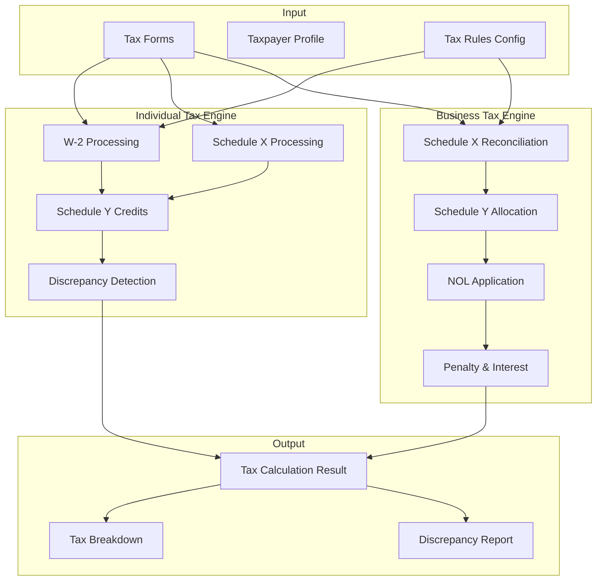
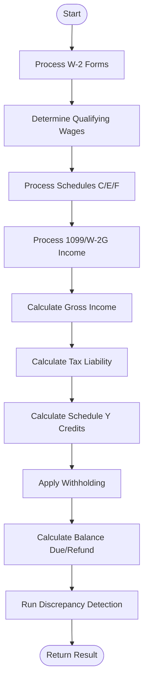
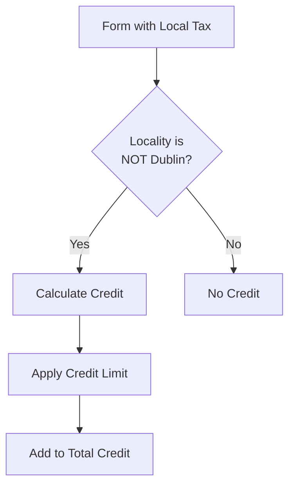
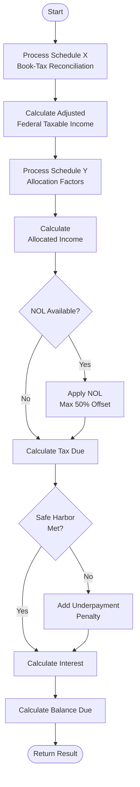
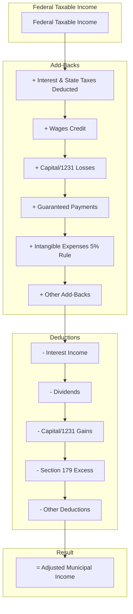
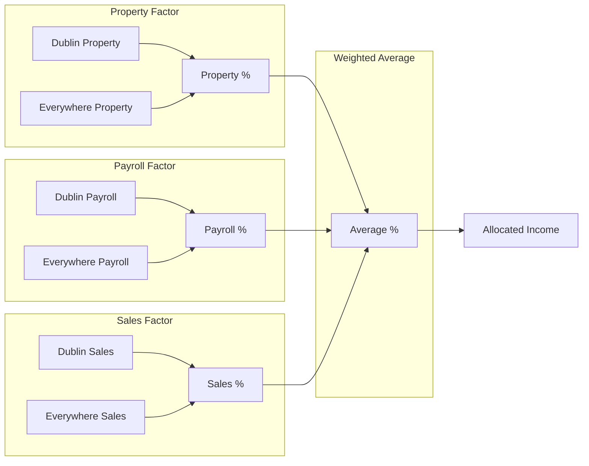
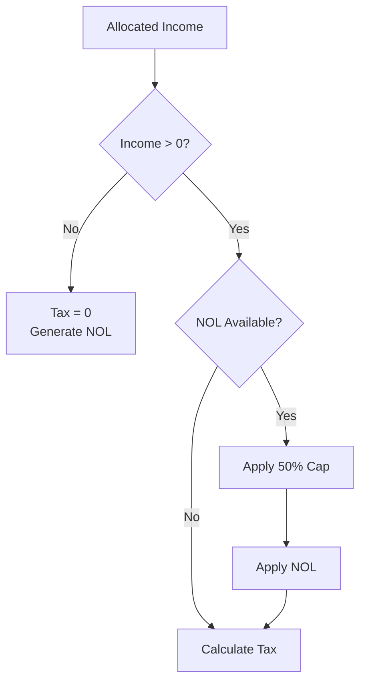
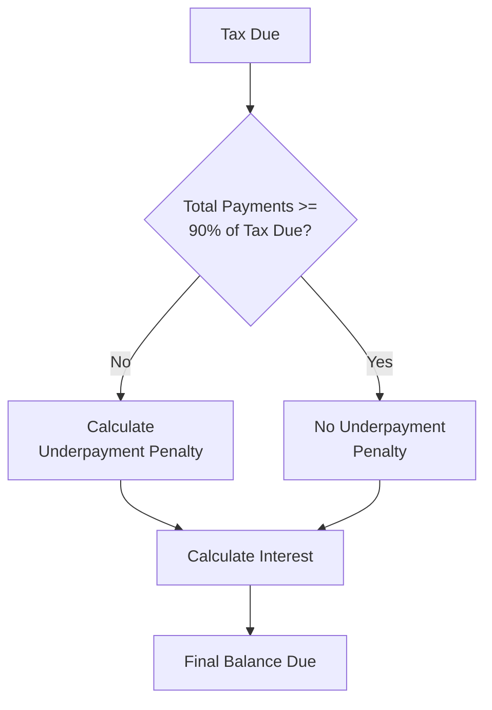
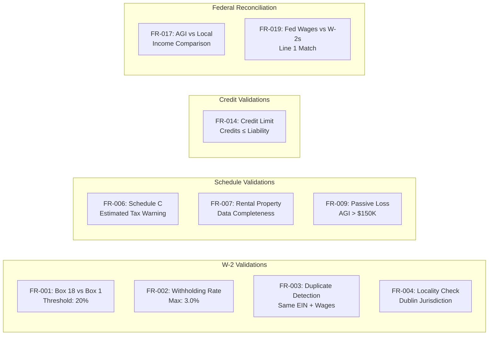

# MuniTax Tax Computation Documentation

## Overview

This document details the tax computation algorithms used in the MuniTax system for both individual and business tax calculations.

---

## Tax Computation Architecture



---

## Individual Tax Calculation

### Calculation Flow Diagram



### W-2 Processing

#### Qualifying Wages Rules

```mermaid
flowchart TD
    W2[W-2 Form] --> RULE{Qualifying<br/>Wages Rule}
    
    RULE -->|HIGHEST_OF_ALL| MAX[MAX(Box 1, Box 5, Box 18)]
    RULE -->|BOX_1_FEDERAL| B1[Federal Wages - Box 1]
    RULE -->|BOX_5_MEDICARE| B5[Medicare Wages - Box 5]
    RULE -->|BOX_18_LOCAL| B18[Local Wages - Box 18]
    
    MAX --> QW[Qualifying Wages]
    B1 --> QW
    B5 --> QW
    B18 --> QW
```

**Algorithm:**
```
For each W-2 form:
    box1 = federalWages ?? 0
    box5 = medicareWages ?? 0
    box18 = localWages ?? 0
    
    qualifyingWages = SWITCH(rule):
        HIGHEST_OF_ALL: MAX(box1, box5, box18)
        BOX_1_FEDERAL: box1
        BOX_5_MEDICARE: box5
        BOX_18_LOCAL: box18
    
    totalGrossIncome += box1
    totalLocalWithheld += localWithheld ?? 0
    w2TaxableIncome += qualifyingWages
```

### Schedule X Processing (Individual)

**Included Income Types:**
- Schedule C (Business Profit/Loss)
- Schedule E (Rental/Partnership Income)
- Schedule F (Farm Income)
- W-2G (Gambling Winnings)
- 1099-NEC/MISC (Non-Employee Compensation)

**Algorithm:**
```
totalNetProfit = 0

For each form:
    IF form is Schedule C AND rules.includeScheduleC:
        netProfit = form.netProfit ?? 0
        totalNetProfit += netProfit
        
    IF form is Schedule E AND rules.includeScheduleE:
        For each rental:
            netProfit += rental.income + rental.deductibleLoss
        For each partnership:
            netProfit += partnership.netProfit
        totalNetProfit += netProfit
        
    IF form is Schedule F AND rules.includeScheduleF:
        totalNetProfit += form.netFarmProfit ?? 0
        
    IF form is W-2G AND rules.includeW2G:
        totalNetProfit += form.grossWinnings ?? 0
        
    IF form is 1099 AND rules.include1099:
        totalNetProfit += form.incomeAmount ?? 0

taxableScheduleX = MAX(0, totalNetProfit)
```

### Schedule Y Credits



**Algorithm:**
```
totalCredit = 0

For each form with localWithheld > 0:
    IF locality is NOT Dublin:
        incomeForCredit = form.localWages ?? form.grossWinnings ?? form.incomeAmount ?? 0
        creditLimit = incomeForCredit * rules.municipalCreditLimitRate
        creditAllowed = MIN(localWithheld, creditLimit)
        totalCredit += creditAllowed
```

### Final Calculation

```
totalTaxableIncome = w2TaxableIncome + taxableScheduleX
municipalLiability = totalTaxableIncome * rules.municipalRate
liabilityAfterCredits = MAX(0, municipalLiability - totalCredit)
balance = totalLocalWithheld - liabilityAfterCredits

IF rules.enableRounding:
    liabilityAfterCredits = ROUND(liabilityAfterCredits)
    balance = ROUND(balance)
```

### Individual Tax Formula Summary

```
┌─────────────────────────────────────────────────────────────────┐
│  INDIVIDUAL TAX CALCULATION                                     │
├─────────────────────────────────────────────────────────────────┤
│  W-2 Qualifying Wages (Rule-Based)              $XXX,XXX        │
│  + Schedule X Net Profit                        $XXX,XXX        │
│  ─────────────────────────────────────────────────────────────  │
│  = Total Taxable Income                         $XXX,XXX        │
│                                                                 │
│  × Municipal Tax Rate (2.5%)                    × 0.025         │
│  ─────────────────────────────────────────────────────────────  │
│  = Gross Municipal Liability                    $XX,XXX         │
│                                                                 │
│  − Schedule Y Credits                           $(X,XXX)        │
│  ─────────────────────────────────────────────────────────────  │
│  = Net Municipal Liability                      $XX,XXX         │
│                                                                 │
│  − Local Tax Withheld                           $(X,XXX)        │
│  ─────────────────────────────────────────────────────────────  │
│  = Balance Due / (Refund)                       $X,XXX          │
└─────────────────────────────────────────────────────────────────┘
```

---

## Business Tax Calculation

### Calculation Flow Diagram



### Schedule X (Book-Tax Reconciliation)



**27-Field Schedule X Calculation:**
```
// Add-Backs
totalAddBacks = 
    interestAndStateTaxes +
    wagesCredit +
    capitalLosses +
    guaranteedPayments +
    intangibleExpenses +
    depreciation +
    mealsEntertainment +
    relatedPartyExpenses +
    politicalContributions +
    officerLifeInsurance +
    otherAddBacks

// Deductions
totalDeductions = 
    interestIncome +
    dividends +
    capitalGains +
    section179Excess +
    bonusDepreciation +
    badDebtReserves +
    charitableExcess +
    domesticProductionDeduction +
    stockBasedCompensation +
    inventoryValuationChanges +
    otherDeductions

adjustedFedIncome = fedTaxableIncome + totalAddBacks - totalDeductions
```

### Schedule Y (Allocation Formula)



**3-Factor Apportionment:**
```
propertyPct = safeDiv(property.dublin, property.everywhere)
payrollPct = safeDiv(payroll.dublin, payroll.everywhere)
salesPct = safeDiv(sales.dublin, sales.everywhere)

factorSum = 0
factorDivisor = 0

IF property.everywhere > 0:
    factorSum += propertyPct
    factorDivisor += 1

IF payroll.everywhere > 0:
    factorSum += payrollPct
    factorDivisor += 1

IF sales.everywhere > 0:
    factorSum += salesPct * salesFactorWeight  // Default 1.0, can be 2.0
    factorDivisor += salesFactorWeight

averagePct = safeDiv(factorSum, factorDivisor)
allocatedIncome = adjustedFedIncome * averagePct
```

### NOL (Net Operating Loss) Application



**Algorithm:**
```
IF allocatedIncome <= 0:
    // Generate NOL for future use
    nolGenerated = ABS(allocatedIncome)
    taxableIncomeAfterNOL = 0
ELSE IF rules.enableNOL AND nolCarryforward > 0:
    nolLimit = allocatedIncome * rules.nolOffsetCapPercent  // 50%
    nolApplied = MIN(nolCarryforward, nolLimit, allocatedIncome)
    taxableIncomeAfterNOL = allocatedIncome - nolApplied
ELSE:
    taxableIncomeAfterNOL = allocatedIncome

taxDue = MAX(rules.minimumTax, taxableIncomeAfterNOL * rules.municipalRate)
```

### Penalty & Interest Calculation



**Underpayment Penalty:**
```
totalPayments = estimatedPayments + priorYearCredit
requiredPayment = taxDue * rules.safeHarborPercent  // 90%

IF totalPayments < requiredPayment AND taxDue > 200:
    penaltyUnderpayment = (taxDue - totalPayments) * rules.penaltyRateUnderpayment  // 15%
ELSE:
    penaltyUnderpayment = 0
```

**Late Filing Penalty:**
```
IF filingDate > dueDate:
    monthsLate = CEILING((filingDate - dueDate) / 30)
    penaltyRate = MIN(monthsLate * 0.05, 0.25)  // 5% per month, max 25%
    penaltyLateFiling = taxDue * penaltyRate
    
    IF taxDue > 200 AND penaltyLateFiling < 50:
        penaltyLateFiling = 50  // Minimum penalty
```

**Interest:**
```
// Simple interest calculation (7% annual)
IF balance > 0 AND daysOverdue > 0:
    dailyRate = rules.interestRateAnnual / 365
    interest = balance * dailyRate * daysOverdue
```

### Business Tax Formula Summary

```
┌─────────────────────────────────────────────────────────────────┐
│  BUSINESS TAX CALCULATION                                       │
├─────────────────────────────────────────────────────────────────┤
│  SCHEDULE X - BOOK-TAX RECONCILIATION                           │
│  Federal Taxable Income (Line 28/30)            $XXX,XXX        │
│  + Add-Backs (Interest, Losses, etc.)           $XX,XXX         │
│  − Deductions (Interest Income, Gains, etc.)    $(XX,XXX)       │
│  ─────────────────────────────────────────────────────────────  │
│  = Adjusted Municipal Income                    $XXX,XXX        │
├─────────────────────────────────────────────────────────────────┤
│  SCHEDULE Y - ALLOCATION                                        │
│  Property Factor: Dublin / Everywhere           XX.XX%          │
│  Payroll Factor: Dublin / Everywhere            XX.XX%          │
│  Sales Factor: Dublin / Everywhere              XX.XX%          │
│  ─────────────────────────────────────────────────────────────  │
│  = Weighted Average Allocation %                XX.XX%          │
├─────────────────────────────────────────────────────────────────┤
│  TAX CALCULATION                                                │
│  Adjusted Municipal Income                      $XXX,XXX        │
│  × Allocation %                                 × XX.XX%        │
│  ─────────────────────────────────────────────────────────────  │
│  = Allocated Taxable Income                     $XXX,XXX        │
│                                                                 │
│  − NOL Carryforward Applied (max 50%)           $(XX,XXX)       │
│  ─────────────────────────────────────────────────────────────  │
│  = Taxable Income After NOL                     $XXX,XXX        │
│                                                                 │
│  × Municipal Tax Rate (2.5%)                    × 0.025         │
│  ─────────────────────────────────────────────────────────────  │
│  = Tax Due                                      $XX,XXX         │
├─────────────────────────────────────────────────────────────────┤
│  PENALTIES & INTEREST                                           │
│  + Underpayment Penalty                         $X,XXX          │
│  + Late Filing Penalty                          $X,XXX          │
│  + Interest                                     $XXX            │
│  − Estimated Payments                           $(X,XXX)        │
│  − Prior Year Credit                            $(X,XXX)        │
│  ─────────────────────────────────────────────────────────────  │
│  = BALANCE DUE                                  $XX,XXX         │
└─────────────────────────────────────────────────────────────────┘
```

---

## Discrepancy Detection

### Validation Rules Matrix



### Discrepancy Severity Levels

| Severity | Threshold | Action |
|----------|-----------|--------|
| **HIGH** | Major issues | Blocks filing, requires resolution |
| **MEDIUM** | Needs review | Should review before filing |
| **LOW** | Informational | No action required |

### Example Discrepancy Detection

```java
// FR-001: W-2 Box 18 vs Box 1 Variance
if (box1 > 0 && box18 > 0) {
    double variance = Math.abs(box1 - box18);
    double variancePercent = (variance / box1) * 100;
    
    if (variancePercent > BOX_VARIANCE_THRESHOLD) {  // 20%
        issues.add(new DiscrepancyIssue(
            "FR-001",
            "W-2 Validation", 
            "W-2 Box 18 vs Box 1",
            box1,           // sourceValue
            box18,          // formValue
            box1 - box18,   // difference
            variancePercent,
            "MEDIUM",
            "W-2 Box 18 differs from Box 1 by " + variancePercent + "%",
            "Verify Box 18 was entered correctly"
        ));
    }
}
```

---

## Configurable Tax Parameters

### Individual Tax Configuration

```typescript
interface TaxRulesConfig {
  municipalRate: number;            // Default: 0.025 (2.5%)
  municipalCreditLimitRate: number; // Default: 0.025 (2.5%)
  municipalRates: Record<string, number>; // Per-city rates
  
  w2QualifyingWagesRule: 
    | 'HIGHEST_OF_ALL' 
    | 'BOX_5_MEDICARE' 
    | 'BOX_18_LOCAL' 
    | 'BOX_1_FEDERAL';
    
  incomeInclusion: {
    scheduleC: boolean;   // Default: true
    scheduleE: boolean;   // Default: true
    scheduleF: boolean;   // Default: true
    w2g: boolean;         // Default: true
    form1099: boolean;    // Default: true
  };
  
  enableRounding: boolean;  // Default: false
}
```

### Business Tax Configuration

```typescript
interface BusinessTaxRulesConfig {
  municipalRate: number;              // Default: 0.025 (2.5%)
  minimumTax: number;                 // Default: 0
  
  allocationMethod: '3_FACTOR' | 'GROSS_RECEIPTS_ONLY';
  allocationSalesFactorWeight: number; // Default: 1.0
  
  enableNOL: boolean;                 // Default: true
  nolOffsetCapPercent: number;        // Default: 0.50 (50%)
  
  intangibleExpenseRate: number;      // Default: 0.05 (5% rule)
  
  safeHarborPercent: number;          // Default: 0.90 (90%)
  penaltyRateLateFiling: number;      // Default: 0.05 (5% per month)
  penaltyRateUnderpayment: number;    // Default: 0.15 (15%)
  interestRateAnnual: number;         // Default: 0.07 (7%)
}
```

---

## Version History

| Version | Date | Changes |
|---------|------|---------|
| 1.0 | 2025-12-01 | Initial tax computation documentation |

---

**Document Owner:** Development Team  
**Last Updated:** December 1, 2025
