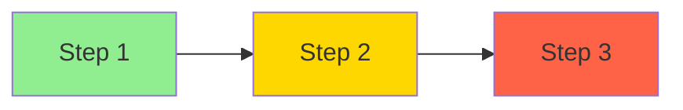

# User Journey Report Schema

**Purpose**: Defines the structure for the user journey analysis output.

---

## Report Structure

```markdown
# User Journey Report

**Generated**: [DATE]
**Total Journeys**: 4
**Average Completion**: [PERCENTAGE]%

## Summary

| Journey | Actor | Completion | Status |
|---------|-------|------------|--------|
| Individual Tax Filing | Taxpayer | 85% | PARTIAL |
| Business Net Profits | Business Owner | 70% | PARTIAL |
| Auditor Review | Auditor | 0% | MISSING |
| Administrator Configuration | Admin | 30% | PARTIAL |

---

## Journey 1: [Journey Name]

**Actor**: [User Role]  
**Status**: [COMPLETE/PARTIAL/MISSING]  
**Completion**: [PERCENTAGE]%

### Journey Flow



**Legend**: 🟢 Complete | 🟡 Partial | 🔴 Missing

### Step-by-Step Status

| # | Step | Status | UI Components | API Endpoints | Notes |
|---|------|--------|---------------|---------------|-------|
| 1 | Step Name | ✅ COMPLETE | Component.tsx | POST /api/... | Working |
| 2 | Step Name | 🟡 PARTIAL | Component.tsx | GET /api/... | Missing validation |
| 3 | Step Name | ❌ MISSING | - | - | Not implemented |

### Critical Gaps

- **GAP-001**: [Description of what's missing]
- **GAP-002**: [Description of what's missing]

### Logical Validation

| Rule | Expected | Actual | Status |
|------|----------|--------|--------|
| [Role] should not request [data] | [Expected behavior] | [Actual behavior] | ✅/❌ |

[Repeat for each journey]
```

---

## Field Definitions

### Journey Entry

```yaml
id: string              # Unique identifier
name: string            # Journey name
actor: string           # User role
status: COMPLETE | PARTIAL | MISSING
completionPercentage: number  # 0-100
steps: JourneyStep[]
criticalGaps: string[]
```

### Journey Step

```yaml
order: number           # Step sequence (1, 2, 3...)
name: string            # Step name
description: string     # What this step does
status: COMPLETE | PARTIAL | MISSING
uiComponents: string[]  # UI components for this step
apiEndpoints: string[]  # API endpoints for this step
notes: string           # Additional details
blockers: string[]      # What's blocking completion
```

---

## Example Output

```markdown
## Journey 1: Individual Tax Filing

**Actor**: Taxpayer  
**Status**: PARTIAL  
**Completion**: 85%

### Step-by-Step Status

| # | Step | Status | UI Components | API Endpoints | Notes |
|---|------|--------|---------------|---------------|-------|
| 1 | Document Upload | ✅ COMPLETE | UploadSection.tsx | POST /extraction/stream | Working |
| 2 | AI Extraction | ✅ COMPLETE | ProcessingLoader.tsx | SSE /extraction/stream | Streaming works |
| 3 | Data Review | ✅ COMPLETE | ReviewSection.tsx | GET /sessions | Editable fields |
| 4 | Tax Calculation | ✅ COMPLETE | ResultsSection.tsx | POST /tax-engine/calculate | All rules applied |
| 5 | Submission | ✅ COMPLETE | - | POST /submissions | Basic flow |
| 6 | Payment | ❌ MISSING | PaymentGateway.tsx | POST /payments | Not integrated |

### Critical Gaps

- **GAP-005**: Payment integration not implemented (blocks revenue collection)
```
