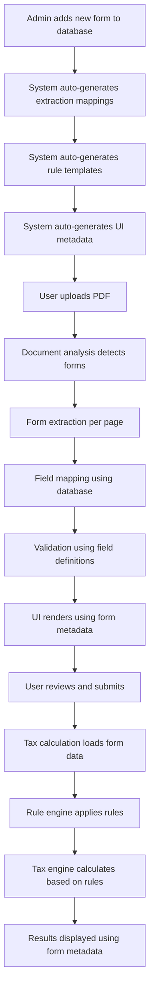

# Spec 019: Form Field Contract System - Tax Form Definition Framework

**Status**: Draft  
**Created**: 2025-12-03  
**Priority**: CRITICAL - Foundation for entire application  
**Complexity**: High  

## Executive Summary

The current tax form system is **critically insufficient** with major forms having only 2-3 fields when they should have 20-80+ fields. This specification establishes a comprehensive, contract-based system for tax form definitions that ensures consistency between AI extraction, backend processing, and frontend display.

### Current Critical Issues

1. **Insufficient Form Coverage**:
   - Dublin 1040/Form R: Only 2 fields (should have 20+)
   - Schedule 2: Only 1 field (should have 21 lines)
   - Schedule 3: Only 5 fields (should have 15+ lines)
   - Schedule F: Only 7 fields (should have 43+ lines)
   - W-2: Missing Box 12 codes, Box 14 local taxes
   - Federal 1040: Only 10 fields (should have 87+ lines)

2. **No Contract Between Services**:
   - Extraction service returns display names ("Employee SSN")
   - Backend expects camelCase (`employeeSSN`)
   - Frontend receives mixed field names
   - No validation or mapping layer

3. **Missing Critical Forms**:
   - Schedule A (Itemized Deductions)
   - Schedule B (Interest and Dividends)
   - Schedule D (Capital Gains)
   - Schedule SE (Self-Employment Tax)
   - Form 8606 (Nondeductible IRAs)
   - Form 8889 (HSA)
   - Form 1116 (Foreign Tax Credit)

## 1. Tax Form Research & Requirements

### 1.1 Federal Individual Forms (IRS)

#### Form 1040 - U.S. Individual Income Tax Return
**Lines**: 87 total fields across 2 pages
**Sections**:
- **Filing Status** (5 options): Single, MFJ, MFS, HOH, QSS
- **Dependents** (4 columns × N rows): Name, SSN, Relationship, Child Tax Credit
- **Income** (Lines 1-9):
  - 1a-1z: W-2 wages, tips, other compensation
  - 2a-2b: Tax-exempt and taxable interest
  - 3a-3b: Qualified and ordinary dividends
  - 4a-4d: IRA distributions (total, taxable, rollover)
  - 5a-5d: Pensions and annuities
  - 6a-6b: Social Security benefits
  - 7: Capital gain/loss (Schedule D)
  - 8: Additional income from Schedule 1
  - 9: Total income
- **Adjustments** (Lines 10-11):
  - 10: Adjustments from Schedule 1
  - 11: Adjusted Gross Income (AGI)
- **Tax and Credits** (Lines 12-24):
  - 12: Standard/Itemized deduction
  - 13: Qualified Business Income deduction
  - 14: Add lines 12 and 13
  - 15: Taxable income
  - 16: Tax (from tax tables/computation)
  - 17: Amount from Schedule 2
  - 18: Add lines 16 and 17
  - 19: Child tax credit/credit for other dependents
  - 20: Amount from Schedule 3
  - 21: Add lines 19 and 20
  - 22: Subtract line 21 from 18
  - 23: Other taxes from Schedule 2
  - 24: Total tax
- **Payments** (Lines 25-33):
  - 25a-25d: Federal income tax withheld
  - 26: Estimated tax payments
  - 27: Earned Income Credit (EIC)
  - 28: Additional Child Tax Credit
  - 29: American Opportunity Credit
  - 30: Amount from Schedule 3
  - 31: Add lines 25-30
  - 32: If line 31 > 24, subtract
  - 33: Amount you owe
- **Third Party Designee**: Phone, PIN
- **Sign Here**: Date, Occupation, Phone

**Field Types**:
```typescript
interface Federal1040 {
  // Filing Information
  filingStatus: 'SINGLE' | 'MFJ' | 'MFS' | 'HOH' | 'QSS';
  taxpayerName: string;
  taxpayerSSN: string;
  spouseName?: string;
  spouseSSN?: string;
  address: Address;
  presidentialElectionFund: boolean;
  spousePresidentialElectionFund?: boolean;
  
  // Dependents
  dependents: Array<{
    name: string;
    ssn: string;
    relationship: string;
    qualifiesForChildTaxCredit: boolean;
  }>;
  
  // Income (Lines 1-9)
  line1a_wagesBox1: number;           // W-2 Box 1
  line1b_householdEmployeeWages: number;
  line1c_tipIncome: number;
  line1d_medicaidWaiverPayments: number;
  line1e_dependentCareBenefits: number;
  line1f_employerAdoptionBenefits: number;
  line1g_otherWagesNotOnW2: number;
  line1h_nonqualifiedDeferredComp: number;
  line1z_totalWages: number;           // Sum of 1a-1h
  
  line2a_taxExemptInterest: number;
  line2b_taxableInterest: number;
  
  line3a_qualifiedDividends: number;
  line3b_ordinaryDividends: number;
  
  line4a_iraDistributionsTotal: number;
  line4b_iraDistributionsTaxable: number;
  line4c_iraRollover: boolean;
  line4d_qualifiedCharitable: number;
  
  line5a_pensionsTotal: number;
  line5b_pensionsTaxable: number;
  line5c_pensionRollover: boolean;
  line5d_pensionQualifiedCharitable: number;
  
  line6a_socialSecurityTotal: number;
  line6b_socialSecurityTaxable: number;
  
  line7_capitalGainLoss: number;       // From Schedule D
  line8_additionalIncome: number;      // From Schedule 1
  line9_totalIncome: number;
  
  // Adjustments (Lines 10-11)
  line10_adjustments: number;          // From Schedule 1
  line11_agi: number;                  // Adjusted Gross Income
  
  // Tax Computation (Lines 12-24)
  line12_standardOrItemizedDeduction: number;
  line12_deductionType: 'STANDARD' | 'ITEMIZED' | 'CHARITABLE_ONLY';
  line13_qbiDeduction: number;
  line14_totalDeductions: number;
  line15_taxableIncome: number;
  line16_tax: number;
  line17_schedule2Amount: number;
  line18_subtotal: number;
  line19_childTaxCredit: number;
  line20_schedule3Amount: number;
  line21_totalCredits: number;
  line22_subtractCredits: number;
  line23_otherTaxes: number;          // From Schedule 2
  line24_totalTax: number;
  
  // Payments (Lines 25-33)
  line25a_federalWithheldW2: number;
  line25b_federalWithheld1099: number;
  line25c_federalWithheldOther: number;
  line25d_totalFederalWithheld: number;
  line26_estimatedTaxPayments: number;
  line27_eic: number;                 // Earned Income Credit
  line28_additionalChildTaxCredit: number;
  line29_americanOpportunityCredit: number;
  line30_schedule3Refundable: number;
  line31_totalPayments: number;
  line32_refundAmount: number;
  line32a_routingNumber?: string;
  line32b_accountType?: 'CHECKING' | 'SAVINGS';
  line32c_accountNumber?: string;
  line32d_applyToEstimated?: number;
  line33_amountOwed: number;
  
  // Additional Fields
  line34_estimatedTaxPenalty: number;
  thirdPartyDesignee: boolean;
  thirdPartyDesigneeName?: string;
  thirdPartyDesigneePhone?: string;
  thirdPartyDesigneePIN?: string;
  
  // Signature
  signatureDate: string;
  taxpayerOccupation: string;
  taxpayerPhone: string;
  taxpayerEmail?: string;
  spouseOccupation?: string;
  preparer?: {
    name: string;
    ptin: string;
    firm: string;
    ein: string;
    address: Address;
    phone: string;
  };
}
```

#### Schedule 1 - Additional Income and Adjustments to Income
**Lines**: 26 lines (10 income + 16 adjustments)
```typescript
interface Schedule1 {
  // Part I - Additional Income (Lines 1-10)
  line1_taxableRefunds: number;
  line2a_alimonyReceived: number;
  line2b_alimonyRecipientSSN?: string;
  line3_businessIncome: number;        // Schedule C
  line4_otherGainsLosses: number;
  line5_rentalRealEstate: number;      // Schedule E
  line6_farmIncome: number;            // Schedule F
  line7_unemploymentComp: number;
  line8a_socialSecurityNetInvIncome: number;
  line8b_otherNetInvIncome: number;
  line8z_totalOtherIncome: number;
  line10_totalAdditionalIncome: number;
  
  // Part II - Adjustments (Lines 11-26)
  line11_educatorExpenses: number;
  line12_businessExpenses: number;     // Armed Forces reservists
  line13_hsaDeduction: number;         // Form 8889
  line14_movingExpenses: number;       // Armed Forces
  line15_selfEmploymentTaxDeduction: number;  // Schedule SE
  line16_sepSimpleRetirement: number;
  line17_selfEmployedHealthInsurance: number;
  line18_penaltyEarlyWithdrawal: number;
  line19a_alimonyPaid: number;
  line19b_alimonyRecipientSSN?: string;
  line20_iraDeduction: number;
  line21_studentLoanInterest: number;
  line22_tuitionAndFees: number;
  line24z_otherAdjustments: number;
  line26_totalAdjustments: number;
}
```

#### Schedule 2 - Additional Taxes
**Lines**: 21 lines
```typescript
interface Schedule2 {
  // Part I - Tax (Lines 1-17)
  line1_alternativeMinimumTax: number;
  line2_excessAdvancePremiumTaxCredit: number;
  line3_excessHsaContributions: number;
  line4_iraAdditionalTax: number;
  line5a_healthCareCoverageMonths: number;
  line5b_healthCareTax: number;
  line6_retirementPlansAdditionalTax: number;
  line7a_householdEmploymentTaxes: boolean;
  line7b_firstTimeHomeBuyerCredit: number;
  line8_additionalMedicareTax: number;
  line9_netInvestmentIncomeTax: number;
  line10_section965Tax: number;
  line11_section72mTax: number;
  line12_section409ATax: number;
  line13_section1291Interest: number;
  line14_section951ATax: number;
  line15_section965NetTax: number;
  line16_otherAdditionalTaxes: number;
  line17_totalAdditionalTax: number;
  
  // Part II - Other Taxes (Lines 18-21)
  line18_selfEmploymentTax: number;    // Schedule SE
  line19a_rrta: boolean;
  line19b_uncollectedSocialSecurity: number;
  line19c_uncollectedMedicare: number;
  line19d_uncollectedRrta: number;
  line20_section72tPenalty: number;
  line21_totalOtherTaxes: number;
}
```

#### Schedule 3 - Additional Credits and Payments
**Lines**: 15 lines
```typescript
interface Schedule3 {
  // Part I - Nonrefundable Credits (Lines 1-8)
  line1_foreignTaxCredit: number;      // Form 1116
  line2_childAndDependentCareCredit: number;  // Form 2441
  line3_educationCredits: number;      // Form 8863
  line4_retirementSavingsCredit: number;  // Form 8880
  line5a_residentialEnergyCredit: number;  // Form 5695
  line5b_otherResidentialCredit: number;
  line6a_adoptionCredit: number;
  line6b_6c_6d_otherCredits: number;
  line7_generalBusinessCredit: number;
  line8_totalNonrefundableCredits: number;
  
  // Part II - Other Payments and Refundable Credits (Lines 9-15)
  line9_netPremiumTaxCredit: number;
  line10_excessSocialSecurityWithheld: number;
  line11_creditForFederalTaxOnFuels: number;
  line12_form8885Credit: number;
  line13a_deferredSocialSecurity: number;
  line13b_form8888Amount: number;
  line13c_13g_13h_otherPayments: number;
  line14_section965Deferred: number;
  line15_totalOtherPaymentsRefundable: number;
}
```

#### Schedule A - Itemized Deductions
**Lines**: 30 lines
```typescript
interface ScheduleA {
  // Medical and Dental (Lines 1-4)
  line1_medicalExpenses: number;
  line2_medicarePremiums: number;
  line3_prescriptions: number;
  line4_totalMedical: number;
  
  // Taxes Paid (Lines 5-7)
  line5a_stateLocalIncomeTax: number;
  line5b_stateLocalSalesTax: number;
  line5c_stateLocalRealEstate: number;
  line5d_stateLocalPersonalProperty: number;
  line5e_totalStateLocal: number;      // Limited to $10,000
  line6_otherTaxes: number;
  line7_totalTaxesPaid: number;
  
  // Interest Paid (Lines 8-10)
  line8a_homeMortgageInterest1098: number;
  line8b_homeMortgageInterestNotOn1098: number;
  line8c_mortgageInsurancePremiums: number;
  line8d_investmentInterest: number;
  line8e_totalHomeMortgageInterest: number;
  line9_investmentInterestExpense: number;
  line10_totalInterestPaid: number;
  
  // Charitable Contributions (Lines 11-14)
  line11_cashContributions: number;
  line12_nonCashContributions: number;
  line13_carryoverFromPrior: number;
  line14_totalCharitable: number;
  
  // Casualty and Theft Losses (Line 15)
  line15_casualtyLosses: number;
  
  // Other Deductions (Lines 16-17)
  line16_unreimbursedEmployeeExpenses: number;
  line17_totalItemizedDeductions: number;
}
```

#### Schedule C - Profit or Loss from Business
**Lines**: 48 fields
```typescript
interface ScheduleC {
  // Business Information
  businessName: string;
  businessAddress: Address;
  ein: string;
  businessCode: string;              // NAICS
  principalBusinessActivity: string;
  accountingMethod: 'CASH' | 'ACCRUAL' | 'OTHER';
  materialParticipation: boolean;
  startedOrAcquiredThisYear: boolean;
  
  // Part I - Income (Lines 1-7)
  line1_grossReceipts: number;
  line2_returns: number;
  line3_subtotal: number;
  line4_costOfGoods: number;           // Part III
  line5_grossProfit: number;
  line6_otherIncome: number;
  line7_grossIncome: number;
  
  // Part II - Expenses (Lines 8-27)
  line8_advertising: number;
  line9_carAndTruck: number;
  line10_commissions: number;
  line11_contractLabor: number;
  line12_depletion: number;
  line13_depreciation: number;         // Form 4562
  line14_employeeBenefits: number;
  line15_insurance: number;
  line16_mortgageInterest: number;
  line17_legal: number;
  line18_officeExpense: number;
  line19_pensionProfit: number;
  line20_rentLease_vehicles: number;
  line20b_rentLease_property: number;
  line21_repairs: number;
  line22_supplies: number;
  line23_taxes: number;
  line24a_travel: number;
  line24b_meals: number;
  line25_utilities: number;
  line26_wages: number;
  line27a_otherExpenses: number;
  line27b_businessUseHome: number;
  line28_totalExpenses: number;
  line29_tentativeProfit: number;
  line30_homeOfficeExpenses: number;
  line31_netProfit: number;
  
  // Part III - Cost of Goods Sold
  line33_inventoryMethod: 'COST' | 'LOWER_OF_COST_OR_MARKET' | 'OTHER';
  line35_inventoryBeginning: number;
  line36_purchases: number;
  line37_laborCost: number;
  line38_materials: number;
  line39_otherCosts: number;
  line40_inventoryEnding: number;
  line41_costOfGoodsSold: number;
  
  // Part IV - Vehicle Information
  line43_vehicleBusinessMiles: number;
  line44a_vehicleAvailable: boolean;
  line44b_evidenceWritten: boolean;
}
```

#### Schedule D - Capital Gains and Losses
```typescript
interface ScheduleD {
  // Part I - Short-Term (Lines 1a-7)
  line1a_shortTermSales: Array<{
    description: string;
    dateAcquired: string;
    dateSold: string;
    proceeds: number;
    costBasis: number;
    adjustments: number;
    gainLoss: number;
  }>;
  line1b_form8949BoxA: number;
  line2_form8949BoxB: number;
  line3_form8949BoxC: number;
  line4_shortTermFrom6252: number;
  line5_shortTermFrom6781: number;
  line6_shortTermFrom8824: number;
  line7_totalShortTerm: number;
  
  // Part II - Long-Term (Lines 8a-15)
  line8a_longTermSales: Array<{
    description: string;
    dateAcquired: string;
    dateSold: string;
    proceeds: number;
    costBasis: number;
    adjustments: number;
    gainLoss: number;
  }>;
  line8b_form8949BoxD: number;
  line9_form8949BoxE: number;
  line10_form8949BoxF: number;
  line11_longTermFrom1099: number;
  line12_longTermFrom6252: number;
  line13_longTermFrom6781: number;
  line14_longTermFrom8824: number;
  line15_totalLongTerm: number;
  
  // Part III - Summary (Lines 16-22)
  line16_combinedGainLoss: number;
  line17_carryoverLosses: number;
  line18_28PercentGain: number;
  line19_unrecaptured1250: number;
  line20_totalCapitalGains: number;
  line21_netCapitalGainOrLoss: number;
  line22_taxableAmount: number;
}
```

#### Schedule E - Supplemental Income and Loss
```typescript
interface ScheduleE {
  // Part I - Rental/Royalty (Lines 1-22 per property)
  properties: Array<{
    propertyType: 'SINGLE_FAMILY' | 'MULTI_FAMILY' | 'VACATION' | 'COMMERCIAL' | 'LAND' | 'ROYALTIES' | 'OTHER';
    address: Address;
    fairRentalDays: number;
    personalUseDays: number;
    qjvElection: boolean;
    
    // Income
    line3_rentsReceived: number;
    line4_royaltiesReceived: number;
    
    // Expenses
    line5_advertising: number;
    line6_auto: number;
    line7_cleaning: number;
    line8_commissions: number;
    line9_insurance: number;
    line10_legal: number;
    line11_managementFees: number;
    line12_mortgageInterest: number;
    line13_otherInterest: number;
    line14_repairs: number;
    line15_supplies: number;
    line16_taxes: number;
    line17_utilities: number;
    line18_depreciation: number;
    line19_otherExpenses: Array<{ description: string; amount: number }>;
    line20_totalExpenses: number;
    line21_netIncome: number;
    line22_deductibleLoss: number;
  }>;
  
  // Part II - Partnership/S-Corp (Lines 28-32)
  passthrough: Array<{
    entityName: string;
    ein: string;
    entityType: 'PARTNERSHIP' | 'S_CORP';
    passive: boolean;
    line28a_passiveIncome: number;
    line28b_nonpassiveIncome: number;
    line28c_section179: number;
  }>;
  
  // Part III - Estates/Trusts (Lines 33-37)
  estatesAndTrusts: Array<{
    name: string;
    ein: string;
    line33_passiveIncome: number;
    line34_nonpassiveIncome: number;
  }>;
  
  // Part IV - REMIC (Lines 38-39)
  line38_remicIncome: number;
  line39_remicExpenses: number;
  
  // Summary (Lines 26, 40-43)
  line26_totalRentalIncome: number;
  line40_totalPassthroughIncome: number;
  line41_totalNetIncome: number;
  line42_reconciliation: number;
}
```

#### Schedule F - Profit or Loss from Farming
```typescript
interface ScheduleF {
  // Farm Information
  principalProduct: string;
  businessName: string;
  ein: string;
  businessCode: string;
  accountingMethod: 'CASH' | 'ACCRUAL';
  materialParticipation: boolean;
  
  // Part I - Farm Income (Cash Method, Lines 1-11)
  line1a_salesLivestock: number;
  line1b_costOfLivestockSold: number;
  line1c_profitLivestock: number;
  line2_salesProduce: number;
  line3a_coopDistributions: number;
  line3b_taxableCoopDividends: number;
  line4a_agriculturalPayments: number;
  line4b_taxableAmount: number;
  line5a_ccC LoansReported: number;
  line5b_cccLoansForfeited: number;
  line5c_taxableCccLoans: number;
  line6_cropInsurance: number;
  line7_customHire: number;
  line8_otherFarmIncome: Array<{ description: string; amount: number }>;
  line9_grossIncome: number;
  line10_coopDistributions: number;
  line11_grossFarmIncome: number;
  
  // Part II - Farm Expenses (Lines 12-34)
  line12_carAndTruck: number;
  line13_chemicals: number;
  line14_conservation: number;
  line15_customHire: number;
  line16_depreciation: number;
  line17_employeeBenefits: number;
  line18_feed: number;
  line19_fertilizers: number;
  line20_freight: number;
  line21_gasoline: number;
  line22_insurance: number;
  line23_mortgageInterest: number;
  line24_otherInterest: number;
  line25_labor: number;
  line26_pensionPlans: number;
  line27_rentLease_vehicles: number;
  line28_rentLease_equipment: number;
  line29_rentLease_land: number;
  line30_repairs: number;
  line31_seeds: number;
  line32_storage: number;
  line33_supplies: number;
  line34_taxes: number;
  line35_utilities: number;
  line36_veterinary: number;
  line37_otherExpenses: Array<{ description: string; amount: number }>;
  line38_totalExpenses: number;
  line39_netFarmProfitOrLoss: number;
  
  // Part III - Farm Income (Accrual Method)
  line45_inventoryBeginning: number;
  line46_costOfLivestockPurchased: number;
  line47_costOfOtherItems: number;
  line48_inventoryEnding: number;
  line49_costOfProduceSold: number;
}
```

#### Schedule SE - Self-Employment Tax
```typescript
interface ScheduleSE {
  // Part I - Self-Employment Tax
  line2_netProfit: number;              // From Schedule C/F
  line3_combinedEarnings: number;
  line4_selfEmploymentIncome: number;
  line5_socialSecurityWageTips: number;  // W-2 Box 5
  line6_subtract: number;
  line7_maximum: number;                 // SS wage base ($160,200 for 2023)
  line8_subtract: number;
  line9_multiply0_9235: number;
  line10_multiply0_153: number;         // 15.3% SE tax rate
  line11_multiply0_029: number;         // Additional Medicare
  line12_selfEmploymentTax: number;
  line13_deduction: number;             // Half of SE tax (to Schedule 1)
  
  // Part II - Optional Methods
  line15_farmOptionalMethod: boolean;
  line16_nonfarmOptionalMethod: boolean;
}
```

### 1.2 Form W-2 - Wage and Tax Statement
**Complete Field List** (All 20 boxes + additional):
```typescript
interface W2Form {
  // Employer Information (Boxes a-c, f)
  box_a_employeeSSN: string;
  box_b_ein: string;
  box_c_employerName: string;
  box_c_employerAddress: Address;
  box_f_employeeNameAddress: string;
  box_f_employeeAddress: Address;
  
  // Wage Information (Boxes 1-6)
  box1_wages: number;
  box2_federalIncomeTaxWithheld: number;
  box3_socialSecurityWages: number;
  box4_socialSecurityTaxWithheld: number;
  box5_medicareWages: number;
  box6_medicareTaxWithheld: number;
  
  // Tips (Box 7-8)
  box7_socialSecurityTips: number;
  box8_allocatedTips: number;
  
  // Dependent Care (Box 10)
  box10_dependentCareBenefits: number;
  
  // Nonqualified Plans (Box 11)
  box11_nonqualifiedPlans: number;
  
  // Box 12 - Codes (Multiple entries possible)
  box12_codes: Array<{
    code: 'A' | 'B' | 'C' | 'D' | 'E' | 'F' | 'G' | 'H' | 'J' | 'K' | 'L' | 'M' | 
          'N' | 'P' | 'Q' | 'R' | 'S' | 'T' | 'V' | 'W' | 'Y' | 'Z' | 'AA' | 'BB' | 
          'DD' | 'EE' | 'FF' | 'GG' | 'HH' | 'II' | 'JJ' | 'KK' | 'LL' | 'MM' | 'NN' | 'PP' | 'QQ' | 'RR' | 'SS' | 'TT';
    amount: number;
    description?: string;
  }>;
  
  // Retirement Plans (Box 13)
  box13_statutoryEmployee: boolean;
  box13_retirementPlan: boolean;
  box13_thirdPartySickPay: boolean;
  
  // State and Local (Boxes 15-20)
  box14_other: Array<{
    description: string;
    amount: number;
  }>;
  box15_state: string;
  box15_stateIdNumber: string;
  box16_stateWages: number;
  box17_stateIncomeTax: number;
  box18_localWages: number;
  box19_localIncomeTax: number;
  box20_localityName: string;
  
  // Additional Tracking
  controlNumber?: string;
  correctedW2: boolean;
  voidW2: boolean;
}
```

### 1.3 Dublin/Local Municipality Forms

#### Dublin Form R / 1040 - Individual Income Tax Return
**Lines**: 20+ fields
```typescript
interface DublinFormR {
  // Taxpayer Information
  taxpayerName: string;
  ssn: string;
  spouseName?: string;
  spouseSSN?: string;
  address: Address;
  phoneNumber: string;
  emailAddress?: string;
  
  // Residency Status
  filingStatus: 'SINGLE' | 'MARRIED_JOINT' | 'MARRIED_SEPARATE';
  residencyStatus: 'RESIDENT' | 'PART_YEAR' | 'NONRESIDENT';
  dateMovedIn?: string;
  dateMovedOut?: string;
  monthsOfResidence?: number;
  
  // Part I - Income (Lines 1-4)
  line1_qualifyingWages: number;        // W-2 wages
  line2_businessNetProfit: number;      // Schedule C
  line3_rentalIncome: number;           // Schedule E
  line4_otherIncome: number;            // 1099, gambling, etc.
  line5_totalIncome: number;
  
  // Part II - Tax Computation (Lines 6-9)
  line6_municipalTaxRate: number;       // 2.0% for Dublin
  line7_taxDue: number;                 // Line 5 × Line 6
  line8_estimatedPayments: number;
  line9_withheldTaxes: number;          // From W-2 Box 19
  
  // Part III - Credits (Lines 10-12)
  line10_residentialCredit: number;     // For residents
  line11_reciprocalCredit: number;      // Credit for taxes paid to other cities
  line11a_creditJurisdiction: string;
  line11b_creditAmount: number;
  line11c_creditRate: number;
  line12_totalCredits: number;
  
  // Part IV - Balance Due or Refund (Lines 13-16)
  line13_taxAfterCredits: number;
  line14_totalPaymentsAndCredits: number;
  line15_balanceDue: number;
  line16_overpayment: number;
  line16a_refundRequested: number;
  line16b_applyToNextYear: number;
  line16c_donate: number;
  
  // Part V - Employer Information
  employers: Array<{
    name: string;
    ein: string;
    address: Address;
    wages: number;
    taxWithheld: number;
    monthsWorked: number;
  }>;
  
  // Part VI - Signature
  signatureDate: string;
  spouseSignatureDate?: string;
  preparer?: {
    name: string;
    firmName: string;
    address: Address;
    phone: string;
    ptin: string;
  };
}
```

#### Form W-1 - Business Withholding Return
**Lines**: 25+ fields
```typescript
interface FormW1 {
  // Business Information
  businessName: string;
  accountNumber: string;
  fein: string;
  businessAddress: Address;
  contactPerson: string;
  phone: string;
  email?: string;
  
  // Filing Period
  filingPeriod: 'MONTHLY' | 'QUARTERLY' | 'SEMI_MONTHLY' | 'DAILY';
  taxYear: number;
  periodStartDate: string;
  periodEndDate: string;
  dueDate: string;
  
  // Part I - Tax Computation (Lines 1-10)
  line1_totalGrossPayroll: number;
  line2_exemptWages: number;            // Out-of-city work
  line3_taxableWages: number;           // Line 1 - Line 2
  line4_municipalRate: number;          // 2.0% for Dublin
  line5_taxDue: number;                 // Line 3 × Line 4
  line6_adjustmentsCredit: number;
  line7_adjustmentsDebit: number;
  line8_netTaxDue: number;
  line9_priorOverpayment: number;
  line10_netAmountDue: number;
  
  // Part II - Employee Detail
  employees: Array<{
    name: string;
    ssn: string;
    address: Address;
    grossWages: number;
    taxableWages: number;
    taxWithheld: number;
    exemptWages: number;
    workLocation: string;
  }>;
  line11_totalEmployees: number;
  line12_totalWagesPaid: number;
  line13_totalTaxWithheld: number;
  
  // Part III - Payment Information
  line14_checkNumber?: string;
  line15_paymentAmount: number;
  line16_paymentDate: string;
  line17_lateFilingPenalty: number;
  line18_latePaymentPenalty: number;
  line19_interest: number;
  line20_totalAmountDue: number;
  
  // Part IV - Signature
  signatureDate: string;
  preparedBy: string;
  title: string;
}
```

#### Form W-3 - Annual Reconciliation
```typescript
interface FormW3 {
  // Business Information
  businessName: string;
  accountNumber: string;
  fein: string;
  businessAddress: Address;
  
  // Tax Year
  taxYear: number;
  
  // Part I - Summary (Lines 1-8)
  line1_totalW1FilingsCount: number;
  line2_totalTaxReported: number;       // Sum of all W-1 filings
  line3_totalW2Count: number;
  line4_totalW2Tax: number;             // Sum of W-2 Box 19
  line5_discrepancy: number;            // Line 2 - Line 4
  line6_explanation?: string;
  line7_adjustmentAmount: number;
  line8_netDiscrepancy: number;
  
  // Part II - Monthly Breakdown
  monthlyFilings: Array<{
    month: string;
    w1Filed: boolean;
    w1TaxAmount: number;
    w1Employees: number;
    w1DueDate: string;
    w1FiledDate?: string;
    w1Late: boolean;
  }>;
  
  // Part III - Penalties and Interest
  line9_lateFilingPenalty: number;
  line10_latePaymentPenalty: number;
  line11_interest: number;
  line12_totalPenaltiesInterest: number;
  
  // Part IV - Balance
  line13_totalAmountDue: number;
  line14_overpaymentCredit: number;
  line15_netBalanceDue: number;
  line16_refundRequested: number;
  
  // Signature
  signatureDate: string;
  preparedBy: string;
  title: string;
}
```

#### Form 27 - Net Profits Return
```typescript
interface Form27 {
  // Business Information
  businessName: string;
  accountNumber: string;
  fein: string;
  businessAddress: Address;
  businessType: 'CORPORATION' | 'S_CORP' | 'PARTNERSHIP' | 'LLC' | 'SOLE_PROP';
  fiscalYearEnd: string;
  
  // Tax Year
  taxYear: number;
  isAmendment: boolean;
  
  // Part I - Federal Reconciliation (Schedule X)
  scheduleX: {
    line1_federalTaxableIncome: number;  // From 1120/1065 Line 28
    
    // Add-backs (Lines 2-8)
    line2_stateLocalTaxes: number;
    line3_interestExpense: number;
    line4_depreciationDifference: number;
    line5_section179Excess: number;
    line6_guaranteedPayments: number;
    line7_capitalLosses: number;
    line8_otherAddbacks: number;
    line9_totalAddbacks: number;
    
    // Deductions (Lines 10-16)
    line10_interestIncome: number;
    line11_dividendIncome: number;
    line12_capitalGains: number;
    line13_intangibleExpenses: number;  // 5% rule
    line14_nolCarryforward: number;
    line15_otherDeductions: number;
    line16_totalDeductions: number;
    
    line17_adjustedFederalIncome: number;  // Line 1 + Line 9 - Line 16
  };
  
  // Part II - Allocation (Schedule Y)
  scheduleY: {
    // Property Factor
    line1_propertyDublin: number;
    line2_propertyEverywhere: number;
    line3_propertyFactor: number;        // Line 1 / Line 2
    
    // Payroll Factor
    line4_payrollDublin: number;
    line5_payrollEverywhere: number;
    line6_payrollFactor: number;         // Line 4 / Line 5
    
    // Sales Factor (double-weighted)
    line7_salesDublin: number;
    line8_salesEverywhere: number;
    line9_salesFactor: number;           // Line 7 / Line 8
    line10_salesFactorDoubleWeight: number;  // Line 9 × 2
    
    // Average
    line11_totalFactors: number;
    line12_divisor: number;              // Usually 4 (3 factors, sales doubled)
    line13_allocationPercentage: number; // Line 11 / Line 12
  };
  
  // Part III - Tax Computation (Lines 1-15)
  line1_adjustedFederalIncome: number;   // From Schedule X Line 17
  line2_allocationPercentage: number;    // From Schedule Y Line 13
  line3_allocatedIncome: number;         // Line 1 × Line 2
  line4_nolCarryforward: number;
  line5_taxableIncome: number;           // Line 3 - Line 4
  line6_municipalRate: number;           // 2.0%
  line7_taxDue: number;                  // Max(Line 5 × Line 6, Minimum Tax)
  line8_minimumTax: number;              // $25 for small businesses
  line9_estimatedPayments: number;
  line10_priorYearCredit: number;
  line11_totalCredits: number;
  line12_netTaxDue: number;
  line13_penaltyUnderpayment: number;
  line14_interest: number;
  line15_totalAmountDue: number;
  
  // Part IV - NOL Schedule
  nolSchedule: {
    line1_priorYearNOL: number;
    line2_currentYearNOL: number;
    line3_nolUsedThisYear: number;
    line4_nolCarryforward: number;
    line5_nolExpirationYear: number;
  };
  
  // Part V - Signature
  signatureDate: string;
  officerName: string;
  officerTitle: string;
  phone: string;
  preparer?: {
    name: string;
    firmName: string;
    address: Address;
    phone: string;
    ptin: string;
  };
}
```

## 2. Contract System Architecture

### 2.1 Database Schema - Form Field Registry

```sql
-- Table: form_definitions
CREATE TABLE form_definitions (
    id UUID PRIMARY KEY DEFAULT gen_random_uuid(),
    form_type VARCHAR(100) NOT NULL UNIQUE,
    form_category VARCHAR(50) NOT NULL, -- 'FEDERAL', 'STATE', 'LOCAL', 'BUSINESS'
    display_name VARCHAR(200) NOT NULL,
    description TEXT,
    tax_authority VARCHAR(100), -- 'IRS', 'DUBLIN', 'OHIO', etc.
    version VARCHAR(20) DEFAULT '2024',
    active BOOLEAN DEFAULT true,
    created_at TIMESTAMP DEFAULT NOW(),
    updated_at TIMESTAMP DEFAULT NOW()
);

-- Table: field_definitions
CREATE TABLE field_definitions (
    id UUID PRIMARY KEY DEFAULT gen_random_uuid(),
    form_definition_id UUID REFERENCES form_definitions(id) ON DELETE CASCADE,
    field_name VARCHAR(100) NOT NULL, -- camelCase for code
    display_name VARCHAR(200) NOT NULL, -- Human-readable
    field_type VARCHAR(50) NOT NULL, -- 'NUMBER', 'STRING', 'BOOLEAN', 'DATE', 'ADDRESS', 'ARRAY'
    line_number VARCHAR(20), -- e.g., "1a", "12c", "Schedule X Line 5"
    is_required BOOLEAN DEFAULT false,
    is_calculated BOOLEAN DEFAULT false,
    calculation_formula TEXT, -- JSON formula definition
    validation_rules JSONB, -- Min, max, regex, etc.
    default_value TEXT,
    help_text TEXT,
    irs_instructions_reference VARCHAR(500),
    field_group VARCHAR(100), -- 'INCOME', 'DEDUCTIONS', 'CREDITS', 'PAYMENTS'
    display_order INTEGER,
    weight VARCHAR(20) DEFAULT 'MEDIUM', -- 'CRITICAL', 'HIGH', 'MEDIUM', 'LOW'
    extraction_hints JSONB, -- AI extraction guidance
    created_at TIMESTAMP DEFAULT NOW(),
    updated_at TIMESTAMP DEFAULT NOW(),
    UNIQUE(form_definition_id, field_name)
);

-- Table: field_dependencies
CREATE TABLE field_dependencies (
    id UUID PRIMARY KEY DEFAULT gen_random_uuid(),
    field_id UUID REFERENCES field_definitions(id) ON DELETE CASCADE,
    depends_on_field_id UUID REFERENCES field_definitions(id) ON DELETE CASCADE,
    dependency_type VARCHAR(50), -- 'REQUIRED_IF', 'VISIBLE_IF', 'CALCULATED_FROM'
    condition_expression TEXT, -- JSON condition
    created_at TIMESTAMP DEFAULT NOW()
);

-- Table: form_relationships
CREATE TABLE form_relationships (
    id UUID PRIMARY KEY DEFAULT gen_random_uuid(),
    parent_form_id UUID REFERENCES form_definitions(id),
    child_form_id UUID REFERENCES form_definitions(id),
    relationship_type VARCHAR(50), -- 'REQUIRES', 'OPTIONAL', 'FLOWS_TO'
    created_at TIMESTAMP DEFAULT NOW()
);

-- Table: extraction_mappings
CREATE TABLE extraction_mappings (
    id UUID PRIMARY KEY DEFAULT gen_random_uuid(),
    field_id UUID REFERENCES field_definitions(id) ON DELETE CASCADE,
    ai_field_names TEXT[], -- Array of possible AI-extracted names
    box_number VARCHAR(20), -- For forms with numbered boxes
    ocr_keywords TEXT[], -- Keywords for OCR/extraction
    bounding_box_hints JSONB, -- Typical location in document
    created_at TIMESTAMP DEFAULT NOW(),
    updated_at TIMESTAMP DEFAULT NOW()
);

-- Indexes
CREATE INDEX idx_field_definitions_form ON field_definitions(form_definition_id);
CREATE INDEX idx_field_definitions_name ON field_definitions(field_name);
CREATE INDEX idx_extraction_mappings_field ON extraction_mappings(field_id);
CREATE INDEX idx_form_definitions_type ON form_definitions(form_type);
```

### 2.2 Field Definition Examples

```sql
-- Example: W-2 Form Definition
INSERT INTO form_definitions (form_type, form_category, display_name, description, tax_authority)
VALUES ('W-2', 'FEDERAL', 'Form W-2 - Wage and Tax Statement', 'Annual wage and tax statement from employers', 'IRS');

-- Example: W-2 Field Definitions
INSERT INTO field_definitions (
    form_definition_id,
    field_name,
    display_name,
    field_type,
    line_number,
    is_required,
    field_group,
    weight,
    validation_rules,
    help_text,
    display_order
) VALUES 
(
    (SELECT id FROM form_definitions WHERE form_type = 'W-2'),
    'box1_wages',
    'Box 1 - Wages, Tips, Other Compensation',
    'NUMBER',
    '1',
    true,
    'INCOME',
    'CRITICAL',
    '{"min": 0, "max": 10000000, "decimals": 2}'::jsonb,
    'Federal taxable wages from Box 1 of Form W-2',
    1
),
(
    (SELECT id FROM form_definitions WHERE form_type = 'W-2'),
    'box2_federalIncomeTaxWithheld',
    'Box 2 - Federal Income Tax Withheld',
    'NUMBER',
    '2',
    true,
    'WITHHOLDING',
    'CRITICAL',
    '{"min": 0, "max": 10000000, "decimals": 2}'::jsonb,
    'Federal income tax withheld from Box 2',
    2
);

-- Example: Extraction Mappings for W-2
INSERT INTO extraction_mappings (field_id, ai_field_names, box_number, ocr_keywords)
VALUES 
(
    (SELECT id FROM field_definitions WHERE field_name = 'box1_wages'),
    ARRAY['Box 1', 'Wages', 'Federal Wages', 'federalWages', 'box_1'],
    '1',
    ARRAY['wages', 'tips', 'compensation', 'box 1']
),
(
    (SELECT id FROM field_definitions WHERE field_name = 'box2_federalIncomeTaxWithheld'),
    ARRAY['Box 2', 'Federal Withholding', 'federalWithheld', 'box_2', 'Federal income tax withheld'],
    '2',
    ARRAY['federal', 'withheld', 'box 2', 'income tax']
);
```

### 2.3 API Contract Specification

#### 2.3.1 Form Metadata Endpoint
```typescript
// GET /api/v1/forms/metadata/{formType}
interface FormMetadataResponse {
  formType: string;
  displayName: string;
  description: string;
  category: 'FEDERAL' | 'STATE' | 'LOCAL' | 'BUSINESS';
  taxAuthority: string;
  version: string;
  
  fields: Array<{
    fieldName: string;              // camelCase for code
    displayName: string;            // Human-readable
    fieldType: 'NUMBER' | 'STRING' | 'BOOLEAN' | 'DATE' | 'ADDRESS' | 'ARRAY';
    lineNumber?: string;
    isRequired: boolean;
    isCalculated: boolean;
    calculationFormula?: string;
    validationRules: {
      min?: number;
      max?: number;
      pattern?: string;
      decimals?: number;
      enum?: string[];
    };
    defaultValue?: any;
    helpText?: string;
    fieldGroup: string;
    displayOrder: number;
    weight: 'CRITICAL' | 'HIGH' | 'MEDIUM' | 'LOW';
    
    // For extraction
    extractionHints: {
      aiFieldNames: string[];      // Possible AI names
      boxNumber?: string;
      ocrKeywords: string[];
      typicalLocation?: BoundingBox;
    };
  }>;
  
  dependencies: Array<{
    fieldName: string;
    dependsOnField: string;
    dependencyType: 'REQUIRED_IF' | 'VISIBLE_IF' | 'CALCULATED_FROM';
    condition: string;
  }>;
  
  relatedForms: Array<{
    formType: string;
    relationshipType: 'REQUIRES' | 'OPTIONAL' | 'FLOWS_TO';
  }>;
}
```

#### 2.3.2 Extraction Response Contract
```typescript
// POST /api/v1/extraction/extract
interface ExtractionResponse {
  status: 'COMPLETE' | 'ERROR';
  progress: number;
  
  forms: Array<{
    // Metadata
    id: string;
    formType: string;              // Matches form_definitions.form_type
    fileName: string;
    taxYear: number;
    confidenceScore: number;
    sourcePage: number;
    extractionReason: string;
    owner: 'PRIMARY' | 'SPOUSE';
    isAiExtracted: boolean;
    
    // Provenance
    boundingBox?: BoundingBox;
    fieldConfidence: Record<string, number>;
    fieldBoundingBoxes: Record<string, BoundingBox>;
    fieldExtractionReasons: Record<string, string>;
    
    // Form Data - Structured according to form metadata
    fields: Record<string, any>;   // Key = fieldName from field_definitions
    
    // Validation
    missingRequiredFields: string[];
    lowConfidenceFields: string[];
    validationErrors: Array<{
      fieldName: string;
      errorType: string;
      message: string;
    }>;
  }>;
  
  extractedProfile?: {
    name: string;
    ssn?: string;
    address?: Address;
    filingStatus?: string;
    spouse?: {
      name: string;
      ssn?: string;
    };
  };
  
  summary: {
    totalPagesScanned: number;
    formsExtracted: number;
    overallConfidence: number;
    extractionDurationMs: number;
    modelUsed: string;
  };
}
```

#### 2.3.3 Tax Calculation Request Contract
```typescript
// POST /api/v1/tax-engine/calculate/individual
interface TaxCalculationRequest {
  forms: Array<{
    formType: string;
    fields: Record<string, any>;   // Must match form metadata
    metadata: {
      id: string;
      taxYear: number;
      owner: 'PRIMARY' | 'SPOUSE';
      isAiExtracted: boolean;
      fileName: string;
    };
  }>;
  
  profile: TaxPayerProfile;
  settings: TaxReturnSettings;
  rules: TaxRulesConfig;
}
```

### 2.4 Frontend Component Contract

#### 2.4.1 Universal Form Renderer
```typescript
// components/forms/UniversalFormRenderer.tsx
interface UniversalFormRendererProps {
  formType: string;
  formData: Record<string, any>;
  formMetadata: FormMetadataResponse;
  onFieldChange: (fieldName: string, value: any) => void;
  onFieldBlur: (fieldName: string) => void;
  readOnly?: boolean;
  highlightedField?: string;
  showProvenanceInfo?: boolean;
  fieldProvenances?: Record<string, FieldProvenance>;
}

export const UniversalFormRenderer: React.FC<UniversalFormRendererProps> = ({
  formType,
  formData,
  formMetadata,
  onFieldChange,
  readOnly,
  ...
}) => {
  // Group fields by fieldGroup
  const fieldsByGroup = useMemo(() => {
    return formMetadata.fields.reduce((acc, field) => {
      const group = field.fieldGroup || 'OTHER';
      if (!acc[group]) acc[group] = [];
      acc[group].push(field);
      return acc;
    }, {} as Record<string, FieldDefinition[]>);
  }, [formMetadata]);
  
  // Render each field based on its type and metadata
  const renderField = (field: FieldDefinition) => {
    switch (field.fieldType) {
      case 'NUMBER':
        return <CurrencyInput />;
      case 'STRING':
        return <TextInput />;
      case 'DATE':
        return <DatePicker />;
      case 'ADDRESS':
        return <AddressInput />;
      case 'ARRAY':
        return <ArrayInput />;
      default:
        return <TextInput />;
    }
  };
  
  return (
    <div className="universal-form">
      {Object.entries(fieldsByGroup).map(([group, fields]) => (
        <FieldGroup key={group} title={group}>
          {fields
            .sort((a, b) => a.displayOrder - b.displayOrder)
            .map(field => (
              <Field
                key={field.fieldName}
                field={field}
                value={formData[field.fieldName]}
                onChange={onFieldChange}
                readOnly={readOnly}
              />
            ))}
        </FieldGroup>
      ))}
    </div>
  );
};
```

## 3. Clarified Architecture Decisions

### 3.1 Service Architecture
- **Form Registry Service**: New dedicated microservice (owns form_definitions, field_definitions, extraction_mappings tables)
- **Rule Service**: Existing service - extended with rule_field_mappings and tax_rule_templates tables
- **Extraction Service**: Refactored into 6+ SOLID classes (not a rewrite, gradual modularization)
- **Tax Engine Service**: Extended to use dynamic form data via rule engine

### 3.2 Technology Choices
- **Rule Expression Language**: Spring Expression Language (SpEL) - already using in rule-service
- **Caching Strategy**: Redis with 24-hour TTL for form metadata
- **Database Population**: SQL scripts initially, Admin UI in Phase 4
- **Extraction Philosophy**: Extract all printed values (including totals) for validation, calculations only in tax engine

### 3.3 Contract-First Development

**ALL services must respect these contracts from Day 1:**

#### Contract 1: Form Metadata Contract
```typescript
// GET /api/v1/form-registry/metadata/{formType}
// Used by: extraction-service, tax-engine-service, frontend
interface FormMetadataResponse {
  formType: string;
  displayName: string;
  category: 'FEDERAL' | 'STATE' | 'LOCAL' | 'BUSINESS';
  version: string;
  fields: FieldDefinition[];
  dependencies: FieldDependency[];
  relatedForms: FormRelationship[];
}

interface FieldDefinition {
  fieldName: string;              // Canonical name: "box1_wages"
  displayName: string;            // UI: "Box 1 - Wages, Tips, Other Compensation"
  fieldType: 'NUMBER' | 'STRING' | 'BOOLEAN' | 'DATE' | 'ADDRESS' | 'ARRAY';
  lineNumber?: string;            // "1", "12c", "Schedule X Line 5"
  isRequired: boolean;
  isCalculated: boolean;          // true = computed by tax engine, false = extracted
  validationRules: ValidationRules;
  fieldGroup: string;             // "INCOME", "WITHHOLDING", "DEDUCTIONS"
  displayOrder: number;
  weight: 'CRITICAL' | 'HIGH' | 'MEDIUM' | 'LOW';
  extractionHints: ExtractionHints;
}

interface ExtractionHints {
  aiFieldNames: string[];         // ["Box 1", "Wages", "Federal Wages"]
  boxNumber?: string;
  ocrKeywords: string[];
  typicalLocation?: BoundingBox;
}

interface ValidationRules {
  min?: number;
  max?: number;
  pattern?: string;
  decimals?: number;
  enum?: string[];
  customValidator?: string;       // SpEL expression
}
```

#### Contract 2: Extraction Response Contract
```typescript
// POST /api/v1/extraction/extract
// Produced by: extraction-service
// Consumed by: frontend, tax-engine-service
interface ExtractionResponse {
  status: 'COMPLETE' | 'PARTIAL' | 'ERROR';
  sessionId: string;
  extractedAt: string;
  
  forms: ExtractedForm[];
  
  extractedProfile?: TaxpayerProfile;
  
  summary: {
    totalPages: number;
    formsDetected: number;
    formsExtracted: number;
    overallConfidence: number;
    extractionDurationMs: number;
    modelVersion: string;
  };
}

interface ExtractedForm {
  id: string;                     // UUID
  formType: string;               // Must match form_definitions.form_type
  fileName: string;
  taxYear: number;
  pageNumber: number;
  
  // Fields use canonical names from field_definitions.field_name
  fields: Record<string, any>;
  
  // Metadata for validation and provenance
  metadata: {
    confidenceScore: number;
    extractionMethod: 'AI' | 'MANUAL' | 'IMPORTED';
    owner: 'PRIMARY' | 'SPOUSE';
    isAiExtracted: boolean;
  };
  
  // Per-field tracking
  fieldMetadata: Record<string, FieldMetadata>;
  
  // Validation results
  validation: {
    isValid: boolean;
    errors: ValidationError[];
    warnings: ValidationWarning[];
    missingRequiredFields: string[];
  };
}

interface FieldMetadata {
  confidence: number;
  boundingBox?: BoundingBox;
  extractedValue?: string;        // Original from PDF
  transformedValue?: any;         // After type conversion
  extractionReason?: string;
}
```

#### Contract 3: Tax Calculation Request Contract
```typescript
// POST /api/v1/tax-engine/calculate/individual
// Consumed by: tax-engine-service
// Calls: rule-service for rule evaluation
interface TaxCalculationRequest {
  sessionId: string;
  calculationId: string;
  taxYear: number;
  jurisdiction: string;           // "FEDERAL", "DUBLIN", "OHIO"
  
  // Forms grouped by type, using canonical field names
  forms: Record<string, FormData[]>;
  
  profile: TaxpayerProfile;
  settings: CalculationSettings;
}

interface FormData {
  formType: string;
  formId: string;
  fields: Record<string, any>;    // Keys MUST match field_definitions.field_name
  metadata: {
    taxYear: number;
    owner: 'PRIMARY' | 'SPOUSE';
    fileName: string;
  };
}

interface TaxCalculationResponse {
  calculationId: string;
  status: 'SUCCESS' | 'ERROR';
  
  // Calculated tax forms
  calculatedForms: Record<string, any>;
  
  // Rule execution audit trail
  appliedRules: AppliedRule[];
  
  // Results
  results: {
    federalTax: number;
    stateTax: number;
    localTax: number;
    totalTax: number;
    refund: number;
    amountDue: number;
  };
  
  // Validation
  validation: {
    isValid: boolean;
    errors: string[];
    warnings: string[];
  };
}

interface AppliedRule {
  ruleId: string;
  ruleName: string;
  ruleExpression: string;
  inputFields: Record<string, any>;
  outputField: string;
  outputValue: any;
  executedAt: string;
}
```

#### Contract 4: Rule Service Contract
```typescript
// GET /api/v1/rules/templates/{jurisdiction}/{taxYear}
// Produced by: rule-service
// Consumed by: tax-engine-service
interface RuleTemplateResponse {
  rules: RuleTemplate[];
  executionOrder: string[];       // Rule IDs in dependency order
}

interface RuleTemplate {
  id: string;
  ruleName: string;
  category: 'INCOME_TAX' | 'DEDUCTIONS' | 'CREDITS' | 'WITHHOLDING' | 'AGGREGATION';
  formType?: string;              // Optional - which form triggers this rule
  ruleExpression: string;         // SpEL expression
  inputFields: RuleFieldMapping[];
  outputField: RuleFieldMapping;
  priority: number;
  active: boolean;
  description: string;
}

interface RuleFieldMapping {
  formType: string;
  fieldName: string;              // Must match field_definitions.field_name
  fieldPath: string;              // JSONPath for rule context
  isRequired: boolean;
  mappingExpression?: string;     // Transformation if needed
}

// POST /api/v1/rules/evaluate
// Execute rules against form data
interface RuleEvaluationRequest {
  rules: string[];                // Rule IDs to execute
  context: Record<string, any>;   // Form data in rule context
}

interface RuleEvaluationResponse {
  results: Record<string, any>;   // Calculated values
  appliedRules: AppliedRule[];
}
```

#### Contract 5: Frontend Component Contract
```typescript
// components/forms/FormRenderer.tsx
interface FormRendererProps {
  formType: string;
  formData: Record<string, any>;
  metadata: FormMetadataResponse;  // From form-registry-service
  mode: 'VIEW' | 'EDIT' | 'REVIEW';
  onFieldChange?: (fieldName: string, value: any) => void;
  highlightedFields?: string[];
  showProvenance?: boolean;
  fieldMetadata?: Record<string, FieldMetadata>;
}

// components/extraction/ExtractionReview.tsx
interface ExtractionReviewProps {
  extractionResponse: ExtractionResponse;  // From extraction-service
  onApprove: (formId: string) => void;
  onReject: (formId: string, reason: string) => void;
  onFieldEdit: (formId: string, fieldName: string, newValue: any) => void;
}

// All components use canonical field names from form registry
```

## 3.4 Implementation Plan (Contract-First Approach)

### **Phase 0: Contracts & Database (Week 1) - FOUNDATION**

**Goal**: Establish single source of truth - ALL services reference these contracts

#### Step 1: Create Form Registry Service
```bash
backend/
├── form-registry-service/
    ├── src/main/java/com/munitax/formregistry/
    │   ├── controller/
    │   │   └── FormMetadataController.java
    │   ├── service/
    │   │   ├── FormMetadataService.java
    │   │   ├── FieldDefinitionService.java
    │   │   └── CacheService.java
    │   ├── repository/
    │   │   ├── FormDefinitionRepository.java
    │   │   ├── FieldDefinitionRepository.java
    │   │   └── ExtractionMappingRepository.java
    │   ├── dto/
    │   │   ├── FormMetadataResponse.java
    │   │   ├── FieldDefinition.java
    │   │   └── ValidationRules.java
    │   └── entity/
    │       ├── FormDefinition.java
    │       ├── FieldDefinition.java
    │       └── ExtractionMapping.java
    └── pom.xml
```

#### Step 2: Database Schema (All Tables)
```sql
-- Form Registry Service Database
CREATE DATABASE form_registry;

-- Tables defined in Section 2.1 (form_definitions, field_definitions, etc.)

-- Rule Service Database (extend existing)
ALTER DATABASE rule_service;

-- Add tables: rule_field_mappings, tax_rule_templates (Section 6.2)
```

#### Step 3: Generate SQL Scripts for Initial Data
```bash
# Auto-generate from types.ts
node scripts/generate-form-definitions.js

# Output:
# - sql/01_form_definitions.sql
# - sql/02_field_definitions_w2.sql
# - sql/03_field_definitions_1040.sql
# - sql/04_extraction_mappings.sql
# - sql/05_rule_templates.sql
```

#### Step 4: Define API Contracts (OpenAPI)
```yaml
# openapi/form-registry-api.yaml
# openapi/extraction-api.yaml
# openapi/tax-engine-api.yaml
# openapi/rule-service-api.yaml
```

#### Step 5: Generate Client SDKs
```bash
# Generate TypeScript client for frontend
npm run generate-clients

# Generate Java Feign clients for backend services
mvn clean install -P generate-clients
```

**Deliverables**:
- ✅ Form Registry Service running
- ✅ Database populated with all form definitions
- ✅ OpenAPI specs for all contracts
- ✅ Client SDKs generated
- ✅ Redis cache configured
- ✅ All services can query form metadata

---

### **Phase 1: Extraction Service Refactor (Week 2) - SOLID Principles**

**Goal**: Modularize extraction-service into single-responsibility classes

#### Current Structure (BAD):
```
extraction-service/
└── service/
    └── RealGeminiService.java  (2000+ lines, does everything)
```

#### New Structure (GOOD):
```
extraction-service/
└── src/main/java/com/munitax/extraction/
    ├── controller/
    │   └── ExtractionController.java           (REST endpoints)
    │
    ├── orchestration/
    │   └── ExtractionOrchestrationService.java (Coordinates flow)
    │
    ├── analysis/
    │   ├── DocumentAnalysisService.java        (PDF structure analysis)
    │   └── FormDetectionService.java           (Identify forms in PDF)
    │
    ├── extraction/
    │   ├── FormExtractionService.java          (Extract single form)
    │   ├── FieldExtractionService.java         (Extract single field)
    │   └── BatchExtractionService.java         (Extract multiple pages)
    │
    ├── ai/
    │   ├── GeminiClientService.java            (Low-level Gemini API)
    │   ├── PromptBuilderService.java           (Build prompts from metadata)
    │   ├── ResponseParserService.java          (Parse AI JSON responses)
    │   └── ConfidenceCalculatorService.java    (Calculate confidence scores)
    │
    ├── mapping/
    │   ├── FieldMappingService.java            (AI names → canonical names)
    │   ├── TypeConversionService.java          (String → Number, Date, etc.)
    │   └── TransformationService.java          (Apply mapping rules)
    │
    ├── validation/
    │   ├── FormValidationService.java          (Validate entire form)
    │   ├── FieldValidationService.java         (Validate single field)
    │   └── RuleValidationService.java          (Apply validation rules)
    │
    ├── provenance/
    │   ├── ProvenanceTrackingService.java      (Track extraction sources)
    │   └── BoundingBoxService.java             (Manage field locations)
    │
    ├── client/
    │   └── FormRegistryClient.java             (Feign client to form-registry)
    │
    └── dto/
        ├── ExtractionRequest.java
        ├── ExtractionResponse.java
        └── ExtractedForm.java
```

#### Refactoring Steps:
1. **Week 2 Day 1-2**: Extract DocumentAnalysisService and FormDetectionService
2. **Week 2 Day 3-4**: Extract AI services (GeminiClient, PromptBuilder, ResponseParser)
3. **Week 2 Day 5**: Extract FieldMappingService and TypeConversionService
4. **Week 3 Day 1-2**: Extract ValidationService classes
5. **Week 3 Day 3-4**: Extract ProvenanceTrackingService
6. **Week 3 Day 5**: Wire up ExtractionOrchestrationService

**Each class has ONE responsibility**:
- `GeminiClientService`: Only calls Gemini API, returns raw JSON
- `PromptBuilderService`: Only builds prompts from form metadata
- `ResponseParserService`: Only parses JSON responses
- `FieldMappingService`: Only maps field names using extraction_mappings table
- `ValidationService`: Only validates against field_definitions

**Deliverables**:
- ✅ Extraction service split into 15+ focused classes
- ✅ Each class < 200 lines
- ✅ Unit tests for each service class
- ✅ Integration tests for orchestration
- ✅ NO calculations in extraction (only reading values)

---

### **Phase 2: Rule Engine Integration (Week 3-4)**

**Goal**: Connect forms to tax calculations via rule engine

#### Extend Rule Service:
```
rule-service/
└── src/main/java/com/munitax/rules/
    ├── controller/
    │   ├── RuleTemplateController.java
    │   └── RuleEvaluationController.java
    │
    ├── service/
    │   ├── RuleTemplateService.java            (CRUD for rule templates)
    │   ├── RuleExecutionService.java           (Execute SpEL rules)
    │   ├── RuleDependencyService.java          (Topological sort)
    │   └── RuleAutoGenerationService.java      (Auto-create rules from forms)
    │
    ├── engine/
    │   ├── SpelRuleEngine.java                 (SpEL evaluation)
    │   ├── RuleContextBuilder.java             (Build context from forms)
    │   └── RuleResultAggregator.java           (Collect rule outputs)
    │
    ├── repository/
    │   ├── RuleTemplateRepository.java
    │   └── RuleFieldMappingRepository.java
    │
    └── client/
        └── FormRegistryClient.java
```

#### Tax Engine Service Updates:
```
tax-engine-service/
└── src/main/java/com/munitax/taxengine/
    ├── service/
    │   ├── DynamicTaxCalculationService.java   (NEW - uses rule engine)
    │   ├── FormDataAggregationService.java     (Aggregate multi-form data)
    │   └── TaxResultBuilderService.java        (Build calculation response)
    │
    ├── client/
    │   ├── FormRegistryClient.java
    │   └── RuleServiceClient.java              (Call rule-service)
    │
    └── calculator/
        ├── FederalTaxCalculator.java           (Uses rules)
        ├── DublinTaxCalculator.java            (Uses rules)
        └── ValidationCalculator.java           (Validate extracted vs calculated)
```

**Key Implementation**:
```java
@Service
public class DynamicTaxCalculationService {
    private final RuleServiceClient ruleClient;
    private final FormRegistryClient formRegistryClient;
    
    public TaxCalculationResponse calculate(TaxCalculationRequest request) {
        // 1. Load form metadata
        Map<String, FormMetadataResponse> metadata = loadFormMetadata(request);
        
        // 2. Validate all forms against metadata
        validateForms(request.getForms(), metadata);
        
        // 3. Get rule templates from rule-service
        RuleTemplateResponse rules = ruleClient.getRuleTemplates(
            request.getJurisdiction(), 
            request.getTaxYear()
        );
        
        // 4. Build rule execution context
        Map<String, Object> context = buildRuleContext(request.getForms());
        
        // 5. Execute rules via rule-service
        RuleEvaluationResponse ruleResults = ruleClient.evaluateRules(
            rules.getExecutionOrder(),
            context
        );
        
        // 6. Build tax calculation response
        return buildTaxResponse(ruleResults, request);
    }
}
```

**Deliverables**:
- ✅ Rule templates for all forms (W-2, 1040, Dublin forms)
- ✅ Auto-generation of rules when forms added
- ✅ Tax engine uses rule service for calculations
- ✅ All form fields flow through to tax calculation
- ✅ Audit trail of applied rules

---

### **Phase 3: Frontend Integration (Week 4-5)**

#### Update Frontend to Use Contracts:
```typescript
// services/formRegistryApi.ts
export class FormRegistryApi {
  async getFormMetadata(formType: string): Promise<FormMetadataResponse> {
    const cached = await this.cache.get(`metadata:${formType}`);
    if (cached) return cached;
    
    const response = await fetch(`/api/v1/form-registry/metadata/${formType}`);
    const metadata = await response.json();
    
    await this.cache.set(`metadata:${formType}`, metadata, 86400); // 24h TTL
    return metadata;
  }
}

// components/forms/DynamicFormRenderer.tsx
export const DynamicFormRenderer: FC<FormRendererProps> = ({
  formType,
  formData,
  mode,
  onFieldChange
}) => {
  // 1. Load metadata from form-registry-service
  const { data: metadata } = useFormMetadata(formType);
  
  // 2. Group fields by fieldGroup
  const fieldGroups = useMemo(() => 
    groupBy(metadata.fields, 'fieldGroup'),
    [metadata]
  );
  
  // 3. Render dynamically
  return (
    <div className="form-container">
      {Object.entries(fieldGroups).map(([group, fields]) => (
        <FieldGroup key={group} title={group}>
          {fields
            .sort((a, b) => a.displayOrder - b.displayOrder)
            .map(field => (
              <FieldRenderer
                key={field.fieldName}
                field={field}
                value={formData[field.fieldName]}
                onChange={(value) => onFieldChange?.(field.fieldName, value)}
                readOnly={mode === 'VIEW' || field.isCalculated}
              />
            ))}
        </FieldGroup>
      ))}
    </div>
  );
};
```

**Deliverables**:
- ✅ Frontend uses FormRegistryApi for all form metadata
- ✅ DynamicFormRenderer replaces hardcoded form components
- ✅ ExtractionReview uses extraction contract
- ✅ TaxCalculation uses calculation contract
- ✅ All field names use canonical names from form registry

---

### **Phase 4: Testing & Validation (Week 5-6)**

#### Test Strategy:
```
tests/
├── unit/
│   ├── extraction/              (Each service class)
│   ├── rules/                   (Rule execution)
│   └── validation/              (Field validation)
│
├── integration/
│   ├── extraction-to-mapping/   (Extract → Map → Validate)
│   ├── form-to-rules/           (Forms → Rules → Calculation)
│   └── end-to-end/              (Upload → Extract → Calculate → Display)
│
└── contract/
    ├── form-registry-contract-tests/
    ├── extraction-contract-tests/
    └── tax-engine-contract-tests/
```

**Deliverables**:
- ✅ 90%+ unit test coverage
- ✅ Contract tests validate all service interactions
- ✅ E2E tests for complete user flows
- ✅ Performance tests (extraction < 2s/page)
- ✅ Load tests (100+ page PDFs)

---

### **Phase 5: Admin UI (Week 6-7) - Optional**

Build admin panel for form management (SQL scripts work for now).

**Deliverables**:
- Form definition CRUD
- Field definition editor
- Rule template editor
- Prompt template editor

## 4. Benefits

1. **Single Source of Truth**: All form definitions in database
2. **Dynamic Updates**: Add fields without code changes
3. **Consistent Extraction**: AI uses same field names as backend
4. **Validation**: Automatic validation from metadata
5. **Localization**: Support multiple languages/jurisdictions
6. **Audit Trail**: Track field definition changes
7. **Extensibility**: Easy to add new forms/fields
8. **Type Safety**: Generate TypeScript types from database

## 5. Migration Strategy

1. Create field mappings for existing forms
2. Run data transformation scripts
3. Validate extracted data matches new structure
4. Gradual rollout with feature flags
5. Maintain backward compatibility during transition

## 6. Rule Engine Integration

### 6.1 Problem Statement

**CRITICAL ISSUE**: Adding forms to the UI is pointless if they don't affect tax calculations. The current system has:
- Forms defined in TypeScript but not connected to tax rules
- Rule engine doesn't know what fields exist on forms
- Tax calculation ignores most form fields
- No automatic linkage between new forms and tax rules

### 6.2 Rule Engine Field Mapping

```sql
-- Table: rule_field_mappings
CREATE TABLE rule_field_mappings (
    id UUID PRIMARY KEY DEFAULT gen_random_uuid(),
    rule_id UUID REFERENCES tax_rules(id) ON DELETE CASCADE,
    field_id UUID REFERENCES field_definitions(id) ON DELETE CASCADE,
    usage_type VARCHAR(50) NOT NULL, -- 'INPUT', 'OUTPUT', 'CONDITION'
    field_path VARCHAR(200) NOT NULL, -- JSONPath to field in rule context
    is_required BOOLEAN DEFAULT false,
    mapping_expression TEXT, -- Transformation logic
    created_at TIMESTAMP DEFAULT NOW(),
    updated_at TIMESTAMP DEFAULT NOW()
);

-- Table: tax_rule_templates
CREATE TABLE tax_rule_templates (
    id UUID PRIMARY KEY DEFAULT gen_random_uuid(),
    form_type VARCHAR(100) REFERENCES form_definitions(form_type),
    rule_category VARCHAR(100) NOT NULL, -- 'INCOME_TAX', 'DEDUCTIONS', 'CREDITS', 'WITHHOLDING'
    rule_name VARCHAR(200) NOT NULL,
    description TEXT,
    rule_expression TEXT NOT NULL, -- SpEL or JSON rules
    priority INTEGER DEFAULT 100,
    active BOOLEAN DEFAULT true,
    tax_year INTEGER,
    jurisdiction VARCHAR(100), -- 'FEDERAL', 'DUBLIN', 'OHIO'
    created_at TIMESTAMP DEFAULT NOW(),
    updated_at TIMESTAMP DEFAULT NOW()
);

-- Indexes
CREATE INDEX idx_rule_field_mappings_rule ON rule_field_mappings(rule_id);
CREATE INDEX idx_rule_field_mappings_field ON rule_field_mappings(field_id);
CREATE INDEX idx_tax_rule_templates_form ON tax_rule_templates(form_type);
```

### 6.3 Automatic Rule Generation

When a new form is added, the system must automatically:

```typescript
interface FormRuleTemplate {
  formType: string;
  autoGeneratedRules: Array<{
    ruleName: string;
    category: 'INCOME_TAX' | 'DEDUCTIONS' | 'CREDITS' | 'WITHHOLDING';
    inputFields: string[];        // Field names from field_definitions
    outputField: string;          // Calculated field
    ruleExpression: string;       // SpEL expression
    description: string;
  }>;
}

// Example: W-2 Auto-Generated Rules
const w2Rules: FormRuleTemplate = {
  formType: 'W-2',
  autoGeneratedRules: [
    {
      ruleName: 'W2_FEDERAL_WITHHOLDING',
      category: 'WITHHOLDING',
      inputFields: ['box2_federalIncomeTaxWithheld'],
      outputField: 'federal1040.line25a_federalWithheldW2',
      ruleExpression: 'SUM(w2Forms, "box2_federalIncomeTaxWithheld")',
      description: 'Sum all W-2 federal withholding to Form 1040 Line 25a'
    },
    {
      ruleName: 'W2_LOCAL_WITHHOLDING_DUBLIN',
      category: 'WITHHOLDING',
      inputFields: ['box19_localIncomeTax', 'box20_localityName'],
      outputField: 'dublinFormR.line9_withheldTaxes',
      ruleExpression: 'SUM(w2Forms WHERE box20_localityName == "Dublin", "box19_localIncomeTax")',
      description: 'Sum Dublin local withholding to Form R Line 9'
    },
    {
      ruleName: 'W2_WAGES_TO_FEDERAL',
      category: 'INCOME_TAX',
      inputFields: ['box1_wages'],
      outputField: 'federal1040.line1z_totalWages',
      ruleExpression: 'SUM(w2Forms, "box1_wages")',
      description: 'Sum all W-2 wages to Form 1040 Line 1z'
    },
    {
      ruleName: 'W2_MEDICARE_WAGES',
      category: 'INCOME_TAX',
      inputFields: ['box5_medicareWages', 'box6_medicareTaxWithheld'],
      outputField: 'schedule2.line8_additionalMedicareTax',
      ruleExpression: 'CALCULATE_ADDITIONAL_MEDICARE_TAX(SUM(w2Forms, "box5_medicareWages"), SUM(w2Forms, "box6_medicareTaxWithheld"))',
      description: 'Calculate additional Medicare tax if wages exceed threshold'
    }
  ]
};
```

### 6.4 Tax Calculation Flow with Form Contract

```typescript
// New Tax Calculation Architecture

interface TaxCalculationContext {
  taxpayer: TaxPayerProfile;
  taxYear: number;
  jurisdiction: string;
  
  // All forms indexed by type
  forms: Map<string, Array<Record<string, any>>>;
  
  // Computed values during calculation
  calculatedFields: Map<string, any>;
  
  // Applied rules (for audit trail)
  appliedRules: Array<{
    ruleId: string;
    ruleName: string;
    inputValues: Record<string, any>;
    outputValue: any;
    timestamp: string;
  }>;
}

interface TaxCalculationEngine {
  // Load form metadata and rules
  initialize(taxYear: number, jurisdiction: string): Promise<void>;
  
  // Execute calculation pipeline
  calculate(context: TaxCalculationContext): Promise<TaxCalculationResult>;
  
  // Phases
  phase1_validateForms(context: TaxCalculationContext): ValidationResult;
  phase2_aggregateInputs(context: TaxCalculationContext): void;
  phase3_applyRules(context: TaxCalculationContext): void;
  phase4_calculateTax(context: TaxCalculationContext): TaxCalculationResult;
}

// Example Implementation
class DynamicTaxCalculationEngine implements TaxCalculationEngine {
  private formMetadata: Map<string, FormMetadataResponse>;
  private ruleTemplates: Map<string, TaxRuleTemplate[]>;
  
  async initialize(taxYear: number, jurisdiction: string): Promise<void> {
    // Load all form metadata from database
    const forms = await this.formRegistryService.getAllForms(taxYear);
    this.formMetadata = new Map(forms.map(f => [f.formType, f]));
    
    // Load all rule templates for this jurisdiction
    const rules = await this.ruleService.getRuleTemplates(jurisdiction, taxYear);
    this.ruleTemplates = this.groupRulesByForm(rules);
  }
  
  phase2_aggregateInputs(context: TaxCalculationContext): void {
    // For each form type with rules
    for (const [formType, rules] of this.ruleTemplates.entries()) {
      const formsOfType = context.forms.get(formType) || [];
      
      // Apply aggregation rules
      for (const rule of rules.filter(r => r.category === 'AGGREGATION')) {
        const result = this.executeRule(rule, formsOfType, context);
        context.calculatedFields.set(rule.outputField, result);
        
        context.appliedRules.push({
          ruleId: rule.id,
          ruleName: rule.ruleName,
          inputValues: this.extractInputValues(rule, formsOfType),
          outputValue: result,
          timestamp: new Date().toISOString()
        });
      }
    }
  }
  
  phase3_applyRules(context: TaxCalculationContext): void {
    // Get rule execution order (topological sort based on dependencies)
    const orderedRules = this.getRuleExecutionOrder();
    
    for (const rule of orderedRules) {
      // Get input values from forms and calculated fields
      const inputs = this.resolveRuleInputs(rule, context);
      
      // Execute rule expression
      const output = this.ruleEngine.evaluate(rule.ruleExpression, inputs);
      
      // Store result
      context.calculatedFields.set(rule.outputField, output);
      
      // Track for audit
      context.appliedRules.push({
        ruleId: rule.id,
        ruleName: rule.ruleName,
        inputValues: inputs,
        outputValue: output,
        timestamp: new Date().toISOString()
      });
    }
  }
}
```

### 6.5 Rule Expression Language

The system uses **Spring Expression Language (SpEL)** for rule expressions:

```typescript
// Rule Expression Examples

// Simple aggregation
"SUM(w2Forms, 'box1_wages')"

// Conditional aggregation  
"SUM(w2Forms WHERE box20_localityName == 'Dublin', 'box19_localIncomeTax')"

// Complex calculation
"IF(federal1040.line11_agi > 250000, 
    (SUM(w2Forms, 'box5_medicareWages') - 250000) * 0.009, 
    0)"

// Cross-form calculation
"federal1040.line1z_totalWages + schedule1.line3_businessIncome + schedule1.line5_rentalRealEstate"

// Lookup with threshold
"TAX_TABLE_LOOKUP(federal1040.line15_taxableIncome, federal1040.filingStatus, taxYear)"

// Credit calculation
"MIN(schedule3.line2_childAndDependentCareCredit, 
     federal1040.line16_tax - federal1040.line19_childTaxCredit)"
```

### 6.6 Form-to-Rule Auto-Discovery

When a form is added to the database, the system automatically:

1. **Scans field definitions** to identify:
   - Income fields → Create income aggregation rules
   - Tax fields → Create withholding rules
   - Deduction fields → Create deduction rules
   - Credit fields → Create credit rules

2. **Generates rule templates** based on field metadata:
   - `field_group = 'INCOME'` → Auto-create income aggregation rule
   - `field_group = 'WITHHOLDING'` → Auto-create withholding rule
   - `field_name` contains 'total' → Auto-create summation rule
   - Related forms (via `form_relationships`) → Auto-create flow-through rules

3. **Creates validation rules** from field constraints:
   - Required fields → Validation rule
   - Min/max values → Range validation rule
   - Calculated fields → Calculation dependency rule

Example Auto-Generation:

```sql
-- Trigger function to auto-generate rules when form is added
CREATE OR REPLACE FUNCTION auto_generate_form_rules()
RETURNS TRIGGER AS $$
DECLARE
    field_rec RECORD;
BEGIN
    -- For each income field, create aggregation rule
    FOR field_rec IN 
        SELECT * FROM field_definitions 
        WHERE form_definition_id = NEW.id 
        AND field_group = 'INCOME'
    LOOP
        INSERT INTO tax_rule_templates (
            form_type, 
            rule_category, 
            rule_name, 
            rule_expression,
            description
        ) VALUES (
            NEW.form_type,
            'INCOME_TAX',
            NEW.form_type || '_' || field_rec.field_name || '_AGGREGATION',
            'SUM(' || NEW.form_type || 'Forms, "' || field_rec.field_name || '")',
            'Auto-generated: Sum all ' || field_rec.display_name
        );
    END LOOP;
    
    RETURN NEW;
END;
$$ LANGUAGE plpgsql;

CREATE TRIGGER trigger_auto_generate_rules
    AFTER INSERT ON form_definitions
    FOR EACH ROW
    EXECUTE FUNCTION auto_generate_form_rules();
```

## 7. Extraction Service Refactoring

### 7.1 Current Problems

**CRITICAL ISSUES**:
1. **Gemini service does calculations** - AI should ONLY extract, never calculate
2. **Monolithic architecture** - 2000+ line service class, impossible to maintain
3. **No separation of concerns** - Extraction, validation, mapping all mixed together
4. **Hardcoded prompts** - Form extraction logic embedded in code
5. **No testing** - Can't unit test individual components

### 7.2 New Modular Architecture

```
extraction-service/
├── controller/
│   └── ExtractionController.java
├── service/
│   ├── ExtractionOrchestrationService.java    // Main coordinator
│   ├── DocumentAnalysisService.java           // PDF analysis, form detection
│   ├── FormExtractionService.java             // Per-form extraction
│   ├── FieldMappingService.java               // AI field name → database field
│   ├── ValidationService.java                 // Field validation
│   └── ProvenanceTrackingService.java         // Track extraction sources
├── ai/
│   ├── GeminiClientService.java               // Low-level Gemini API
│   ├── PromptTemplateService.java             // Load prompts from database
│   ├── ResponseParserService.java             // Parse AI responses
│   └── ConfidenceScoreService.java            // Calculate confidence
├── repository/
│   ├── FormMetadataRepository.java
│   ├── FieldDefinitionRepository.java
│   └── ExtractionMappingRepository.java
└── dto/
    ├── ExtractionRequest.java
    ├── ExtractionResponse.java
    └── FieldExtractionResult.java
```

### 7.4 Extraction Service SOLID Refactoring - Detailed Breakdown

**CRITICAL**: Each service class follows Single Responsibility Principle

#### 7.4.1 Orchestration Layer (Coordinator)
```java
/**
 * ExtractionOrchestrationService.java
 * 
 * RESPONSIBILITY: Coordinate the extraction pipeline, handle errors, manage workflow
 * DEPENDENCIES: All other extraction services
 * SIZE: ~150 lines
 */
@Service
@Slf4j
public class ExtractionOrchestrationService {
    private final DocumentAnalysisService documentAnalysis;
    private final FormExtractionService formExtraction;
    private final FieldMappingService fieldMapping;
    private final FormValidationService validation;
    private final ProvenanceTrackingService provenance;
    
    public ExtractionResponse extractAll(byte[] pdfBytes, String fileName) {
        String sessionId = UUID.randomUUID().toString();
        log.info("Starting extraction session: {}", sessionId);
        
        try {
            // Phase 1: Analyze document structure
            DocumentAnalysisResult analysis = documentAnalysis.analyze(pdfBytes);
            log.info("Detected {} forms in {} pages", analysis.getDetectedForms().size(), analysis.getTotalPages());
            
            List<ExtractedForm> extractedForms = new ArrayList<>();
            
            // Phase 2: Extract each detected form
            for (DetectedForm detected : analysis.getDetectedForms()) {
                ExtractedForm extracted = extractSingleForm(pdfBytes, detected, fileName);
                extractedForms.add(extracted);
            }
            
            // Phase 3: Build response
            return ExtractionResponse.builder()
                .sessionId(sessionId)
                .status("COMPLETE")
                .forms(extractedForms)
                .summary(buildSummary(analysis, extractedForms))
                .build();
                
        } catch (Exception e) {
            log.error("Extraction failed for session {}", sessionId, e);
            return ExtractionResponse.builder()
                .sessionId(sessionId)
                .status("ERROR")
                .build();
        }
    }
    
    private ExtractedForm extractSingleForm(byte[] pdf, DetectedForm detected, String fileName) {
        // Extract raw fields
        FormExtractionResult raw = formExtraction.extractForm(pdf, detected);
        
        // Map AI field names to canonical names
        Map<String, Object> mapped = fieldMapping.mapFields(detected.getFormType(), raw.getRawFields());
        
        // Validate against field definitions
        ValidationResult validation = this.validation.validate(detected.getFormType(), mapped);
        
        // Track provenance
        Map<String, FieldMetadata> provenance = this.provenance.track(raw, mapped);
        
        // Build result
        return ExtractedForm.builder()
            .id(UUID.randomUUID().toString())
            .formType(detected.getFormType())
            .fileName(fileName)
            .pageNumber(detected.getPageNumber())
            .fields(mapped)
            .fieldMetadata(provenance)
            .validation(validation)
            .metadata(buildMetadata(raw))
            .build();
    }
}
```

#### 7.4.2 Document Analysis Layer
```java
/**
 * DocumentAnalysisService.java
 * 
 * RESPONSIBILITY: Analyze PDF structure, identify page count, orientation
 * DEPENDENCIES: None (pure PDF analysis)
 * SIZE: ~100 lines
 */
@Service
@Slf4j
public class DocumentAnalysisService {
    public DocumentAnalysisResult analyze(byte[] pdfBytes) {
        // Analyze PDF structure
        int pageCount = extractPageCount(pdfBytes);
        List<PageInfo> pages = analyzePages(pdfBytes);
        
        return DocumentAnalysisResult.builder()
            .totalPages(pageCount)
            .pages(pages)
            .build();
    }
    
    private int extractPageCount(byte[] pdfBytes) { /* ... */ }
    private List<PageInfo> analyzePages(byte[] pdfBytes) { /* ... */ }
}

/**
 * FormDetectionService.java
 * 
 * RESPONSIBILITY: Identify which tax forms exist in the PDF
 * DEPENDENCIES: GeminiClientService, FormRegistryClient
 * SIZE: ~150 lines
 */
@Service
@Slf4j
public class FormDetectionService {
    private final GeminiClientService geminiClient;
    private final FormRegistryClient formRegistryClient;
    
    public List<DetectedForm> detectForms(byte[] pdfBytes, List<PageInfo> pages) {
        List<DetectedForm> detected = new ArrayList<>();
        
        for (PageInfo page : pages) {
            // Ask Gemini to identify form type on this page
            String prompt = buildFormDetectionPrompt();
            String aiResponse = geminiClient.analyzeImage(extractPageImage(pdfBytes, page.getPageNumber()), prompt);
            
            // Parse response
            String formType = parseFormType(aiResponse);
            double confidence = parseConfidence(aiResponse);
            
            if (confidence > 0.7) {
                detected.add(DetectedForm.builder()
                    .formType(formType)
                    .pageNumber(page.getPageNumber())
                    .confidence(confidence)
                    .build());
            }
        }
        
        return detected;
    }
    
    private String buildFormDetectionPrompt() {
        return "Identify the tax form type in this image. Return ONLY the form type (e.g., 'W-2', 'FORM_1040', 'DUBLIN_FORM_R'). If not a tax form, return 'UNKNOWN'.";
    }
}
```

#### 7.4.3 AI Services Layer
```java
/**
 * GeminiClientService.java
 * 
 * RESPONSIBILITY: Low-level Gemini API calls ONLY
 * DEPENDENCIES: Google Cloud AI Platform SDK
 * SIZE: ~120 lines
 * 
 * THIS SERVICE NEVER INTERPRETS RESULTS - ONLY MAKES API CALLS
 */
@Service
@Slf4j
public class GeminiClientService {
    private final VertexAI vertexAI;
    private final GenerativeModel model;
    
    @PostConstruct
    public void init() {
        this.vertexAI = new VertexAI(projectId, location);
        this.model = new GenerativeModel("gemini-2.0-flash-exp", vertexAI);
    }
    
    /**
     * Extract fields from image with prompt
     * Returns RAW JSON string from Gemini - NO PARSING
     */
    public String extractFields(byte[] imageBytes, String prompt) {
        try {
            Content content = ContentMaker.fromMultiModalData(
                PartMaker.fromMimeTypeAndData("image/jpeg", imageBytes),
                prompt
            );
            
            GenerateContentResponse response = model.generateContent(content);
            return response.getText(); // Raw JSON string
            
        } catch (Exception e) {
            log.error("Gemini API call failed", e);
            throw new ExtractionException("AI extraction failed", e);
        }
    }
    
    /**
     * Analyze image for form detection
     * Returns RAW text response - NO INTERPRETATION
     */
    public String analyzeImage(byte[] imageBytes, String prompt) {
        // Similar to extractFields but for form detection
    }
}

/**
 * PromptBuilderService.java
 * 
 * RESPONSIBILITY: Build extraction prompts from form metadata
 * DEPENDENCIES: FormRegistryClient, ExtractionMappingRepository
 * SIZE: ~200 lines
 */
@Service
@Slf4j
public class PromptBuilderService {
    private final FormRegistryClient formRegistryClient;
    private final ExtractionMappingRepository mappingRepo;
    
    /**
     * Build extraction prompt from database metadata
     * NO HARDCODED PROMPTS - ALL FROM DATABASE
     */
    public String buildExtractionPrompt(String formType) {
        // 1. Get form metadata
        FormMetadataResponse metadata = formRegistryClient.getMetadata(formType);
        
        // 2. Get extraction mappings
        List<ExtractionMapping> mappings = mappingRepo.findByFormType(formType);
        
        // 3. Build prompt from template
        StringBuilder prompt = new StringBuilder();
        prompt.append("Extract the following fields from this ").append(metadata.getDisplayName()).append(":\n\n");
        
        prompt.append("CRITICAL RULES:\n");
        prompt.append("1. ONLY extract visible printed values\n");
        prompt.append("2. DO NOT calculate, sum, or derive any values\n");
        prompt.append("3. If a field is empty, return null\n");
        prompt.append("4. Return exact numeric values without $ or commas\n");
        prompt.append("5. For calculated fields (totals), extract the printed value for validation only\n\n");
        
        prompt.append("Fields to extract:\n");
        for (FieldDefinition field : metadata.getFields()) {
            prompt.append("- ").append(field.getDisplayName());
            if (field.getLineNumber() != null) {
                prompt.append(" (Line ").append(field.getLineNumber()).append(")");
            }
            if (field.isCalculated()) {
                prompt.append(" [CALCULATED - extract printed value only]");
            }
            prompt.append(": ").append(field.getHelpText()).append("\n");
        }
        
        prompt.append("\nReturn JSON with field names exactly as shown.");
        
        return prompt.toString();
    }
}

/**
 * ResponseParserService.java
 * 
 * RESPONSIBILITY: Parse Gemini JSON responses into structured data
 * DEPENDENCIES: Jackson ObjectMapper
 * SIZE: ~100 lines
 */
@Service
@Slf4j
public class ResponseParserService {
    private final ObjectMapper objectMapper;
    
    /**
     * Parse raw JSON string from Gemini
     * Returns Map of field name → value
     */
    public Map<String, Object> parseExtractionResponse(String rawJson) {
        try {
            // Remove markdown code blocks if present
            String cleaned = rawJson.replaceAll("```json\\n?", "").replaceAll("```", "").trim();
            
            // Parse JSON
            return objectMapper.readValue(cleaned, new TypeReference<Map<String, Object>>() {});
            
        } catch (JsonProcessingException e) {
            log.error("Failed to parse Gemini response: {}", rawJson, e);
            throw new ExtractionException("Invalid AI response format", e);
        }
    }
    
    /**
     * Extract confidence scores from response
     */
    public Map<String, Double> parseConfidenceScores(String rawJson) {
        // Parse confidence metadata from response
    }
}

/**
 * ConfidenceCalculatorService.java
 * 
 * RESPONSIBILITY: Calculate confidence scores for extracted fields
 * DEPENDENCIES: None (pure calculation)
 * SIZE: ~80 lines
 */
@Service
public class ConfidenceCalculatorService {
    /**
     * Calculate field-level confidence based on multiple factors
     */
    public double calculateFieldConfidence(
        Object extractedValue,
        FieldDefinition fieldDef,
        BoundingBox boundingBox
    ) {
        double confidence = 1.0;
        
        // Factor 1: Value type matches expected type
        if (!isCorrectType(extractedValue, fieldDef.getFieldType())) {
            confidence *= 0.7;
        }
        
        // Factor 2: Value within valid range
        if (!isInValidRange(extractedValue, fieldDef.getValidationRules())) {
            confidence *= 0.8;
        }
        
        // Factor 3: Bounding box quality
        if (boundingBox != null && boundingBox.getArea() < 10) {
            confidence *= 0.9; // Very small bounding box = less confident
        }
        
        return confidence;
    }
}
```

#### 7.4.4 Mapping Layer
```java
/**
 * FieldMappingService.java
 * 
 * RESPONSIBILITY: Map AI field names to canonical database field names
 * DEPENDENCIES: ExtractionMappingRepository, FormRegistryClient
 * SIZE: ~150 lines
 */
@Service
@Slf4j
public class FieldMappingService {
    private final ExtractionMappingRepository mappingRepo;
    private final TypeConversionService typeConversion;
    
    /**
     * Map raw AI field names to canonical field names
     * Input: {"Box 1": "50000", "Employee SSN": "123-45-6789"}
     * Output: {"box1_wages": 50000.0, "box_a_employeeSSN": "123-45-6789"}
     */
    public Map<String, Object> mapFields(String formType, Map<String, Object> rawFields) {
        // Get all mappings for this form
        List<ExtractionMapping> mappings = mappingRepo.findByFormType(formType);
        
        Map<String, Object> mappedFields = new HashMap<>();
        
        for (ExtractionMapping mapping : mappings) {
            // Try all possible AI field names
            for (String aiFieldName : mapping.getAiFieldNames()) {
                if (rawFields.containsKey(aiFieldName)) {
                    Object rawValue = rawFields.get(aiFieldName);
                    
                    // Convert to correct type
                    Object typedValue = typeConversion.convert(
                        rawValue, 
                        mapping.getFieldDefinition().getFieldType()
                    );
                    
                    // Store with canonical name
                    mappedFields.put(mapping.getFieldDefinition().getFieldName(), typedValue);
                    break;
                }
            }
        }
        
        return mappedFields;
    }
}

/**
 * TypeConversionService.java
 * 
 * RESPONSIBILITY: Convert extracted string values to correct types
 * DEPENDENCIES: None (pure conversion logic)
 * SIZE: ~120 lines
 */
@Service
public class TypeConversionService {
    /**
     * Convert raw value to target field type
     */
    public Object convert(Object rawValue, String fieldType) {
        if (rawValue == null) return null;
        
        switch (fieldType) {
            case "NUMBER":
                return convertToNumber(rawValue);
            case "STRING":
                return rawValue.toString();
            case "BOOLEAN":
                return convertToBoolean(rawValue);
            case "DATE":
                return convertToDate(rawValue);
            default:
                return rawValue;
        }
    }
    
    private Double convertToNumber(Object value) {
        String str = value.toString()
            .replaceAll("[,$]", "")  // Remove currency symbols
            .trim();
        
        try {
            return Double.parseDouble(str);
        } catch (NumberFormatException e) {
            log.warn("Failed to convert '{}' to number", value);
            return null;
        }
    }
    
    private Boolean convertToBoolean(Object value) {
        String str = value.toString().toLowerCase();
        return str.equals("true") || str.equals("yes") || str.equals("x") || str.equals("1");
    }
}

/**
 * TransformationService.java
 * 
 * RESPONSIBILITY: Apply transformation rules during mapping
 * DEPENDENCIES: None (pure transformation)
 * SIZE: ~100 lines
 */
@Service
public class TransformationService {
    /**
     * Apply transformation expression to value
     * Examples: "UPPER_CASE", "REMOVE_DASHES", "MULTIPLY_BY_100"
     */
    public Object applyTransformation(Object value, String transformationRule) {
        // Apply transformation based on rule
    }
}
```

#### 7.4.5 Validation Layer
```java
/**
 * FormValidationService.java
 * 
 * RESPONSIBILITY: Validate entire form against field definitions
 * DEPENDENCIES: FieldValidationService, FormRegistryClient
 * SIZE: ~120 lines
 */
@Service
@Slf4j
public class FormValidationService {
    private final FieldValidationService fieldValidation;
    private final FormRegistryClient formRegistryClient;
    
    public ValidationResult validate(String formType, Map<String, Object> fields) {
        FormMetadataResponse metadata = formRegistryClient.getMetadata(formType);
        
        List<ValidationError> errors = new ArrayList<>();
        List<ValidationWarning> warnings = new ArrayList<>();
        List<String> missingRequired = new ArrayList<>();
        
        // Validate each field
        for (FieldDefinition fieldDef : metadata.getFields()) {
            Object value = fields.get(fieldDef.getFieldName());
            
            FieldValidationResult result = fieldValidation.validate(value, fieldDef);
            errors.addAll(result.getErrors());
            warnings.addAll(result.getWarnings());
            
            if (fieldDef.isRequired() && (value == null || value.toString().isEmpty())) {
                missingRequired.add(fieldDef.getFieldName());
            }
        }
        
        return ValidationResult.builder()
            .isValid(errors.isEmpty() && missingRequired.isEmpty())
            .errors(errors)
            .warnings(warnings)
            .missingRequiredFields(missingRequired)
            .build();
    }
}

/**
 * FieldValidationService.java
 * 
 * RESPONSIBILITY: Validate single field value
 * DEPENDENCIES: None (pure validation)
 * SIZE: ~150 lines
 */
@Service
public class FieldValidationService {
    public FieldValidationResult validate(Object value, FieldDefinition fieldDef) {
        List<ValidationError> errors = new ArrayList<>();
        List<ValidationWarning> warnings = new ArrayList<>();
        
        if (value == null) {
            if (fieldDef.isRequired()) {
                errors.add(new ValidationError(fieldDef.getFieldName(), "REQUIRED", "Field is required"));
            }
            return new FieldValidationResult(errors, warnings);
        }
        
        // Type validation
        if (!isCorrectType(value, fieldDef.getFieldType())) {
            errors.add(new ValidationError(
                fieldDef.getFieldName(), 
                "TYPE_MISMATCH", 
                "Expected " + fieldDef.getFieldType() + ", got " + value.getClass().getSimpleName()
            ));
        }
        
        // Range validation
        ValidationRules rules = fieldDef.getValidationRules();
        if (rules != null && fieldDef.getFieldType().equals("NUMBER")) {
            Double numValue = ((Number) value).doubleValue();
            
            if (rules.getMin() != null && numValue < rules.getMin()) {
                errors.add(new ValidationError(
                    fieldDef.getFieldName(),
                    "BELOW_MINIMUM",
                    "Value " + numValue + " is below minimum " + rules.getMin()
                ));
            }
            
            if (rules.getMax() != null && numValue > rules.getMax()) {
                warnings.add(new ValidationWarning(
                    fieldDef.getFieldName(),
                    "ABOVE_MAXIMUM",
                    "Value " + numValue + " exceeds typical maximum " + rules.getMax()
                ));
            }
        }
        
        // Pattern validation
        if (rules != null && rules.getPattern() != null && fieldDef.getFieldType().equals("STRING")) {
            if (!value.toString().matches(rules.getPattern())) {
                errors.add(new ValidationError(
                    fieldDef.getFieldName(),
                    "PATTERN_MISMATCH",
                    "Value does not match expected pattern"
                ));
            }
        }
        
        return new FieldValidationResult(errors, warnings);
    }
}
```

#### 7.4.6 Provenance Layer
```java
/**
 * ProvenanceTrackingService.java
 * 
 * RESPONSIBILITY: Track where each field value came from
 * DEPENDENCIES: None
 * SIZE: ~100 lines
 */
@Service
public class ProvenanceTrackingService {
    /**
     * Build field metadata tracking provenance
     */
    public Map<String, FieldMetadata> track(
        FormExtractionResult raw,
        Map<String, Object> mappedFields
    ) {
        Map<String, FieldMetadata> metadata = new HashMap<>();
        
        for (Map.Entry<String, Object> entry : mappedFields.entrySet()) {
            String fieldName = entry.getKey();
            Object value = entry.getValue();
            
            metadata.put(fieldName, FieldMetadata.builder()
                .confidence(raw.getConfidenceScores().getOrDefault(fieldName, 0.0))
                .boundingBox(raw.getBoundingBoxes().get(fieldName))
                .extractedValue(raw.getRawFields().get(fieldName))
                .transformedValue(value)
                .extractionReason("AI_GEMINI_2.0")
                .build());
        }
        
        return metadata;
    }
}
```

**Summary**: 15+ focused service classes, each < 200 lines, each with ONE clear responsibility.

### 7.4 Prompt Templates in Database

**NO MORE HARDCODED PROMPTS**:

```sql
-- Table: extraction_prompts
CREATE TABLE extraction_prompts (
    id UUID PRIMARY KEY DEFAULT gen_random_uuid(),
    form_type VARCHAR(100) REFERENCES form_definitions(form_type),
    prompt_version VARCHAR(20) DEFAULT '1.0',
    prompt_template TEXT NOT NULL,
    system_instructions TEXT,
    extraction_guidelines JSONB,
    examples JSONB,
    active BOOLEAN DEFAULT true,
    created_at TIMESTAMP DEFAULT NOW(),
    updated_at TIMESTAMP DEFAULT NOW()
);

-- Example: W-2 Extraction Prompt
INSERT INTO extraction_prompts (form_type, prompt_template, system_instructions, extraction_guidelines)
VALUES (
    'W-2',
    'Extract all fields from this W-2 Wage and Tax Statement.

CRITICAL RULES:
1. ONLY extract visible values - DO NOT calculate or derive anything
2. If a box is empty, return null
3. Return exact numeric values without formatting
4. For Box 12 codes, extract all present

Fields to extract:
{{#fields}}
- {{displayName}} ({{fieldName}}): {{helpText}}
{{/fields}}

Return JSON with field names exactly as specified.',
    
    'You are a data extraction assistant. Your ONLY job is to read values from documents. 
    You must NEVER perform calculations, derivations, or inferences. 
    Extract only what you can see.',
    
    '{
        "rules": [
            "Extract only visible printed values",
            "Do not sum, calculate, or derive any values",
            "If uncertain about a value, mark confidence < 0.7",
            "For currency, extract numeric value only (no $ or ,)",
            "For SSN/EIN, preserve format with dashes"
        ],
        "prohibited": [
            "Calculating totals",
            "Deriving values from other fields",
            "Making assumptions about missing data",
            "Inferring information not explicitly present"
        ]
    }'::jsonb
);
```

### 7.5 No Calculations in Extraction

**STRICT RULE**: Gemini service must NEVER calculate anything.

```java
// BAD - Current implementation
public W2Form extractW2(byte[] pdf) {
    String prompt = "Extract W-2 and calculate the total withholding...";
    // ❌ AI should NOT calculate
}

// GOOD - New implementation
public W2Form extractW2(byte[] pdf) {
    // 1. Get prompt from database
    String prompt = promptTemplateService.getPrompt("W-2");
    
    // Prompt explicitly says:
    // "ONLY extract visible values. DO NOT calculate totals."
    
    // 2. Extract raw values
    Map<String, Object> raw = geminiClient.extract(pdf, prompt);
    
    // 3. Map fields
    Map<String, Object> mapped = fieldMappingService.map("W-2", raw);
    
    // 4. Calculations done by rule engine later
    // Tax engine will do: line25a = SUM(w2Forms, "box2_federalIncomeTaxWithheld")
    
    return mapped;
}
```

## 8. Complete Integration Flow

### 8.1 End-to-End: Form Definition → Extraction → Calculation



### 8.2 Adding a New Form - Complete Flow

**Example: Add Form 8606 (Nondeductible IRAs)**

```sql
-- Step 1: Define form
INSERT INTO form_definitions (form_type, form_category, display_name, description, tax_authority)
VALUES ('FORM_8606', 'FEDERAL', 'Form 8606 - Nondeductible IRAs', 'Track nondeductible IRA contributions', 'IRS');

-- Step 2: Define fields
INSERT INTO field_definitions (form_definition_id, field_name, display_name, field_type, line_number, field_group, is_required)
VALUES 
    ((SELECT id FROM form_definitions WHERE form_type = 'FORM_8606'), 
     'line1_nondeductibleContributions', 
     'Line 1 - Nondeductible contributions', 
     'NUMBER', 
     '1', 
     'CONTRIBUTIONS', 
     true),
    ((SELECT id FROM form_definitions WHERE form_type = 'FORM_8606'), 
     'line2_totalBasis', 
     'Line 2 - Total basis', 
     'NUMBER', 
     '2', 
     'CONTRIBUTIONS', 
     true);

-- Step 3: Define extraction mappings
INSERT INTO extraction_mappings (field_id, ai_field_names, box_number, ocr_keywords)
VALUES 
    ((SELECT id FROM field_definitions WHERE field_name = 'line1_nondeductibleContributions'),
     ARRAY['Line 1', 'Nondeductible contributions', 'line_1', 'nondeductible_contributions'],
     '1',
     ARRAY['nondeductible', 'contributions', 'line 1']);

-- Step 4: Define rule template (auto-generated by trigger or manual)
INSERT INTO tax_rule_templates (form_type, rule_category, rule_name, rule_expression, description)
VALUES 
    ('FORM_8606', 
     'DEDUCTIONS', 
     'FORM_8606_TO_SCHEDULE_1',
     'schedule1.line20_iraDeduction -= form8606.line1_nondeductibleContributions',
     'Reduce IRA deduction by nondeductible contributions');

-- Step 5: Define extraction prompt
INSERT INTO extraction_prompts (form_type, prompt_template)
VALUES (
    'FORM_8606',
    'Extract all fields from Form 8606 - Nondeductible IRAs.
    
    ONLY extract visible values - DO NOT calculate.
    
    Fields:
    {{#fields}}
    - {{displayName}}: {{helpText}}
    {{/fields}}'
);
```

**Result**: 
- ✅ Form automatically appears in UI (via metadata API)
- ✅ Extraction service can extract it (via prompt template + mappings)
- ✅ Validation works (via field definitions)
- ✅ Tax calculation uses it (via rule templates)
- ✅ NO CODE CHANGES NEEDED

### 8.3 Tax Calculation Integration Example

```java
@Service
public class IntegratedTaxCalculationService {
    
    public TaxCalculationResult calculateIndividualTax(TaxCalculationRequest request) {
        // 1. Load form metadata for all forms in request
        Map<String, FormMetadataResponse> metadata = new HashMap<>();
        for (var form : request.getForms()) {
            metadata.put(form.getFormType(), 
                        formRegistryService.getMetadata(form.getFormType()));
        }
        
        // 2. Validate all forms against metadata
        for (var form : request.getForms()) {
            ValidationResult validation = validationService.validate(
                form.getFormType(), 
                form.getFields()
            );
            if (!validation.isValid()) {
                throw new ValidationException(validation.getErrors());
            }
        }
        
        // 3. Build calculation context
        TaxCalculationContext context = TaxCalculationContext.builder()
            .taxpayer(request.getProfile())
            .taxYear(request.getTaxYear())
            .jurisdiction(request.getJurisdiction())
            .forms(groupFormsByType(request.getForms()))
            .calculatedFields(new HashMap<>())
            .appliedRules(new ArrayList<>())
            .build();
        
        // 4. Execute tax calculation engine
        TaxCalculationEngine engine = getTaxEngine(request.getJurisdiction());
        await engine.initialize(request.getTaxYear(), request.getJurisdiction());
        
        return engine.calculate(context);
    }
    
    private Map<String, List<Map<String, Object>>> groupFormsByType(
        List<FormData> forms
    ) {
        return forms.stream()
            .collect(Collectors.groupingBy(
                FormData::getFormType,
                Collectors.mapping(FormData::getFields, Collectors.toList())
            ));
    }
}
```

## 9. Implementation Phases (Updated)

### Phase 1: Database & Core Services (Week 1-2)
1. Create all database tables
2. Implement FormRegistryService
3. Implement FieldDefinitionRepository
4. Create auto-generation triggers
5. Populate initial form definitions

**Deliverable**: Database with all federal + Dublin forms defined

### Phase 2: Extraction Service Refactor (Week 2-3)
1. Break down monolithic GeminiService into modules:
   - DocumentAnalysisService
   - FormExtractionService  
   - FieldMappingService
   - ValidationService
2. Move prompts to database
3. Remove ALL calculation logic from extraction
4. Implement prompt template system
5. Add comprehensive logging

**Deliverable**: Modular extraction service with database-driven prompts

### Phase 3: Rule Engine Integration (Week 3-4)
1. Create rule_field_mappings table
2. Create tax_rule_templates table
3. Implement auto-rule generation
4. Build dynamic rule engine
5. Create rule expression evaluator
6. Connect forms to tax calculation

**Deliverable**: Tax calculations automatically use all form fields

### Phase 4: Frontend Integration (Week 4-5)
1. Build UniversalFormRenderer
2. Create metadata API endpoints
3. Update ReviewSection to use metadata
4. Update ExtractionSummary to use metadata
5. Add form field provenance display

**Deliverable**: UI dynamically renders all forms from database

### Phase 5: Testing & Validation (Week 5-6)
1. Unit tests for all services
2. Integration tests for extraction → calculation flow
3. E2E tests for form addition
4. Performance testing
5. Load testing with 100+ page PDFs

**Deliverable**: 90%+ test coverage, <2s extraction time

### Phase 6: Admin UI & Documentation (Week 6-7)
1. Build admin panel for form management
2. Field definition editor
3. Rule template editor
4. Prompt template editor
5. Complete API documentation
6. Developer guide for adding forms

**Deliverable**: Self-service form management without code changes

## 10. Success Criteria (Updated)

### 10.1 Form System
- [ ] All IRS forms have complete field definitions (87 fields for 1040, etc.)
- [ ] All Dublin forms have complete field definitions
- [ ] Zero hardcoded form structures in code
- [ ] Forms can be added via database without code changes
- [ ] UI dynamically renders from metadata
- [ ] Performance: < 500ms to fetch form metadata

### 10.2 Extraction System
- [ ] Gemini service NEVER performs calculations
- [ ] Extraction service is fully modular (6+ separate services)
- [ ] Prompts stored in database, not code
- [ ] Extraction accuracy > 95% for critical fields
- [ ] Field mapping accuracy > 98%
- [ ] Extraction time < 2s per page

### 10.3 Rule Engine Integration
- [ ] Every form field is mapped to at least one tax rule
- [ ] Rules auto-generated when form is added
- [ ] Tax calculation uses ALL extracted form data
- [ ] Rules can be modified without code changes
- [ ] Rule execution traceable (audit trail)
- [ ] Calculation matches IRS worksheets exactly

### 10.4 System Integration
- [ ] Adding new form automatically:
  - Creates extraction mappings
  - Generates rule templates
  - Generates UI metadata
  - Enables extraction
  - Enables validation
  - Includes in tax calculation
- [ ] End-to-end flow tested: Form definition → Extraction → Calculation → Display
- [ ] Zero manual configuration needed
- [ ] Test coverage > 90%

### 10.5 Code Quality
- [ ] No service class > 500 lines
- [ ] All services have single responsibility
- [ ] All dependencies injected
- [ ] All public methods tested
- [ ] All database queries indexed
- [ ] API documentation complete

## 11. Migration Plan

### 11.1 Phase 1: Parallel Systems (Week 1-3)
- New database tables created alongside existing code
- Populate database with current form definitions
- Both old and new systems operational

### 11.2 Phase 2: Feature Flag Rollout (Week 4-5)
- Feature flag: `use_dynamic_forms = false` (default)
- Enable for internal testing
- Compare results between old and new systems

### 11.3 Phase 3: Gradual Migration (Week 6-8)
- Migrate one form at a time
- Week 6: W-2, 1099
- Week 7: Federal 1040, Schedules 1-3
- Week 8: Dublin forms

### 11.4 Phase 4: Deprecation (Week 9-10)
- Remove old hardcoded form definitions
- Remove calculation logic from Gemini service
- Remove old rule engine code
- Clean up unused imports and dependencies

### 11.5 Phase 5: Optimization (Week 11-12)
- Performance tuning
- Database query optimization
- Caching strategies
- Load testing with production data

## 12. Risk Mitigation

### 12.1 Technical Risks

**Risk**: Database performance with complex queries
- **Mitigation**: Comprehensive indexing, query optimization, caching layer

**Risk**: Rule engine complexity with 100+ rules
- **Mitigation**: Topological sort for dependencies, parallel execution where possible

**Risk**: Extraction accuracy drops without explicit prompts
- **Mitigation**: A/B testing, prompt optimization, confidence thresholds

### 12.2 Business Risks

**Risk**: Migration breaks existing tax calculations
- **Mitigation**: Parallel systems, extensive testing, gradual rollout

**Risk**: Performance regression with dynamic loading
- **Mitigation**: Aggressive caching, pre-loading, lazy loading strategies

**Risk**: Admin users create invalid forms
- **Mitigation**: Validation at database level, approval workflow, rollback capability

## 13. Monitoring & Observability

### 13.1 Metrics to Track

```java
// Extraction Metrics
- extraction_duration_ms (per form type)
- extraction_accuracy_rate (per field)
- field_mapping_success_rate
- confidence_score_average (per form type)

// Rule Engine Metrics  
- rules_executed_count
- rule_execution_duration_ms
- rule_failure_rate
- calculated_fields_count

// System Metrics
- form_metadata_load_time_ms
- database_query_duration_ms
- cache_hit_rate
- api_response_time_ms
```

### 13.2 Alerts

- Extraction confidence < 70% for critical fields
- Rule execution time > 1s
- Form metadata load time > 500ms
- Validation failure rate > 5%
- Database connection pool exhaustion

## 14. Documentation Requirements

### 14.1 Developer Documentation
- Architecture decision records (ADRs)
- Service interaction diagrams
- Database schema documentation
- API documentation (OpenAPI/Swagger)
- Rule expression language guide

### 14.2 Admin Documentation
- Form management guide
- Field definition best practices
- Rule template creation guide
- Extraction prompt optimization guide

### 14.3 Testing Documentation
- Test strategy document
- Test data generation guide
- Performance benchmarks
- Regression test suite
